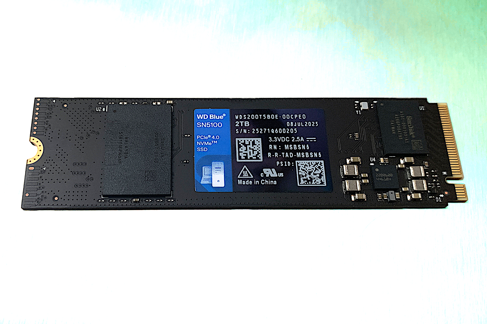
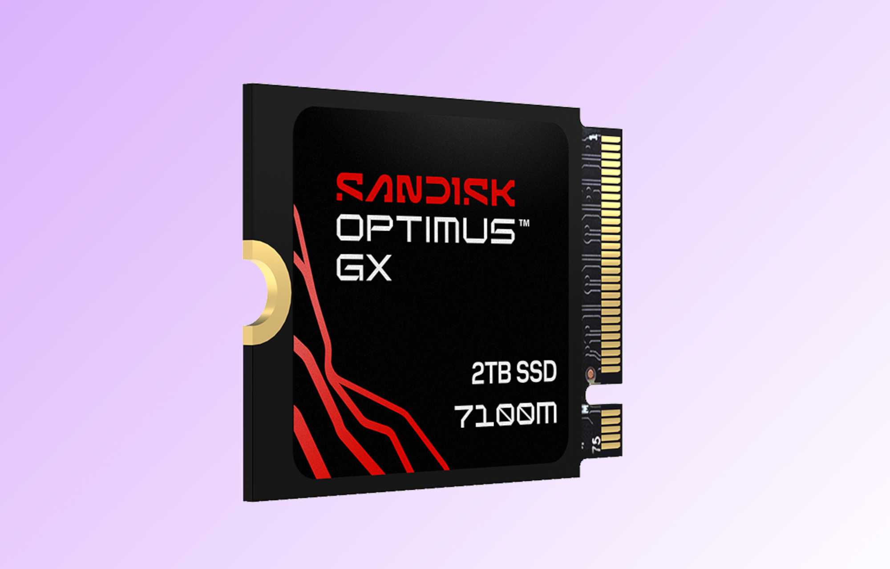
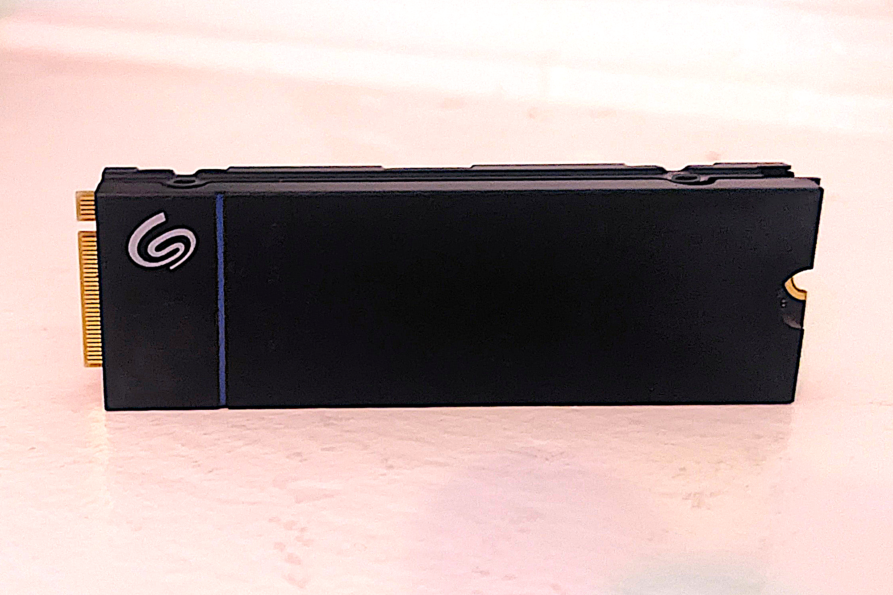
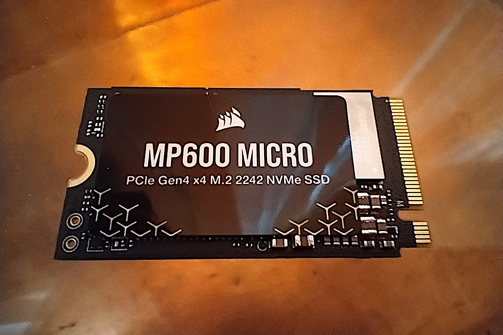

PCWorld ha actualizado su guía de los mejores SSD PCIe 4.0 de 2026, elaborada por Jon L. Jacobi a partir de las pruebas de casi una treintena de unidades NVMe. La conclusión principal es que la cuarta generación de PCI Express sigue siendo la opción más sensata para la mayoría de los equipos: el PCIe 5.0 ofrece el doble de ancho de banda teórico, pero buena parte del software —Windows incluido— no logra aprovecharlo, y su sobreprecio sigue siendo considerable.

La guía advierte además de un contexto de precios al alza y disponibilidad irregular, impulsado en buena medida por la demanda de la inteligencia artificial, por lo que conviene comprobar el precio actual antes de comprar. Estos son los cinco SSD PCIe 4.0 destacados por el medio.

## El mejor SSD PCIe 4.0 en general y la opción económica

El elegido como mejor SSD PCIe 4.0 global es el **WD Black SN7100**, que pasará a comercializarse como SanDisk Optimux GX 7100 tras la separación de SanDisk y WD. La unidad de 2 TB analizada convenció por su rendimiento secuencial con diseño HMB (búfer de memoria del host), que utiliza la memoria RAM del equipo para las tareas de caché en lugar de incorporar DRAM propia. Ese planteamiento ofrece transferencias secuenciales algo más rápidas a cambio de un rendimiento aleatorio inferior al de los diseños con DRAM, algo que en la práctica se nota sobre todo en una respuesta del sistema ligeramente más ágil. Lleva cinco años de garantía con una resistencia de 600 TBW por cada terabyte de capacidad.

Quien busque gastar menos tiene el **WD Blue SN5100** (próximamente SanDisk Optimus 5100), sucesor del SN5000 y también de diseño HMB sin DRAM. En las pruebas quedó tercero entre todos los SSD HMB analizados y primero con holgura en la escritura de un archivo de 450 GB, con un rendimiento secuencial a la altura de modelos más caros. Su punto débil es la ralentización en escrituras muy prolongadas propia de la NAND QLC. Comparte la garantía de cinco años con 600 TBW por terabyte.

## SSD PCIe 4.0 para consolas y dispositivos portátiles

Los jugadores de consola y de dispositivos portátiles tienen tres recomendaciones específicas. Para las consolas portátiles como Steam Deck, que requieren el formato compacto 2230, la guía señala el **SanDisk Optimus GX 7100M** como el SSD PCIe 4.0 más rápido que el laboratorio ha probado en ese tamaño —y en general—, con un rendimiento 4K especialmente notable para tratarse de un diseño HMB. Eso sí, su precio es elevado frente a alternativas como el Crucial P310.

Para PlayStation 5, la elección es el **Seagate Game Drive PS5 NVMe**, un modelo con DRAM propia —casi imprescindible porque la consola de Sony no admite HMB—, disipador de perfil bajo y capacidades de 1 y 2 TB. Obtuvo el segundo mejor registro en operaciones aleatorias entre todos los PCIe 4.0 probados y presume de una resistencia de 1.275 TBW, más del doble de la norma del sector, con cinco años de garantía. Funciona igualmente en cualquier PC con ranura M.2 2280.

El nicho del formato intermedio 2242 (22 × 42 mm), impulsado por equipos como el Lenovo Legion Go y algunos ThinkPad, lo cubre el **Corsair MP600 Micro**: fue el 2242 más rápido de las pruebas, con un rendimiento comparable al de muchas unidades 2280 estándar, a un precio contenido.

## Qué mirar al comprar un SSD PCIe 4.0 en España

Más allá de los modelos concretos, la guía deja varios criterios útiles para el comprador. Primero, capacidad, precio y garantía: los modelos económicos suelen ofrecer tres años, mientras que las gamas altas llegan a cinco, con la resistencia en terabytes escritos (TBW) como indicador de longevidad —la NAND QLC declara valores más bajos que la TLC, aunque con un uso doméstico normal las unidades actuales no suelen agotarse—. Segundo, no comprar rendimiento de más: un SSD PCIe solo rinde a la velocidad de la generación del equipo donde se instale, y se necesita al menos un Ryzen 3000 o un Core de undécima generación con placa compatible para aprovechar el PCIe 4.0. Y tercero, comprobar el formato físico (2280, 2230 o 2242) antes de pedir, porque no todos los equipos aceptan todos los tamaños.

Con [los precios de la NAND al alza por la demanda de la IA](/noticias/nand-price-hike-2026/), el PCIe 4.0 se consolida como el punto dulce entre precio y prestaciones: rinde hasta unos 7,5 GB/s en condiciones óptimas, muy por encima de los 3,5 GB/s del PCIe 3.0, sin el sobreprecio del PCIe 5.0. Y si la compra es para rejuvenecer un equipo antiguo, conviene recordar que [clonar el SSD viejo puede arrastrar los errores de Windows](/noticias/cloning-old-ssd-problems/): una instalación limpia a veces compensa.
