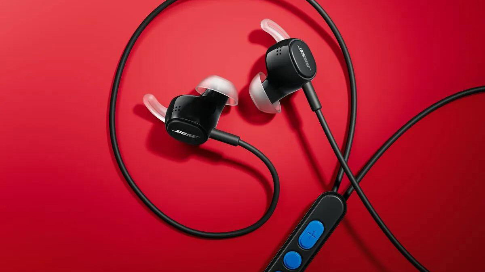
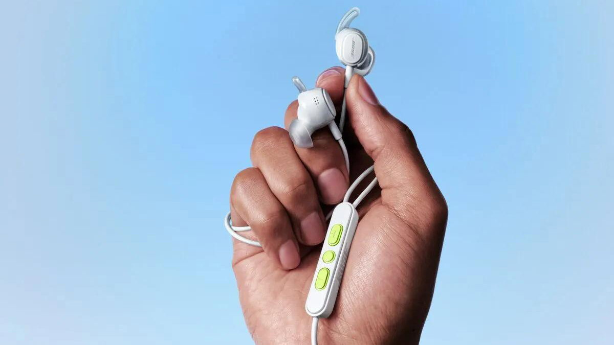
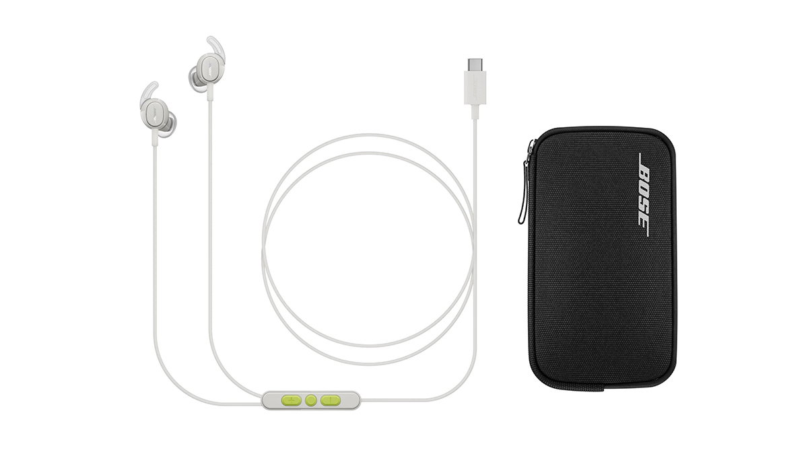

Bose ha presentado los **Noise Cancelling Wired Earbuds**, sus primeros auriculares con cable en once años, una propuesta que recupera la conexión física sin renunciar a la cancelación activa de ruido. El modelo llega con toma USB-C, la tecnología QuietControl de la marca y un precio de 99 dólares en Estados Unidos, muy por debajo de sus auriculares inalámbricos con ANC.

## El regreso de Bose a los auriculares con cable

El anuncio llega en un momento en el que los auriculares con cable y los IEM vuelven a ganar terreno entre quienes priorizan la baja latencia, el sonido sin compresión por Bluetooth y no depender de una batería. Bose no abandona lo inalámbrico —hace apenas unos días presentó sus Ultra Open Earbuds 2 y los Sport Open Earbuds—, pero recupera una categoría que tenía aparcada desde hace más de una década.

## QuietControl: cancelación de ruido con tres modos

Lo llamativo de unos auriculares con cable es que integren cancelación activa de ruido, y Bose ha adaptado su sistema **QuietControl** a esta categoría. La compañía emplea cuatro micrófonos —dos por auricular— para monitorizar el sonido ambiente y ofrece tres modos de escucha que se alternan desde el propio cable:

- **Modo Silencio (Quiet)**: la máxima reducción de ruido ambiental.
- **Modo Conciencia (Aware)**: deja entrar el sonido exterior para no aislarse del entorno.
- **ANC desactivado**: escucha convencional con el cable, sin cancelación activa.

A diferencia de otros modelos con cable, estos Bose se alimentan directamente del dispositivo a través del USB-C, por lo que **no necesitan una batería propia**: las funciones de cancelación de ruido funcionan mientras estén conectados.

## Control en el cable y sonido sin pérdidas

El cable, de 1,28 metros, incluye un **mando remoto integrado** con botones que permiten ajustar el volumen, controlar la reproducción, gestionar llamadas y cambiar entre los modos de cancelación. Ese mismo módulo incorpora un micrófono en la parte posterior, colocado para reducir el ruido de la ropa y mantener la voz nítida en las llamadas.

En el apartado de audio, Bose recurre a su procesador de señal digital **SoundDesign** con soporte para audio USB Clase 2, lo que habilita la reproducción sin pérdidas con una salida fija de **24 bits y 48 kHz**. Al ser una conexión física, la latencia se reduce de forma notable, algo que la marca destaca para vídeo, juegos y creación de contenido.

## Precio, colores y disponibilidad

Los Bose Noise Cancelling Wired Earbuds se pondrán a la venta el **15 de octubre de 2026** por **99 dólares** en Estados Unidos; todavía no hay precio ni fecha confirmados para Europa. Llegan en tres acabados: negro con detalles azules, blanco humo con detalles verde lima y la edición limitada **Dewdrop Mint**, un guiño nostálgico.

El paquete incluye almohadillas de silicona en tres tamaños (S, M y L) y aletas de sujeción en dos tamaños, que pueden combinarse para un mejor ajuste, además de un estuche con cremallera. Todo el conjunto cuenta con **certificación IPX4** frente a salpicaduras y sudor.

## Qué cambia para el lector

La apuesta de Bose es interesante porque rompe la idea de que el cable y la cancelación de ruido son incompatibles: quien busque la fiabilidad de una conexión física ya no tiene que renunciar al silencio de un ANC. Con 99 dólares, además, el precio queda lejos de los auriculares inalámbricos premium de la compañía.

Queda por ver el precio europeo y si el modelo convence en calidad de sonido, pero el movimiento encaja con una tendencia más amplia en la que los fabricantes están recuperando el audio por cable mientras siguen impulsando plataformas como la [Snapdragon Sound Elite Gen 2 de Qualcomm](/noticias/qualcomm-snapdragon-sound-elite-gen-2/).
