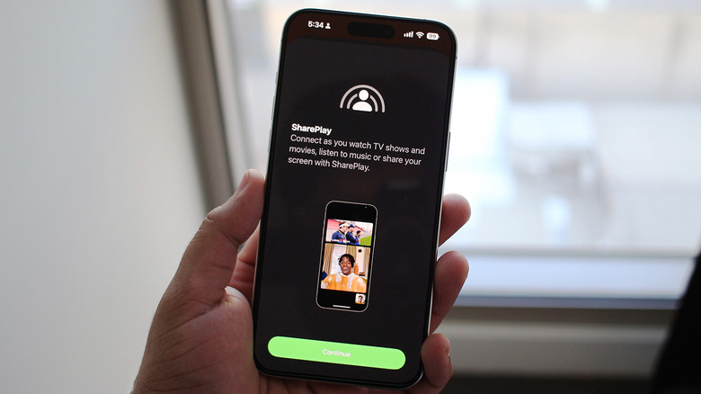

CarPlay permite que un iPhone proyecte su interfaz en la pantalla del coche para consultar el mapa o controlar la reproducción sin tocar el teléfono. Un mismo vehículo puede tener varios iPhones emparejados, pero **solo uno de ellos puede usar CarPlay a la vez**. El problema aparece cuando dos personas con el teléfono ya emparejado suben al coche y el sistema elige el iPhone del acompañante en lugar del del conductor.

Esta guía está pensada para quien necesita devolver la conexión a su teléfono, o para quien quiere que el copiloto controle la música sin quedarse con la sesión de CarPlay. Los métodos disponibles varían según el fabricante del coche: algunos sistemas permiten elegir un teléfono prioritario y otros carecen de esa opción. Conviene probarlos en orden y quedarse con el que funcione en cada vehículo.

## Antes de empezar

- **Ambos iPhones deben haberse emparejado antes con el coche.** El sistema solo puede alternar entre teléfonos que ya conoce.
- **CarPlay atiende a un solo iPhone por sesión.** No existe una forma de proyectar dos teléfonos al mismo tiempo; cambiar la conexión significa pasársela a uno y quitársela al otro.
- **Para la vía de SharePlay o Spotify Jam**, todos los iPhone implicados deben cumplir los requisitos del apartado final: iOS 17 o posterior en el caso de SharePlay, y una suscripción de Apple Music en el teléfono anfitrión.

## Paso 1: identificar qué teléfono está conectado

Antes de tocar nada, confirma qué iPhone tiene la sesión activa. Si el coche se conecta automáticamente al teléfono del conductor, no hay nada que hacer. El cambio solo es necesario cuando el sistema proyecta el iPhone del acompañante y quieres recuperar el control desde el tuyo.

## Paso 2: elegir un teléfono preferido desde el sistema del coche

Muchos sistemas de infoentretenimiento permiten designar un teléfono preferido o primario, que recibe prioridad siempre que haya varios iPhones emparejados cerca. El ajuste suele encontrarse en el **apartado de Bluetooth** o en el **menú de gestión de dispositivos** del sistema de infoentretenimiento del coche, aunque el nombre exacto depende del fabricante.

Algunos fabricantes, como Hyundai, permiten cambiar la conexión de CarPlay o Android Auto sobre la marcha. En esos casos, el coche debería recordar la preferencia la próxima vez que detecte los mismos dispositivos.

## Paso 3: apagar el Bluetooth y el Wi-Fi del otro iPhone

Si tu coche no ofrece una opción de teléfono preferido, un recurso rápido y poco elegante consiste en **desactivar manualmente el Bluetooth y el Wi-Fi del iPhone que no quieres usar**. Al desaparecer de las redes inalámbricas, el coche debería quedarse con el teléfono que siga conectado. Es una solución de emergencia: tendrás que repetirla cada vez que los dos teléfonos vuelvan a coincidir en el vehículo.

## Paso 4: probar la conexión por cable

Otra alternativa es conectar el iPhone por cable para ver si el coche da prioridad al teléfono físicamente enchufado por delante del que está emparejado de forma inalámbrica. No es un método fiable: en foros como Reddit, varios usuarios han señalado que no les ha funcionado para forzar la conexión con cable.

## Paso 5: dejar que el copiloto controle la música con SharePlay

Si lo que buscas no es recuperar la pantalla, sino que el acompañante pueda hacerse cargo de la música, hay un atajo que evita cambiar la conexión por completo. La compatibilidad de SharePlay con CarPlay llegó con **iOS 17**, y permite que los ocupantes se unan a la sesión de Apple Music del conductor para añadir, reordenar o quitar canciones desde su propio dispositivo.

Para esta vía, todos los ocupantes deben tener un iPhone con **iOS 17 o posterior**. Los acompañantes **no necesitan ser suscriptores de Apple Music**: solo el anfitrión debe tener suscripción.

Quienes usen Spotify disponen de una función equivalente, **Jam**, que permite a todos los ocupantes unirse a la sesión del anfitrión y aportar canciones a la cola desde sus propios teléfonos. En este caso tampoco hace falta Spotify Premium para los participantes cuando se utiliza la función en persona.

## Cómo verificar que funcionó

- La pantalla del coche muestra la interfaz del iPhone que querías proyectar, y no la del acompañante.
- Si elegiste un teléfono preferido, comprueba que el coche mantiene esa prioridad la próxima vez que detecte los mismos dispositivos.
- Si usaste SharePlay o Spotify Jam, el copiloto puede añadir o reordenar canciones desde su teléfono y los cambios se ven en la pantalla del coche.

## Advertencias y limitaciones

- **SharePlay y Spotify Jam solo sirven para la música.** Si el copiloto necesita usar la navegación o consultar mensajes en la pantalla del infoentretenimiento, tendrá que cambiar la conexión de CarPlay con uno de los métodos anteriores.
- **El cambio de conexión depende del fabricante.** No todos los sistemas de infoentretenimiento permiten elegir un teléfono preferido ni cambiar de dispositivo sobre la marcha.
- **Apagar el Bluetooth y el Wi-Fi del otro iPhone es una solución temporal.** No evita que el problema se repita cada vez que los dos teléfonos vuelvan a estar cerca del coche.
- **La conexión por cable no garantiza la prioridad.** El método no funciona de forma consistente según lo reportado por los usuarios.
- **CarPlay sigue atendiendo a un solo teléfono a la vez.** Cambiar entre iPhones implica siempre ceder la sesión por completo, no compartirla.
