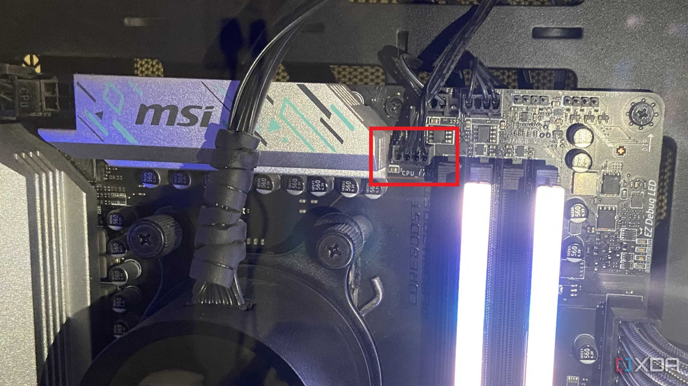
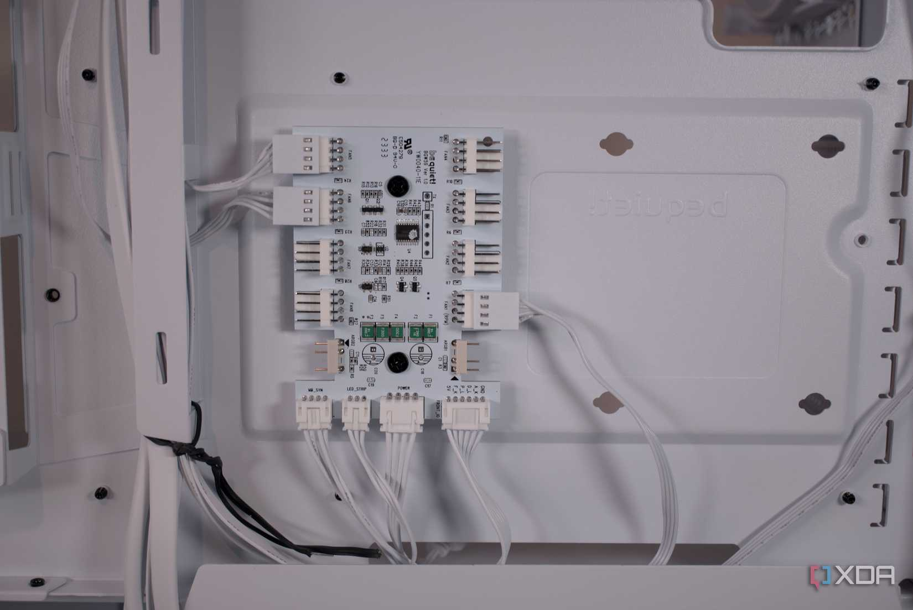
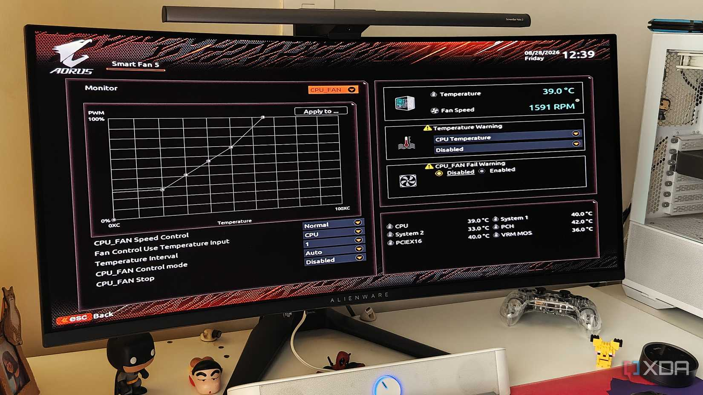

Montar un PC parece hoy más sencillo que nunca: casi todos los cabezales de ventilador de una placa base moderna son de 4 pines, así que la tentación es dar por hecho que cualquier ventilador conectado a ellos quedará bajo control. La realidad es más matizada. Como explica XDA Developers, que un conector tenga cuatro pines no significa que la placa pueda regular bien lo que se enchufa en él, y el problema pasa desapercibido porque el ventilador gira igual.

## PWM y DC: dos formas de regular que no son intercambiables

La clave está en el cuarto pin. Ese contacto extra existe para enviar la señal PWM que marca al ventilador a qué velocidad debe girar. Un ventilador de 3 pines, que sigue siendo habitual en muchas cajas, carece de él: si el cabezal está configurado en modo PWM, el ventilador recibe los 12 V por el pin de alimentación y gira a plena potencia, ignorando por completo la curva configurada en la BIOS.

La solución para esos ventiladores es el modo DC, que en lugar de mantener el voltaje fijo lo varía para controlar las revoluciones. Así un ventilador de 3 pines sí puede seguir una curva basada en temperatura, aunque con una precisión algo menor a bajas velocidades. El detalle importante es que un cabezal no elige ese modo por sí solo: hay que comprobarlo.

## Los splitters sacrifican el control individual

El segundo punto ciego aparece cuando se agrupan varios ventiladores. Las placas, incluso las de gama alta, ofrecen un número limitado de cabezales para la caja, por lo que es común recurrir a splitters o hubs. El resultado es que todos los ventiladores conectados a un mismo cabezal reciben la misma señal y siguen la misma curva: no se pueden regular por separado.

Eso no es un defecto si los ventiladores cumplen la misma función. Agrupar los tres frontales de admisión por un lado y los superiores de extracción por otro es razonable; lo que no tiene sentido es repartirlos al azar por comodidad. La recomendación es agrupar según el trabajo real de cada ventilador: admisión, extracción o radiador.

## El modo Auto ayuda, pero no conviene confiar a ciegas

Las placas actuales hacen difícil equivocarse del todo. La mayoría incluye un modo Auto que detecta si se ha conectado un ventilador de 3 o de 4 pines y ajusta el control en consecuencia, algo que agradecen quienes no quieren entrar en los menús de la BIOS. Aun así, no es universal: según el modelo, algunos cabezales vienen de fábrica en PWM o en DC, y el modo automático no siempre está disponible en todos.

El caso del cabezal de bomba es ilustrativo. En las placas MSI X870, por ejemplo, viene configurado en PWM de serie, que es justo lo que necesita una bomba de refrigeración líquida, pero si alguien enchufa ahí un ventilador de 3 pines acabará funcionando al máximo sin remedio. Nuestra lectura es que el modo Auto es una red de seguridad, no un sustituto de revisar la configuración: conviene dedicar unos minutos a verificar el modo de cada cabezal y a comprobar que los ventiladores están agrupados con criterio. Es un ajuste silencioso que, bien hecho, se traduce en menos ruido y temperaturas más estables.
