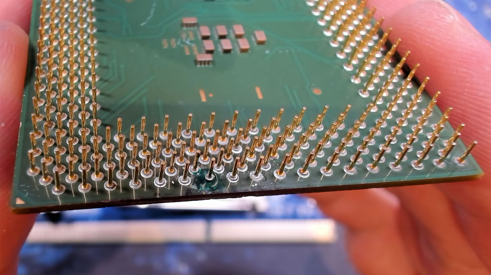
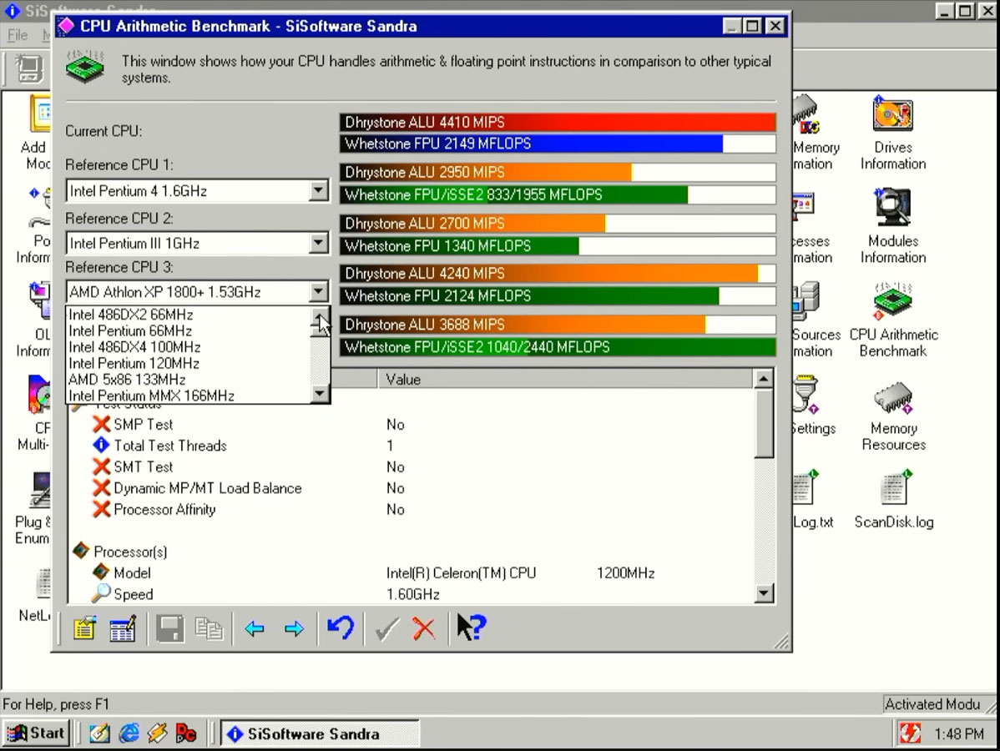

Un procesador Intel Celeron 1200 que parecía irrecuperable ha vuelto a funcionar. El canal de YouTube **Bits und Bolts** se topó con una unidad a la que le faltaba un pin y a la que, además, le habían arrancado la almohadilla de soldadura que había debajo, es decir, la conexión directa con el interior del chip. En lugar de darla por perdida, el autor del experimento excavó el sustrato, reconstruyó la conexión y logró que el sistema arrancara. Como remate, lo dejó funcionando con un 33 % de overclock, es decir, a 1600 MHz.

El caso lo han recogido medios como Tom's Hardware y el chino MyDrivers, que citan el vídeo original del canal como origen del experimento.

## Un pin de datos que condena al chip

El Celeron 1200 es una pieza de principios de los 2000: núcleo **Tualatin**, proceso de **0,13 micrómetros (130 nm)**, un solo núcleo y un solo hilo, **1,2 GHz** de frecuencia base, **256 KB de caché L2** y bus frontal de **100 MHz**, con un TDP de **32,1 W** y unos 44 millones de transistores. Al ser pariente cercano del Pentium III, arrastra ya unos 25 años de historia.

El problema era concreto: faltaba el pin de datos **D47** y su almohadilla inferior estaba destrozada. La diferencia con otros pines es clave. Cuando se rompe un pin de alimentación o de masa, a veces el procesador sigue funcionando porque otros pines asumen la misma función. Con un pin de datos no hay margen: sin esa conexión, el equipo ni siquiera arranca.

## Excavar el sustrato y soldar una pieza donante

La reparación consistió en abrir un hueco en la superficie del sustrato para llegar hasta las capas de cobre internas y poder reconstruir el contacto. El reto era de precisión extrema: el pin nuevo debía conectarse únicamente al pequeño círculo central de la zona dañada y no tocar ninguna de las superficies de cobre que lo rodean, porque eso provocaría un cortocircuito.

Para lograrlo, el autor aplicó **máscara de soldadura** alrededor del punto central y dejó solo esa zona al descubierto. Mientras curaba, extrajo un pin intacto de otro procesador Tualatin que ya estaba roto, lo colocó con cuidado, aplicó fundente y estañó el área central antes de soldarlo en posición vertical.

Antes de montar el procesador, comprobó con un multímetro que no hubiera cortocircuitos. Después lo encajó en el zócalo y el sistema arrancó sin incidencias.

## Un 33 % extra y una advertencia importante

Con el chip ya operativo, el autor lo sometió a varias pruebas de rendimiento, entre ellas el benchmark **SiSoftware Sandra**, y lo subió de vueltas. El resultado: un **33 % de overclock** estable a **1600 MHz**. Según sus propias palabras, era la primera vez que reparaba un daño en un pin con un aspecto tan grave.

Conviene ser claro con el contexto: se trata de una reparación de laboratorio al límite. Hace falta microscopio, pulso firme y años de experiencia en soldadura fina, y cualquier error puede destruir el procesador o dañar la placa. Para el usuario común, un chip con un pin arrancado sigue siendo, en la práctica, un chip para reemplazar. Lo interesante del caso no es que sea replicable en casa, sino lo que demuestra: que con paciencia y técnica incluso un fallo físico que parecía definitivo puede tener vuelta atrás.
