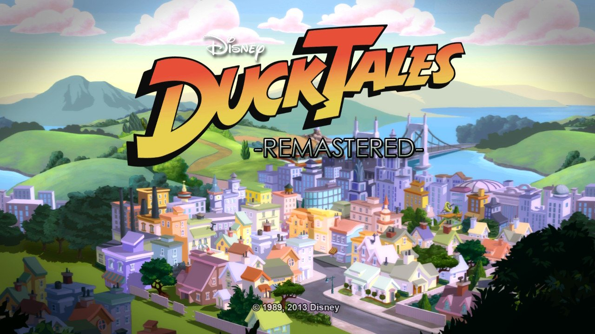
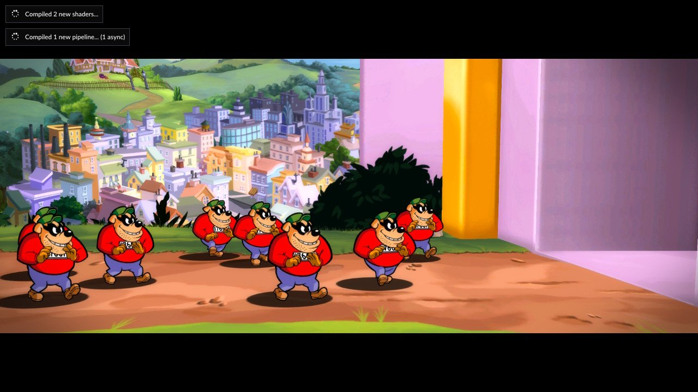
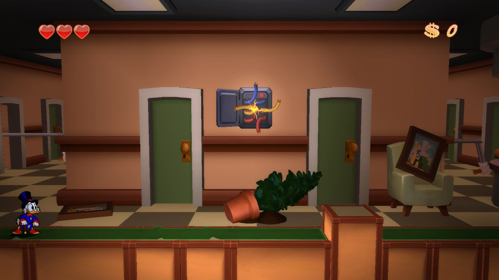

El desarrollador conocido en la escena como **NaGaa95** (Nagaa en GBAtemp) ha
publicado **Cemu-nx**, un port no oficial del emulador de Wii U **Cemu** para
Nintendo Switch. El proyecto se presentó el 20 de julio en un hilo de GBAtemp y,
desde entonces, ese mismo hilo supera las 200 respuestas. No se trata de un
emulador nuevo: parte del código del Cemu original, disponible para Windows,
Linux y macOS, y lo adapta al hardware de la consola híbrida. El repositorio de
GitHub figura como bifurcación del proyecto oficial.

## Qué incluye el port

Cemu-nx no se limita a cargar juegos, sino que incorpora un lanzador propio y un
conjunto de funciones pensadas para usar la consola como un pequeño centro de
emulación. Según la descripción del autor, incluye:

- Biblioteca de carátulas con descarga automática desde SteamGridDB.
- Ajustes por juego y configuración de paquetes gráficos.
- Reasignación de mandos, entrada multijugador, giroscopio y vibración.
- Escaneo de Amiibo mediante los Joy-Con.
- Audio tanto por la TV como del GamePad de Wii U.
- Decodificación H.264 por hardware mediante Averne/FFmpeg.
- Almacenamiento en tarjeta SD, USB y recursos compartidos por SMB.
- Instalación y gestión de juegos, actualizaciones y DLC.
- Soporte experimental de Pretendo y otros servicios en línea alternativos.
- Lectura de los formatos WUA, WUD, WUX, WUHB, RPX, ELF e ISO, además de juegos
  extraídos.

El render corre sobre **Vulkan (NVK)**, un trabajo que el autor atribuye al
desarrollador **@dantiicu**.

## En qué estado está

Se trata de un proyecto **en fase temprana y con compatibilidad desigual**, y así
lo advierte el propio autor: el rendimiento y el catálogo de juegos que arrancan
"variarán". La primera ejecución de un título compila shaders y provoca
microcortes o pausas largas que, según sus notas, se reducen en arranques
posteriores. Hay que colocar el archivo `nro` en `sdmc:/switch/Cemu/` junto a un
`keys.txt`, y lanzarlo desde el Homebrew Menu en modo aplicación completa
(*title-override*), no desde el álbum.

La emulación también depende del overclock en bastantes casos. El autor
recomienda como mínimo **2193 MHz de CPU y 2400 MHz de memoria**, y una
frecuencia de GPU que varía con la resolución: unos 921 MHz a 720p y 1228 MHz a
900p. Incluso con esos ajustes, usuarios del hilo reportan cierres de Atmosphère
al intentar *Wind Waker HD* sin overclock, y algunas funciones quedan fuera de
alcance: **los juegos que dependen de la pantalla del GamePad no son
compatibles**.

La nota de portada de GBAtemp recogía que títulos como *Wind Waker HD* y
*Paper Mario: Color Splash* se movían a plena velocidad en el vídeo del autor,
mientras que *Breath of the Wild* aún no llegaba a ese punto. En las pruebas
compartidas por otro usuario del foro, *DuckTales: Remastered* aparece a 60 FPS.

Conviene leer estas cifras con cautela: son el mejor caso mostrado por el autor,
no una garantía de que el catálogo de Wii U funcione de forma general.

## Qué implica para quien quiera probarlo

Cemu-nx es **homebrew**, así que requiere una Switch con acceso a Homebrew Menu y
los archivos de sistema correspondientes; no funciona en una consola de fábrica.
Tampoco reparte juegos: hay que aportar copias propias obtenidas de forma legal.
El almacenamiento exige atención, porque las imágenes de Wii U superan con
frecuencia los 4 GB, un tamaño incómodo para una tarjeta SD formateada en FAT32;
el autor indica que el lanzador admite discos USB o HDD en exFAT.

El proyecto se suma a una racha de ports homebrew del mismo desarrollador para
Switch, entre ellos NetherSX2 (PlayStation 2) y DraStic (Nintendo DS). Lo
llamativo del caso es la ironía técnica: la sucesora de la Wii U emula ahora a su
predecesora, una consola que nunca llegó a tener una biblioteca de emulación
amplia.

Por ahora, lo prudente es tratar Cemu-nx como **un hito técnico y un experimento
en evolución**, no como una forma cómoda de jugar al catálogo de Wii U en Switch.
