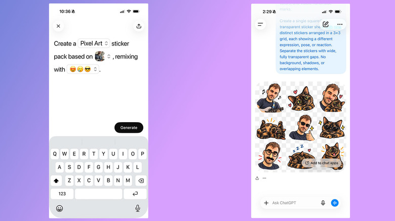
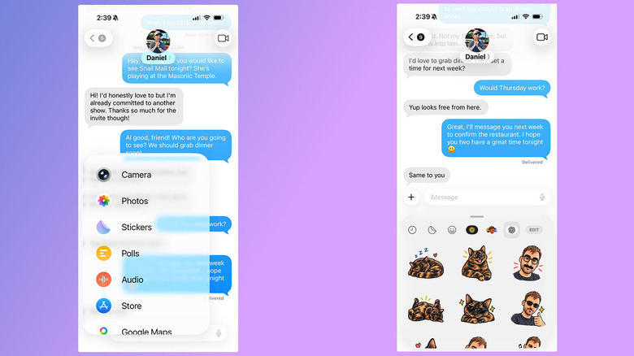

Los stickers son una forma sencilla de dar calidez y matices a un mensaje, igual que los emoji. Apple permite desde hace años convertir las fotos del carrete en pegatinas para iMessage, pero las opciones de personalización de ese método son limitadas. OpenAI añadió recientemente un flujo específico de creación de stickers dentro de **ChatGPT Images** que facilita convertir casi cualquier foto en un conjunto de pegatinas para enviar por iMessage y WhatsApp.

Esta guía recoge el proceso completo desde la app móvil, cómo corregir el resultado si no convence y cómo enviar después los stickers. El flujo de ChatGPT es independiente de las funciones de IA que Apple integra en el sistema; si quieres controlar cuáles están activas en tu iPhone, tienes la guía para [desactivar Apple Intelligence en iOS 27](/noticias/disable-apple-intelligence-ios-27/).

## Requisitos previos

- Una cuenta de ChatGPT y la app móvil instalada en [iOS](https://apps.apple.com/us/app/chatgpt/id6448311069) o [Android](https://play.google.com/store/apps/details?id=com.openai.chatgpt).
- Para importar los stickers a iMessage hace falta un iPhone. En un teléfono Android, iMessage no aparecerá como opción.
- Para usar WhatsApp, la aplicación instalada en el mismo dispositivo.
- Ten presente que los stickers generados consumen tu límite de uso diario y semanal de ChatGPT.

## Cómo generar stickers con ChatGPT paso a paso

La vía más sencilla para crear los stickers es la app móvil de ChatGPT. Una vez abierta, hay que seguir estos pasos:

1. **Abre el panel lateral.** Toca el icono de menú situado en la esquina superior izquierda de la interfaz.
2. **Entra en Images.** Selecciona **Images** en el panel.
3. **Abre la pestaña Trending.** Dentro de la pestaña **Trending**, toca **Stickers**.
4. **Elige estilo, referencias y emoji.** Selecciona un estilo, una o varias imágenes de referencia y un conjunto de emoji. La selección de emoji sirve para guiar a ChatGPT.
5. **Añade los stickers a tus apps de mensajería.** Tras unos instantes, ChatGPT genera un conjunto de nueve stickers. Si el resultado convence, toca **Add to chat apps** y después **iMessage** o **WhatsApp** para importarlos a la plataforma elegida. Si escoges WhatsApp, primero tendrás que dar un nombre al paquete de stickers antes de que se añada a la app.

## Cómo retocar un sticker que no te convence

Si el conjunto generado no es lo que esperabas, no hace falta empezar de cero. Se puede pedir un ajuste con estos pasos:

1. Toca uno de los stickers.
2. Selecciona **Edit** en el menú que aparece.
3. Describe los cambios que quieres introducir escribiendo en la barra de texto.

## Generar stickers con un prompt propio

Al margen del flujo anterior, también puedes escribir tu propio prompt pidiendo a ChatGPT que genere un sticker. Este método resulta útil si quieres que el chatbot se mantenga más fiel a la foto original.

El resto funciona igual: si el resultado te gusta, toca **Add to chat app** y luego **iMessage** o **WhatsApp** para exportarlo. Para modificarlo, toca la imagen y después **Edit**. Y si en algún momento tienes la sensación de que ChatGPT ha entendido mal tu petición, puedes pedirle que lo intente de nuevo desde cero tocando el icono de tres puntos y, a continuación, **Retry**.

## Cómo enviar los nuevos stickers

Cuando ya tengas varios stickers que te gusten, enviarlos consiste en abrir tu app de mensajería y usar el mismo procedimiento de siempre para las pegatinas.

### En iMessage

Abre la app Mensajes y sigue estos pasos:

1. Abre una conversación.
2. Toca el botón **Plus**.
3. Selecciona **Stickers**.
4. Toca el logotipo de OpenAI en la parte superior de la ventana de redacción.
5. Selecciona el sticker que quieras enviar.

### En WhatsApp

El proceso en WhatsApp es todavía más directo:

1. Abre una conversación.
2. Toca el icono de sticker, situado a la derecha de la barra de redacción. Es posible que aparezca un segundo icono de sticker debajo si la app muestra primero una selección de GIF; en ese caso, selecciónalo.
3. Elige el sticker que quieras enviar. Lo encontrarás agrupado bajo el nombre que le hayas dado al paquete.

## Cómo verificar que los stickers se importaron bien

La comprobación es la misma que la del envío: si en iMessage el sticker aparece en el selector de **Stickers** bajo el logotipo de OpenAI, y en WhatsApp figura dentro de la bandeja de stickers agrupado con el nombre que le pusiste al paquete, la importación se completó correctamente. Si no lo encuentras, revisa que hayas pulsado **Add to chat apps** (o **Add to chat app**) y que la generación haya terminado sin agotar tu límite de uso.

## Advertencias y limitaciones

- Los stickers generados con ChatGPT **consumen tu límite diario y semanal**. En una cuenta gratuita, es posible que tengas que esperar a que el límite se renueve antes de poder completar una petición.
- iMessage solo estará disponible si importas los stickers desde un iPhone; en Android la opción no aparece.
- En WhatsApp, el paquete debe tener un nombre antes de añadirse a la aplicación.
- Los nombres de los botones se mantienen en inglés tal como aparecen en la app de ChatGPT y en las apps de mensajería.
