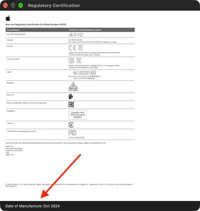

Saber la fecha de fabricación de un Mac dejó de ser sencillo cuando Apple empezó a usar números de serie aleatorios. Con macOS 27, el sistema vuelve a mostrar ese dato en un lugar poco visible: el certificado de regulación. Esta guía explica cómo llegar hasta él y qué significa la fecha que aparece.

## Requisitos previos

- Un Mac compatible con macOS 27 (conocido como macOS Golden Gate) actualizado a esa versión.
- Acceso a una cuenta con permiso para abrir los Ajustes del Sistema.

## Pasos

### 1. Abre los Ajustes del Sistema

Haz clic en el menú Apple de la barra superior y selecciona **Ajustes del Sistema**. También puedes abrir la aplicación desde el Dock o con la búsqueda de Spotlight.

### 2. Entra en General y luego en Información

En la barra lateral de los ajustes, selecciona **General** y después pulsa **Información**. Ahí verás el resumen del equipo: modelo, chip, memoria y número de serie.

### 3. Abre la certificación de regulación

Debajo del botón de informe del sistema, pulsa **Certificación de regulación**. Se abrirá el certificado con los datos regulatorios del equipo.

### 4. Localiza la fecha de fabricación

Desplázate hasta la parte inferior del certificado. Allí aparece el campo **Fecha de fabricación** con la fecha registrada del equipo.

## Cómo verificar que funcionó

Si seguiste los pasos correctamente, el certificado muestra el campo de fecha de fabricación con un valor concreto al final del documento. Si el campo no aparece, comprueba que el equipo ejecuta macOS 27: la certificación de regulación con este campo llegó durante el ciclo de betas de esa versión y no existe en versiones anteriores.

Conviene tener en cuenta un matiz detectado por la comunidad: en al menos un caso documentado, la fecha mostrada correspondía a la placa base del equipo y no al ensamblaje completo, en un Mac cuya placa había sido sustituida. La fecha parece estar ligada a ese componente.

## Advertencias y limitaciones

Esta opción solo está disponible en macOS 27 o posterior. En versiones anteriores no se muestra el campo, y tampoco existe ya el método antiguo de descodificar el número de serie, ya que Apple adoptó números de serie aleatorios sin datos de fabricación codificados en 2021. La función no ha sido destacada oficialmente por Apple, según [la guía original de MacRumors](https://www.macrumors.com/how-to/check-your-mac-manufacture-date-macos/).

Si acabas de actualizar, puedes repasar [qué trajo la segunda oleada de betas de macOS Golden Gate 27.2](/noticias/apple-beta-2-wave-watchos-27-2/) para situar esta novedad dentro del ciclo de versiones del sistema.
