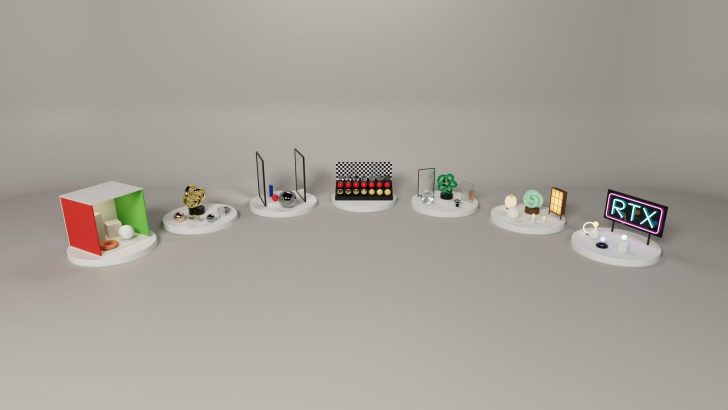
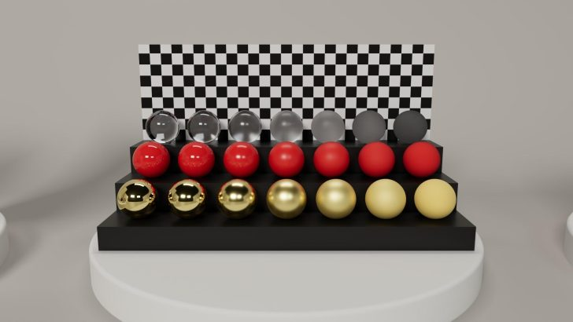
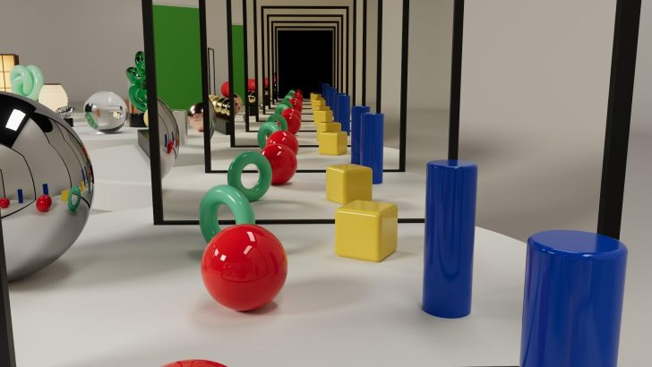

Un usuario de Reddit afirma haber construido desde cero un trazador de trayectorias (path tracer) acelerado por hardware en aproximadamente una hora, usando como única herramienta el modelo Claude Opus 5.5 de Anthropic. El programa resultante es una demo de trazado de rayos en tiempo real que aprovecha dos tarjetas GeForce RTX 5090 y las bibliotecas CUDA y OptiX de NVIDIA, con soporte para materiales difusos, metálicos, transparentes y autoiluminados.

El autor, que publica como u/Zealousideal_View_12, compartió el pasado 24 de septiembre varias capturas de la demo en funcionamiento. Según su relato, el modelo generó una base de código en C++ y CUDA apoyada en NVIDIA OptiX 9.1, que accede directamente a los núcleos RT y a los núcleos Tensor de las GPU modernas. El medio Wccftech, que se hizo eco del caso, destaca que el experimento sugiere que ni siquiera hace falta dominar las API gráficas, la compilación de sombreadores o la ejecución en paralelo para levantar un trazador de este tipo.

## Una petición inicial y dos RTX 5090 trabajando en paralelo

La petición enviada al modelo pedía una demo completa de trazado de rayos acelerada con núcleos CUDA, RTX y Blackwell, capaz de utilizar las dos RTX 5090 del equipo y de mostrar reflexión difusa y metálica, brillo, rugosidad, transparencia, translucidez y autoiluminación. El autor no ha aclarado si después de esa petición inicial hubo retoques o peticiones adicionales, por lo que conviene leer la marca de "una hora" con cierta cautela.

En el plano técnico, el renderizador emplea una canalización multiadaptador de fotograma dividido: cada imagen se corta en sentido horizontal y las filas se reparten entre las dos tarjetas, con un reparto que se ajusta según la carga de cada GPU en tiempo real. El resultado declarado es de 34 fotogramas por segundo y 267 millones de muestras de rayos por segundo, unas cifras respetables para un trazador de trayectorias generado automáticamente. No es la primera vez que dos buques insignia de NVIDIA trabajan juntos en un experimento doméstico: [un equipo con dos RTX 5090 ya había demostrado hasta dónde llega el consumo de estas configuraciones](/noticias/dual-rtx-5090-power-draw/).

## Reordenación de sombreadores y muestreo en el trazador de trayectorias

Más allá del reparto entre GPU, el proyecto incorpora técnicas propias del renderizado moderno. Utiliza Shader Execution Reordering (SER), que reorganiza las trayectorias de los rayos dentro de la GPU para mantener ocupados sus recursos, y combina la estimación del siguiente evento (Next-Event Estimation) con el muestreo de importancia múltiple (Multiple Importance Sampling) para resolver la distribución de la luz y las sombras suaves.

Las escenas de muestra recorren el repertorio clásico de este tipo de demos: una caja de Cornell con esfera, toro y cubo; una cuadrícula de esferas que compara transparencia, difusos rojos y metales dorados; un pasillo de espejos con repetición infinita; y bodegones con velas, pantallas de papel y espirales autoiluminadas que ponen a prueba la translucidez y la emisión propia de luz.

## Por qué importa para el lector

El caso interesa por dos motivos. Primero, porque confirma una tendencia visible en la comunidad gráfica: la IA ya escribe código CUDA y OptiX lo bastante coherente como para producir demos funcionales, algo que hasta hace poco exigía meses de trabajo especializado. Segundo, porque llega en un momento en que el trazado de trayectorias deja de ser una curiosidad académica: [los mods comunitarios ya llevan el path tracing a juegos comerciales](/noticias/dark-souls-3-path-tracing-dlss-5/) y NVIDIA publica herramientas oficiales en la misma dirección.

Dicho esto, el relato parte de una única fuente —el propio autor en Reddit— y no hay de momento código publicado ni verificación independiente de las cifras de rendimiento. La historia demuestra lo que un modelo actual puede generar, pero no sustituye a una prueba reproducible. Si el proyecto se libera y otros usuarios con hardware Blackwell lo replican, estaremos ante algo más que una anécdota: la prueba de que el desarrollo gráfico asistido por IA ya es una vía seria para prototipar sobre la GPU.
