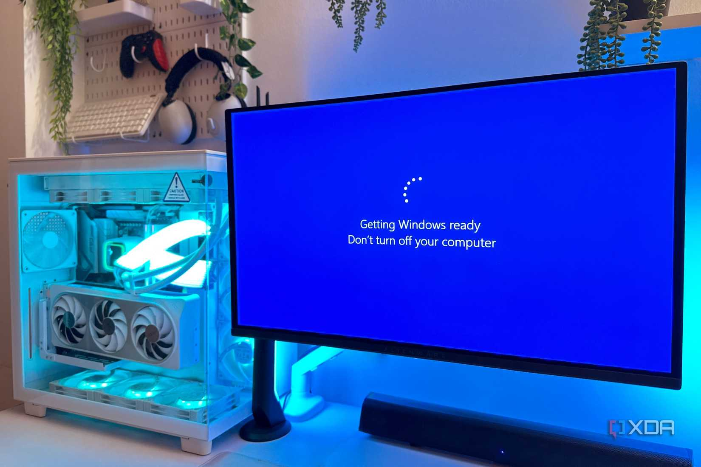
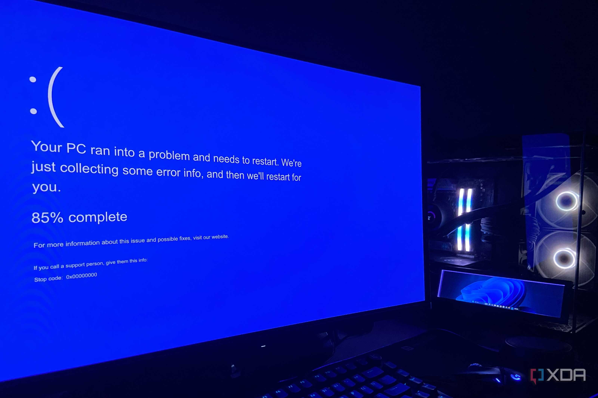
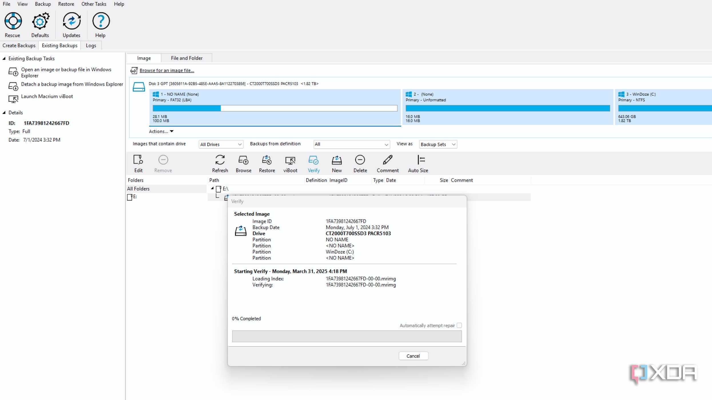
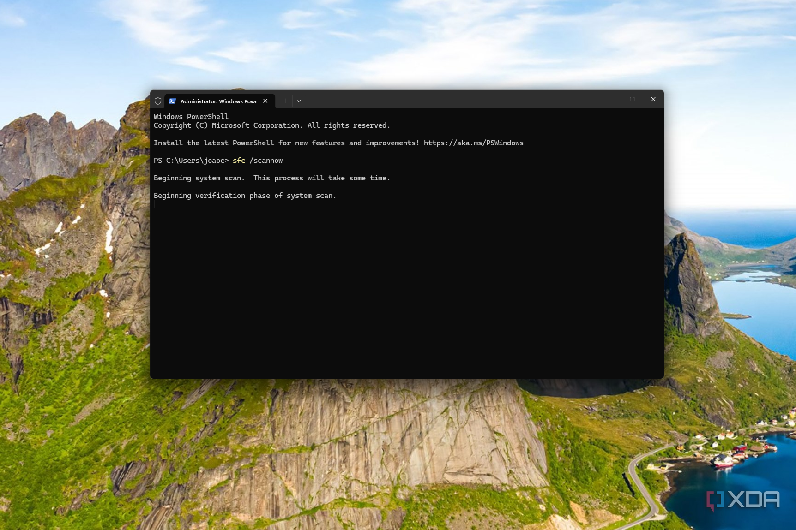
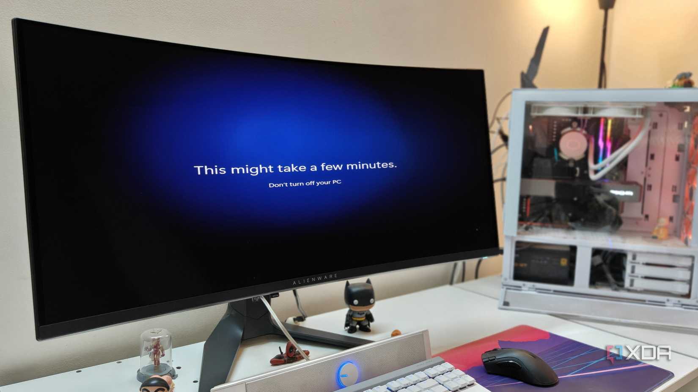
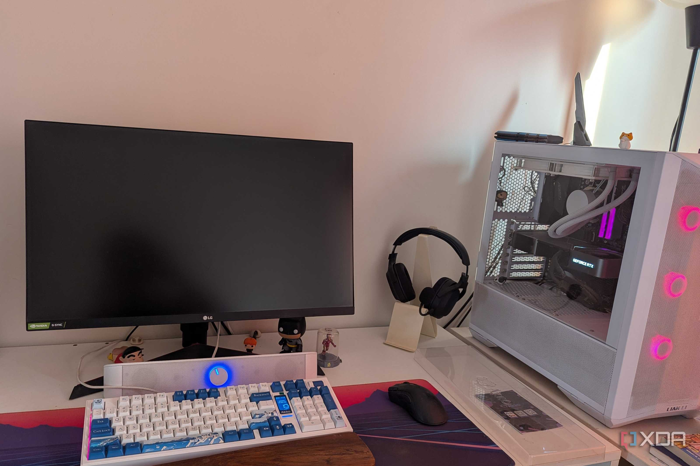
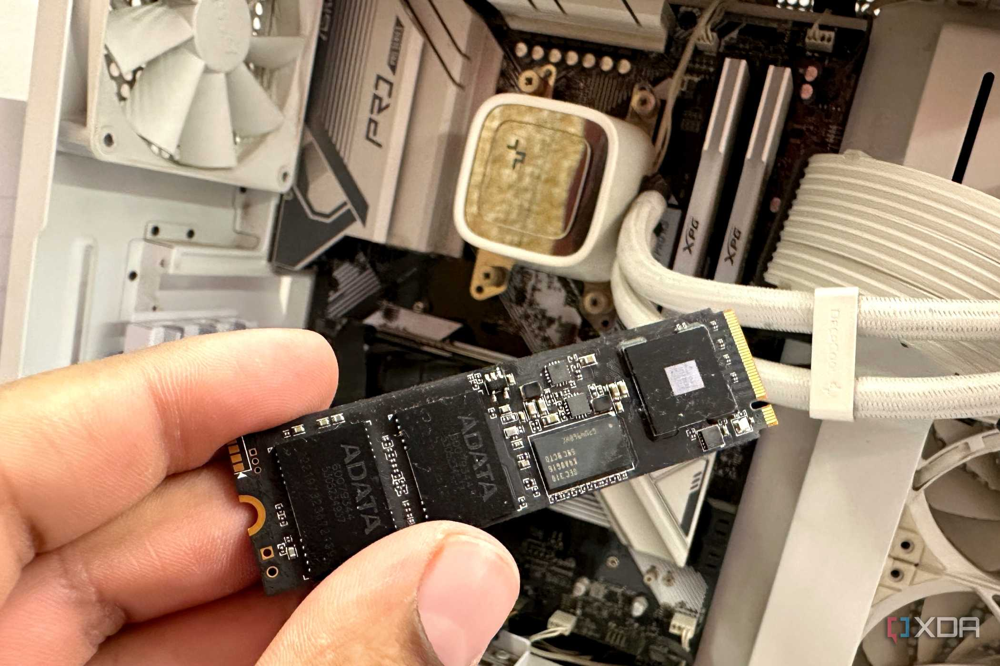

Cuando se cambia de PC, hay una decisión que casi todos los usuarios se plantean: instalar el sistema operativo desde cero o clonar el disco antiguo para seguir donde lo dejamos. La segunda opción es la más cómoda, porque evita reinstalar programas y reconfigurarlo todo. El redactor de XDA Developers Tanveer Singh eligió ese atajo y, según relata, acabó pagándolo durante años: los problemas de su vieja instalación de Windows viajaron con el clon a su equipo nuevo.

## Un atajo tentador: clonar en lugar de reinstalar

El autor explica que en 2022 pasó de un equipo con Ryzen 5 1600 y GTX 1660 Ti a otro con Ryzen 7 5700X y RTX 3080. Hasta entonces, un SSD SATA Samsung 860 EVO había sido su disco de arranque durante unos cuatro años, y el nuevo sistema estrenaba un WD Black SN770, un NVMe Gen4 bastante más rápido. Para no perder su entorno de Windows 10 ya configurado, instaló Macrium Reflect y clonó el SSD SATA al nuevo NVMe.

En aquel momento no notó nada raro. Todo funcionaba como esperaba y el rendimiento no era un problema. Los primeros indicios de que algo no iba bien tardaron unos meses en aparecer.

## Los errores del sistema viajaron con el clon

Según cuenta, su instalación de Windows 10 ya había mostrado corrupción ocasional en el SSD antiguo, pero lo resolvía con un análisis SFC o DISM y seguía adelante. Al clonar, esos fallos heredados encontraron una segunda vida en el equipo nuevo: pantallas negras y bucles de arranque cada pocos meses, además de problemas extraños de Bluetooth, suspensión y conexión a internet que no conseguía explicar.

La respuesta del autor no fue atacar la raíz, sino crear imágenes de sistema periódicas con Macrium Reflect para poder volver a un estado funcional cuando el equipo fallara. Fue un parche que alargó la agonía en lugar de resolverla.

## La instalación limpia que llegó demasiado tarde

El problema no desapareció hasta que, hace unos meses, el autor dio el salto a Windows 11 con una instalación nueva. Entonces se esfumaron tanto la corrupción recurrente como los fallos de Bluetooth, suspensión y red. Su conclusión es clara: una instalación desde cero borra casi todos los errores subyacentes de la copia anterior y, de paso, elimina la acumulación de programas y ajustes innecesarios que se arrastran con los años.

El propio autor matiza que una corrupción a nivel de firmware o un malware persistente podrían sobrevivir incluso a un formateo, aunque son casos poco frecuentes. Lo habitual es que el sistema quede limpio.

## Qué significa esto para quien cambia de SSD

Clonar no es una mala práctica en sí misma. Muchos usuarios clonan su disco de arranque y no vuelven a acordarse del asunto, como recuerdan algunos comentarios de la propia noticia. La diferencia está en el estado de la instalación de origen: si el sistema ha sido estable durante años, el clon probablemente funcione sin sobresaltos.

El aviso vale sobre todo para quien viene de una instalación que ya mostraba corrupción, fallos de arranque o comportamientos erráticos. En ese caso, arrastrar el clon es trasladar el problema al hardware nuevo. Para el lector que esté pensando en cambiar de SSD, la recomendación práctica es sencilla: si el sistema actual funciona bien, clonar es rápido y válido; si arrastra errores, merece la pena dedicar una tarde a una instalación limpia y copiar después solo los datos personales, tras comprobarlos con un análisis antivirus. El tiempo ahorrado por el clon puede salir caro en forma de inestabilidad.
