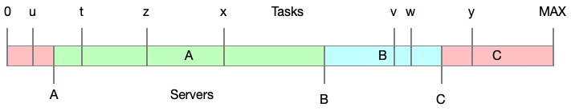
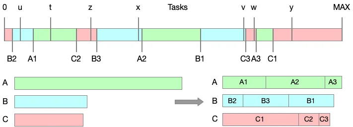

Cloudflare ha vuelto a liberar 100 TB de RAM en su infraestructura, y esta vez el ahorro no vino de cambiar qué guarda en caché, sino de revisar cómo decide en qué máquina hacerlo. La compañía redujo de 100.000 a 10.000 las entradas de su mapa de hashes por equipo tras comprobar que el resto apenas aportaba nada al reparto de carga. El ajuste se apoya en Pingora, su framework de código abierto, y en el algoritmo Ketama, según recoge Tom's Hardware.

No es la primera vez que la empresa recorta memoria a gran escala: hace unos meses logró un ahorro similar al encoger las entradas de la caché DNS de su resolutor 1.1.1.1. Ahora el ahorro llega por la vía del software, sin tocar el hardware.

## Cómo Cloudflare reparte una URL entre miles de servidores

Una de las líneas de negocio principales de Cloudflare es la caché: servir una URL desde memoria o disco en lugar de ir a buscarla al sitio de origen, una operación que puede tardar bastante. Para lograrlo, cada petición debe dirigirse a uno de sus servidores de caché, una tarea que la compañía llama enrutamiento de backend y que, a su escala, obliga a mantener en memoria tablas enormes.

El primer enfoque, asignar cada URL a un servidor de forma secuencial, falla enseguida porque dos peticiones de la misma URL acaban en máquinas distintas. La solución pasa por calcular también un hash del servidor —a partir de su dirección IP y su nombre— y emparejar ambos valores por proximidad numérica.

El reparto funciona, pero aparece un segundo problema: si uno de cuatro servidores cae, las peticiones que atendía se reasignan al más cercano en el mapa, que queda sobrecargado mientras los otros dos siguen casi ociosos. La respuesta habitual es generar muchas entradas por servidor y mezclarlas de forma aleatoria, de modo que una caída reparta la carga entre los supervivientes.

Ese truco tiene un coste: cuantas más entradas y más reglas de peso —para que los servidores más grandes atiendan más peticiones— junto con las restricciones de contenido y de región arquitectónica, más memoria se necesita. En total, Cloudflare llegó a operar con hasta 100.000 hashes de servidor por máquina.

## Por qué Cloudflare se quedó con 10.000 hashes

Tras aplicar álgebra y estadística básica, los ingenieros concluyeron que esas 100.000 entradas estaban muy por encima del punto en el que el esfuerzo deja de compensar. Sus cálculos indicaron que una décima parte, es decir 10.000 entradas, bastaba para obtener prácticamente los mismos resultados: la tasa de error apenas mejoraba al seguir subiendo por encima de esa cifra. La propia gráfica que acompaña este artículo muestra esa curva: el error cae con fuerza al principio y se aplana a partir de las 10.000 entradas por servidor.

A ese recorte se sumó un ajuste fino en las estructuras de datos de Rust, que ahorra dos bytes por entrada en el mapa de servidores. Parece irrelevante, pero multiplicado por miles de millones de registros se traduce en una cantidad de memoria considerable.

## Un cambio reversible para ahorrar RAM

Para no arriesgar el servicio, el equipo no sustituyó el algoritmo original: añadió esta "v2" como una ruta de código separada, de modo que puede volver atrás si algo se rompe. El resultado global de la operación ronda los 100 TB de RAM liberados.

## Qué significa para quien compra memoria

Este tipo de optimizaciones no llegan a las tiendas, pero sí importan al bolsillo. Menos memoria malgastada por servidor significa que un mismo parque de máquinas puede asumir más carga, lo que alivia en parte la presión sobre la demanda de DRAM que ha disparado los precios durante los últimos meses. No sustituye a las mejoras de hardware ni resuelve la escasez, pero recuerda que el software ineficiente también consume memoria: un paralelismo que ya se vio en el recorte de memoria de [DeepSeek V4.1 Flash](/noticias/deepseek-v4-1-flash-memory/).

Cloudflare demuestra que revisar una decisión de diseño aparentemente resuelta puede rendir más que añadir más silicio, siempre que existan datos para saber cuándo dejar de escalar.
