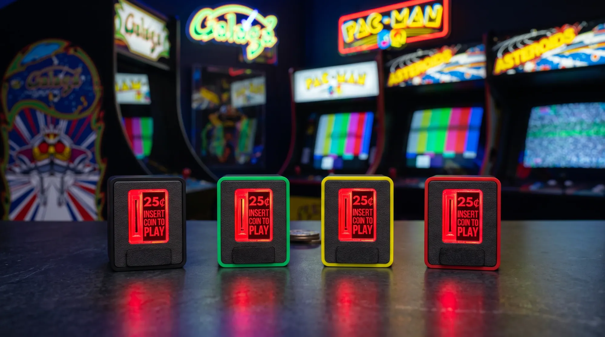
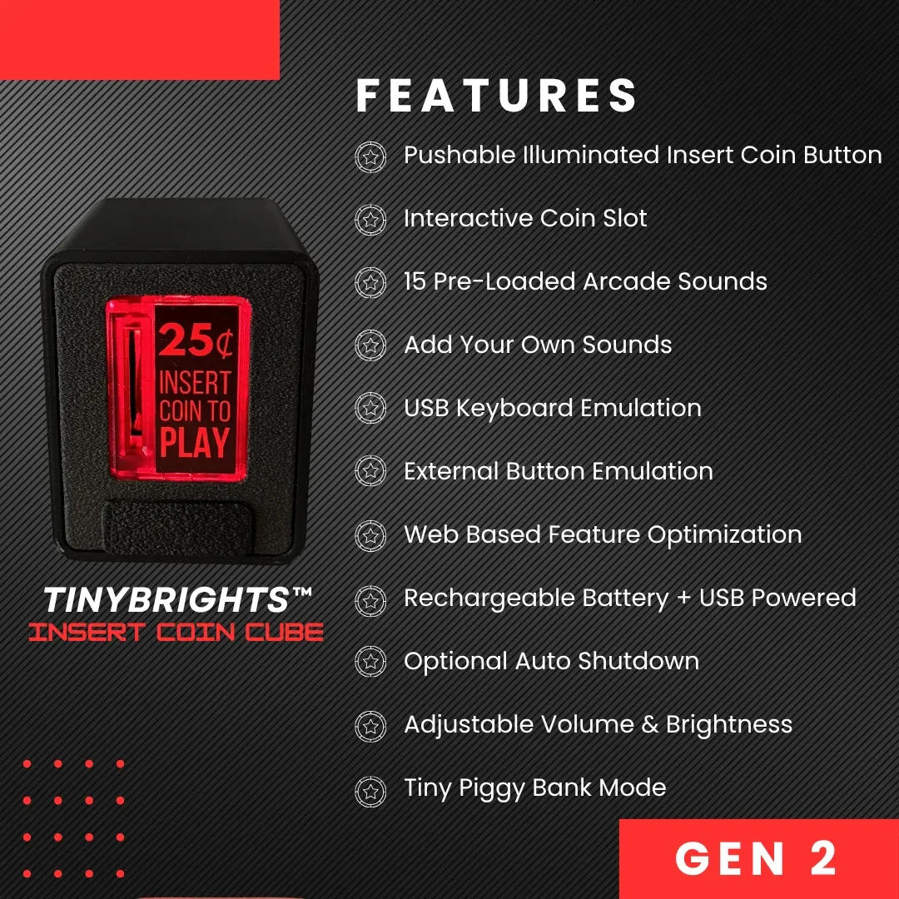

Chronic Concepts ha puesto a la venta el Insert Coin Cube de segunda generación, una ranura de monedas física que se conecta por USB al ordenador y añade un crédito en el emulador arcade cada vez que se introduce una moneda real. Según ha informado Retro Dodo, el accesorio reproduce el gesto clásico de las máquinas recreativas: insertar la moneda, escuchar el sonido metálico y empezar la partida.

## Cómo funciona el Insert Coin Cube: una moneda real, un crédito en el emulador

El cubo replica la ranura de las cabinas arcade clásicas y acepta monedas de 25 centavos estadounidenses (o la ficha incluida). Su cuerpo de plástico moldeado por inyección aloja hasta cinco monedas tras una puerta transparente que se ilumina al pulsar el botón de devolución.

La clave está en la conexión: el dispositivo se presenta ante el sistema como un teclado USB-HID, de modo que funciona con Linux, Windows, macOS, RetroPie y MAME sin controladores. Basta asignar su única señal a la tecla de crédito del emulador para que cada moneda insertada equivalga a pulsar «insert coin», igual que en la sala de juegos. Las monedas pueden recuperarse por la trampilla frontal o quedarse dentro, a modo de hucha.

## Sonido, aplicación web y batería personalizables

El cubo integra un altavoz interno con 15 efectos de sonido seleccionables para el momento de la inserción, y permite cargar sonidos propios desde su aplicación web de configuración. Esa misma página, una web estática que puede descargarse para usarse sin conexión, sirve para ajustar el volumen y el brillo, gestionar la biblioteca de sonidos y afinar la emulación de teclado.

Para preservar la batería, la aplicación ofrece apagado automático y activación al insertar una moneda, de forma que el accesorio solo consume cuando se usa.

## Precio, colores y disponibilidad

El Insert Coin Cube de segunda generación, con carcasa de mayor calidad y nuevos colores (cuatro acabados), cuesta 29,99 dólares en la tienda oficial de Chronic Concepts y ya está a la venta. El fabricante prevé lanzar en octubre un soporte de montaje y un arnés de cableado para integrarlo en cabinas arcade completas.

Para quien ya juegue en recreativas emuladas, el contexto acompaña: el ecosistema arcade en emulación sigue muy vivo, desde [las mejoras de NetPlay con rollback en el emulador MAME para Android](/noticias/mame4droid-mame-0-289/) hasta los accesorios que recuperan la experiencia física de los salones. Este cubo no mejora los juegos, pero devuelve algo que el teclado nunca tuvo: el ritual de pagar por jugar.
