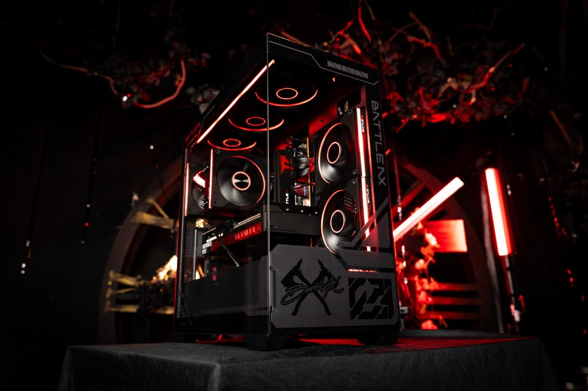
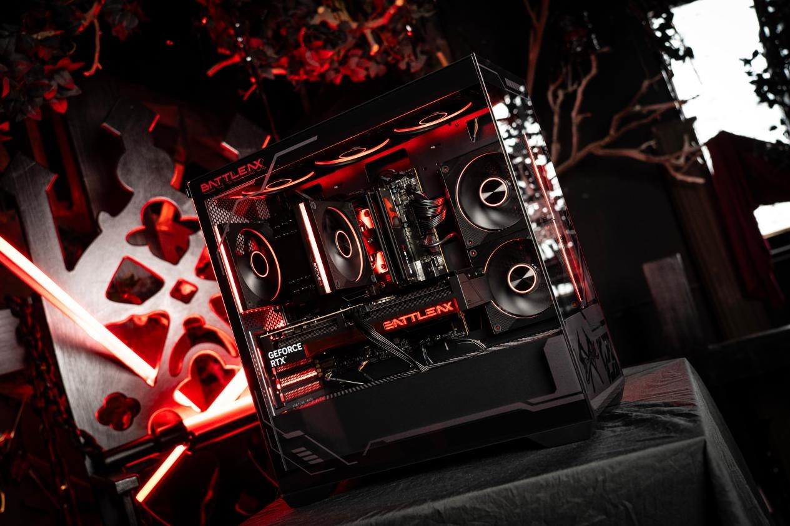
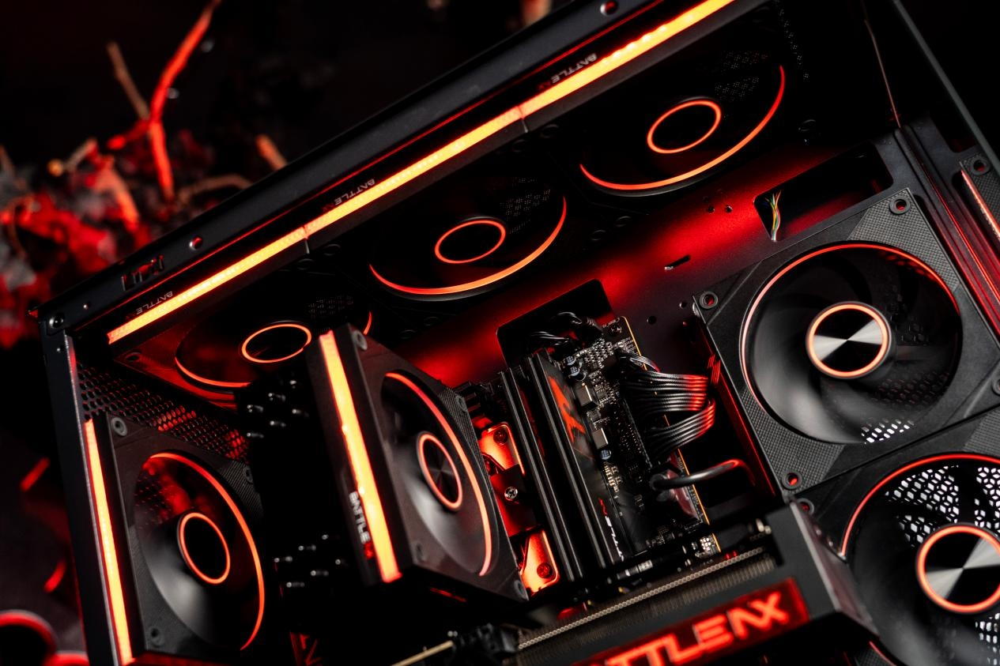
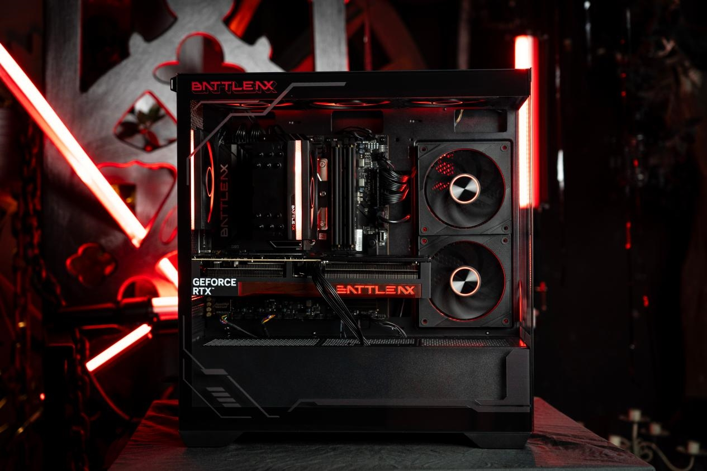

Colorful ha puesto a la venta su nueva caja Battle Axe BA26M-G Black Blade junto a dos ventiladores Battle Axe Black Blade SE, una apuesta con la que la marca amplía su familia Battle Axe al terreno de las torres. El conjunto, orientado a montajes convencionales, combina un diseño panorámico sin pilar con una capacidad pensada para configuraciones exigentes, según informa MyDrivers.

## Diseño panorámico con estética Battle Axe

La torre apuesta por un acabado completamente negro con laterales acristalados y estructura sin pilar delantero, el formato conocido como panorámico, que deja el interior a la vista. La parte superior incorpora una rejilla magnética contra el polvo y varios puntos del chasis llevan impresos motivos de la serie Battle Axe con acabado ultravioleta.

## La caja Battle Axe Black Blade admite gráficas de 390 mm y placas micro-ATX

En compatibilidad, la Battle Axe Black Blade acepta tarjetas gráficas de hasta 390 mm de longitud, de modo que los modelos insignia de gran tamaño tienen cabida sin ajustes forzados. Ofrece cinco ranuras PCIe, admite placas base micro-ATX y mini-ITX, y es compatible con fuentes de alimentación de hasta 220 mm. El panel frontal de conexiones incluye un puerto USB 3.0 y dos puertos USB 2.0 para periféricos habituales.

## Refrigeración: hasta nueve ventiladores y radiador de 360 mm

El apartado térmico es uno de los puntos centrales del lanzamiento. La caja permite instalar hasta nueve ventiladores repartidos entre la parte superior, la trasera, la zona de la placa base y la base, formando un canal de aire vertical que recorre todo el interior. En el techo admite además un radiador de 360 mm para refrigeración líquida.

Los ventiladores Battle Axe Black Blade SE que acompañan al lanzamiento se ofrecen en versiones de aspas normales e invertidas para adaptarse a cada posición del montaje. Cada unidad integra 40 diodos LED ARGB, una etiqueta central con textura de disco compacto que refleja la luz al girar, almohadillas antivibración en las esquinas y conectores encadenables que simplifican el cableado. Es un enfoque parecido al de otras torres recientes que combinan cristal panorámico y ventiladores a juego, como [la caja Cronox ARGB de ASUS ROG con sus Eurux GR120](/noticias/asus-rog-cronox-eurux/).

## Un ecosistema Battle Axe cada vez más completo

Con esta caja y sus ventiladores, Colorful completa un ecosistema Battle Axe que ya incluía tarjetas gráficas de la serie RTX 50 y placas base, de modo que los aficionados a la marca pueden montar un equipo con una estética unificada. La compañía no ha detallado por el momento el precio ni la disponibilidad fuera del mercado chino, por lo que habrá que esperar para saber cuándo llegará a las tiendas europeas.

