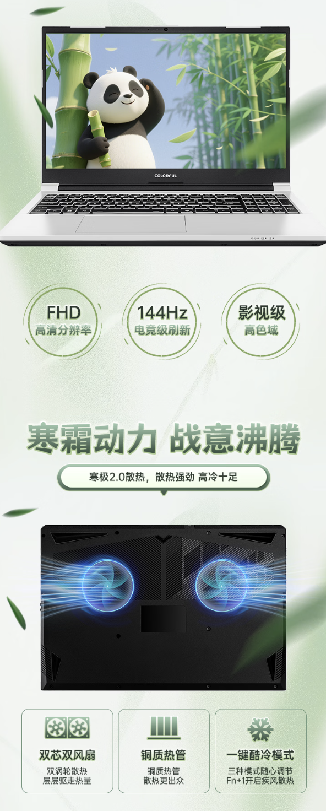
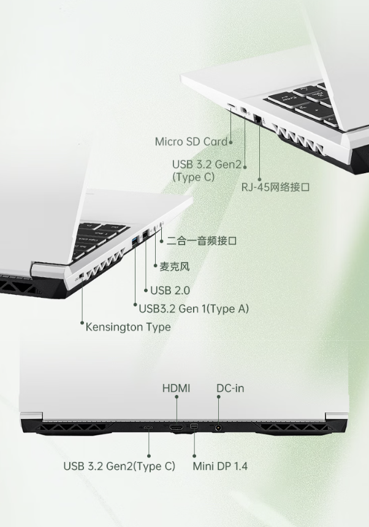

Colorful ha sacado al mercado una nueva variante de su portátil gaming Inheritance P15 (隐星 P15): la edición «Panda», un equipo de dos tonos que se estrena en China con una configuración encabezada por la gráfica RTX 3050 de portátil, 16 GB de memoria y un SSD de 512 GB. El precio de lanzamiento es de 6.299 yuanes, unos 820 € al cambio.

## El Inheritance P15 «Panda» cambia de acabado, no de esencia

El apodo de la edición viene de su reparto de colores: las caras A, C y D del chasis —tapa superior, zona de teclado y fondo— se entregan en plata, mientras que el marco de la pantalla (cara B) es negro. Ese contraste, más el fondo de bambú del material promocional, es lo que da nombre a la variante.

El resto del planteamiento es el del P15 de siempre: panel IPS de 1920 × 1080 píxeles con refresco de 144 Hz —de 15,6 pulgadas según el póster de Colorful— y teclado completo con retroiluminación de varios colores. El material del fabricante también destaca la refrigeración de doble ventilador con tubos de cobre y un modo de enfriamiento rápido activable con `Fn + 1`.

## Ficha técnica: Core i5-13420H, 16 GB y RTX 3050

Lo que define a este SKU es la combinación de componentes, y ITHome la describe como una especificación «de estilo retro»:

| Componente | Detalle |
| --- | --- |
| Procesador | Intel Core i5-13420H (8 núcleos / 12 hilos) |
| Memoria | 16 GB DDR4-3200 MHz |
| Almacenamiento | SSD M.2 PCIe 3.0 de 512 GB |
| Gráfica | NVIDIA GeForce RTX 3050 Laptop, con DLSS |
| Pantalla | 15,6", IPS 1920 × 1080 a 144 Hz |
| Refrigeración | Doble ventilador |
| Conectividad | Wi-Fi 6 |

En cuanto a la conectividad, el borde izquierdo concentra un USB-C 3.2 Gen 2, la entrada de red RJ45 y lector de tarjetas MicroSD; el derecho lleva un USB-A 3.2 Gen 1, un USB-A 2.0 y dos tomas de 3,5 mm. El diagrama de puertos del fabricante muestra además en el borde trasero el HDMI, el Mini DisplayPort 1.4 y la entrada de corriente.

## Un precio de lanzamiento válido solo en China

El equipo se vende a **6.299 yuanes** (unos 820 € al cambio, con el euro a 7,66 CNY según el tipo de referencia del Banco Central Europeo del 28 de septiembre de 2026). En algunas regiones de China, ITHome señala que la subvención estatal a la compra de electrónica (国补) baja la cifra hasta los **5.354,15 yuanes**, en torno a 700 €. Son cifras orientativas: el tipo de cambio cambia a diario y el precio incluye las condiciones del mercado chino, no un PVP europeo.

¿Qué implica para quien lo valora? A este presupuesto, la RTX 3050 de portátil y la memoria DDR4 son componentes de generaciones anteriores: rinden para juego casual y ofimática, pero sitúan al P15 en la entrada de gama frente a equipos con gráficas de la serie RTX 5000. La compensación es justo el precio, y eso solo se aplica en China: la nota de ITHome no menciona disponibilidad fuera de ese mercado.

Quien siga el segmento de portátiles baratos en yuanes puede comparar con el [WIKO Hi MateBook 14 edición Core](/noticias/wiko-hi-matebook-14/), presentado también hoy a 8.199 yuanes, o revisar la [caja Battle Axe Black Blade de Colorful](/noticias/colorful-caja-390mm-9-ventiladores/), otro lanzamiento de la misma marca esta misma semana.
