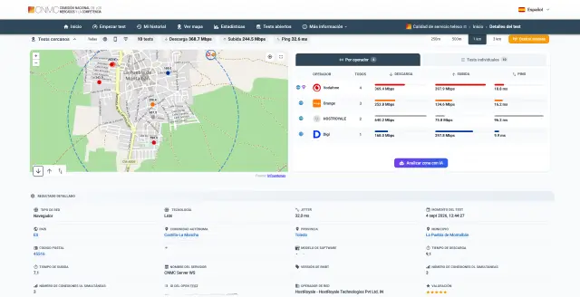
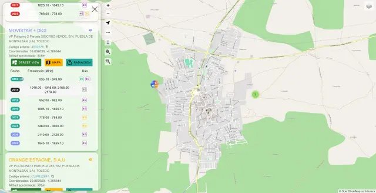
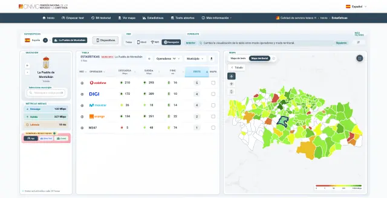

Cuando llamas para darte de baja, es habitual que la operadora te ofrezca al momento un paquete de fibra o de conexión móvil con velocidades más altas, incluso de fibra de 1 Gb, para retenerte. Lo mismo ocurre si has decidido cambiar de proveedor de servicios de internet (ISP): la oferta puede mejorar sobre el papel, pero no siempre se traduce en la velocidad que vas a recibir en casa.

Esta guía sirve para responder a una pregunta concreta antes de firmar o de aceptar una contraoferta: ¿puede esta compañía darme de verdad lo que promete en mi zona? La respuesta no depende solo de la publicidad, sino de la cobertura real y de los datos que ya han medido otros usuarios. La herramienta que reúne esa información es el test de velocidad de la Comisión Nacional de los Mercados y la Competencia (CNMC).

## Requisitos previos

- Un dispositivo con conexión a internet: un ordenador con red fija o un móvil con tarjeta SIM de datos.
- Si vas a probar desde el móvil, puedes descargar la aplicación de la CNMC para **iOS** y **Android**. También puedes hacer el test desde el navegador sin instalar nada.
- El acceso directo al test: [calidadtelecos.cnmc.gob.es](https://calidadtelecos.cnmc.gob.es/). No hace falta introducir tu ubicación para empezar.

## Paso 1: entra en el test de velocidad de la CNMC

El test de Ookla (Speedtest) es el más conocido, pero solo muestra la velocidad de bajada, la de subida y la latencia. El de la CNMC aporta bastante más información en la misma pantalla, así que conviene usarlo como referencia.

Abre el enlace [calidadtelecos.cnmc.gob.es](https://calidadtelecos.cnmc.gob.es/) desde el equipo que quieras medir. Si lo haces desde el móvil y prefieres una app, instala la de la CNMC para iOS o Android.

## Paso 2: ejecuta el test y lee los resultados

Lanza la prueba desde la página. Cuando termine, verás:

- La **velocidad de descarga** y la de **subida**.
- El **ping** medido en milisegundos.
- El **número de tests** realizados en tu localidad.

Esos tres datos ya indican si la conexión se acerca a lo que te prometen. Un test aislado no basta: interesa comparar con las mediciones de otros usuarios de tu zona, que aparecen en la propia herramienta.

## Paso 3: consulta el mapa de antenas

Una de las partes más útiles es el **mapa de antenas**. En él puedes ver la ubicación exacta de cada antena de tu localidad, su cercanía, su nivel de saturación y la fecha en que se instaló. Ese detalle permite comprobar si la operadora que te hace la oferta tiene infraestructura propia cerca de ti o si depende de la red de otra compañía.

Para afinar más, puedes complementar el mapa de la CNMC con el de [antenasmoviles.es](https://antenasmoviles.es). Esa página añade datos como el **código de antena**, la **altitud aproximada** y hasta los **niveles de radiación**.

Las principales operadoras en la actualidad —Movistar, Digi, Orange y Vodafone— cuentan con antenas propias, así que este mapa sirve para contrastar afirmaciones como que una compañía no puede dar un servicio de calidad por no tener red propia.

## Paso 4: lee el informe generado con inteligencia artificial

Al terminar el test, la herramienta ofrece un **informe elaborado con inteligencia artificial** que valora si tu conexión es óptima en comparación con las pruebas de los demás operadores. Ahí es donde se ve si tu velocidad está por debajo, a la par o por encima de lo que consiguen otros usuarios en condiciones similares.

Conviene fijarse también en el **proveedor** que aparece en el resultado. Debería ser tu operadora si no usas ninguna herramienta de enmascaramiento. Si empleas una VPN, el sistema puede identificar al proveedor de esa VPN en lugar de a tu compañía real, aunque la conexión siga siendo la tuya.

## Paso 5: revisa las estadísticas de tu localidad

La misma página incluye **estadísticas por municipio**. En ellas se consultan las velocidades según el tipo de conexión —WiFi, móvil, fijo inalámbrico y otras— y las valoraciones que cada usuario ha dado a su test.

La cantidad de datos disponible depende del tamaño de la localidad: en municipios pequeños verás pocas pruebas, mientras que en ciudades grandes y áreas metropolitanas hay muchas más, con lo que las medias resultan más fiables. La herramienta también da acceso a un mapa general y a estadísticas de toda España, algo útil si viajas y quieres saber si una mala conexión se debe a tu dispositivo o a tu proveedor.

## Cómo verificar que funcionó

- El resultado del test debe devolverte una cifra de descarga, otra de subida y un ping. Si el test se completa, ya tienes una medida objetiva de tu conexión.
- En el mapa de antenas debe aparecer, junto a tu localidad, la red que corresponde a tu operadora con su nivel de saturación y su fecha de instalación.
- El proveedor que figura en el informe debe coincidir con tu compañía. Si no es así, revisa si tienes una VPN activa antes de sacar conclusiones.

## Limitaciones y advertencias

- En localidades pequeñas hay menos tests registrados, así que las conclusiones sobre la velocidad media de la zona son menos representativas.
- Una VPN u otro servicio de enmascaramiento puede hacer que el informe atribuya tu conexión a otro proveedor. En ese caso, el dato de velocidad sigue siendo válido, pero el de operador no.
- Si tienes una página web o un blog, puedes integrar el widget del test de velocidad de la CNMC para que tus visitantes lo hagan desde ahí mismo.
- Ante cualquier incidencia que gestiones por teléfono, conviene **grabar las llamadas** y **pedir el número de incidencia** que crea la compañía. Es un dato obligatorio que necesitarás si luego reclamas ante la oficina del consumidor o ante una asociación como la Organización de Consumidores y Usuarios (OCU).
- Si el servicio técnico te pide hacer un test de velocidad, siempre puedes elegir el de la CNMC aunque te propongan otro: es uno de los más completos del mercado y tienes derecho a utilizarlo como referencia.
