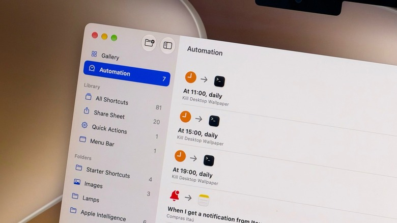

Shortcuts acompaña a macOS desde Monterey y, aun así, sigue siendo una de esas
aplicaciones que mucha gente nunca llega a abrir. Al abrirla da la impresión de ser
complicada: hay que elegir las acciones adecuadas, encadenarlas y esperar a que el
conjunto funcione. Con macOS 27 Golden Gate la barrera de entrada baja: la función
**Describe a Shortcut** permite escribir lo que se necesita y dejar que la app monte
el atajo con ayuda de inteligencia artificial. No siempre acierta a la primera, pero
vuelve el uso mucho más accesible para quien no quiere aprender a programar.

Esta guía explica paso a paso cómo crear shortcuts en un MacBook, cómo ponerlos al
alcance de la mano y qué hace falta para que la parte con IA funcione.

## Qué es Shortcuts y para qué sirve

Shortcuts es una herramienta de automatización: se construyen secuencias —llamadas
*shortcuts*— que ejecutan tareas en los dispositivos del usuario. El ejemplo que usa
Apple es un atajo que, al salir del trabajo, envía a la pareja un mensaje con la hora
estimada de llegada según el tráfico. Hay versiones mucho más elaboradas, como un
shortcut que revisa el calendario y el tiempo para resumir qué espera el día.

El valor está en las tareas que casi nadie recuerda a hacer. Casi nadie ordena su
carpeta de descargas hasta que necesita espacio, por ejemplo, y ahí es donde un
shortcut cumple su función.

## Requisitos previos

- Un Mac con la aplicación **Shortcuts** instalada: viene integrada en macOS.
- **macOS 27 Golden Gate** para usar *Describe a Shortcut*, la creación de atajos a
  partir de una instrucción escrita, que es la novedad de esta versión.
- Un Mac con chip **Apple M1 o posterior** si vas a usar Apple Intelligence dentro de
  Shortcuts y Siri AI. Los Mac con procesador Intel quedan fuera.

## Pasos

### Paso 1: describe el shortcut que quieres crear

1. Abre la aplicación **Shortcuts** en tu Mac.
2. Pulsa el botón **+** para entrar en el campo de instrucción.
3. Escribe qué debe hacer el shortcut con el máximo detalle posible. Cuanta más
   concreción, más probable es que la app acierte.

La instrucción importa más que la redacción. «Clean up my Downloads» («ordena mi
carpeta de descargas») es demasiado vaga: la app no sabe qué consideras orden. Mejor
algo del tipo: «Cada viernes, mueve a la carpeta *Archive* todo lo que haya en mi
carpeta de descargas con más de 30 días».

También funciona para resumir texto con Apple Intelligence. Un instructivo como
«toma el texto de mi portapapeles, resúmelo en tres frases y guárdalo en una nota
nueva» basta para que la app monte la secuencia.

### Paso 2: revisa el resultado y afina la instrucción

El resultado se comprueba en el momento. Si el shortcut ordena la carpeta de
descargas, abre la carpeta y mira qué se ha movido. La carpeta de descargas es un buen
primer caso precisamente porque el resultado es visible de un vistazo.

Si la app se ha pasado y ha movido demasiado, vuelve a escribir la instrucción con
detalles aún más concretos en lugar de dar el shortcut por bueno.

### Paso 3: pon el shortcut al alcance de la mano

Un atajo que no forma parte de la rutina se olvida. Hay dos vías para evitarlo:

1. Selecciona el shortcut y pulsa **Edit**.
2. Entra en el menú **Shortcut Details** (el que lleva el icono de información).
3. Elige **Add Keyboard Shortcut** para asignarle una combinación de teclado.

Para fijarlo en el **Control Center** (Centro de control) o en la barra de menús:

1. Abre el **Control Center** de tu Mac (arriba a la derecha).
2. Selecciona **Edit Controls**.
3. Añade la acción desde la aplicación Shortcuts.

Explorar también la pestaña **Automation** merece la pena: permite encadenar shortcuts
que se ejecutan solos cuando hacen falta, sin abrir la app.

### Paso 4: ejecuta shortcuts con Visual Intelligence y Siri

macOS 27 incluye además Visual Intelligence con su propia combinación de teclado:
**Shift + Command + Space**. Tras pulsarla, selecciona una ventana en pantalla y pide
a Siri que responda preguntas sobre ella o que actúe, por ejemplo añadiendo un evento
al calendario. Un correo con una fecha en el interior es un buen caso de prueba.

Siri también puede lanzar tus shortcuts por voz. Para controlar qué asistente tienes
activo, en este portal ya explicamos [cómo activar Siri AI o volver a Siri Classic en
iOS 27](/noticias/siri-ai-ios-27/).

## Cómo verificar que funcionó

- Si el shortcut ordena archivos, abre la carpeta afectada y comprueba qué se ha
  movido: es la comprobación más directa.
- Si resume texto, copia un artículo o un correo largo, ejecuta el shortcut y abre
  **Notas** para ver la versión corta.
- Si asignaste una combinación de teclado, pulsa la tecla y comprueba que el shortcut
  se ejecuta sin necesidad de abrir la aplicación.

## Advertencias y limitaciones

- **La IA no siempre acierta.** Describe a Shortcut facilita mucho el uso de la app,
  pero el resultado conviene revisarlo siempre antes de darlo por bueno.
- **Apple Intelligence es obligatoria** para las funciones con IA de Shortcuts y para
  Siri AI: hace falta un Mac con chip M1 o posterior. Los Mac con Intel se quedan
  fuera, en línea con lo que ya contamos sobre [el fin de la era de los Mac con Intel
  en macOS 27](/noticias/macos-27-removes-bootcamp-intel/).
- **Puede haber límites de uso** al emplear los modelos de inteligencia artificial de
  Apple dentro de Shortcuts: los instructivos más complejos podrían agotar ese límite
  antes.
