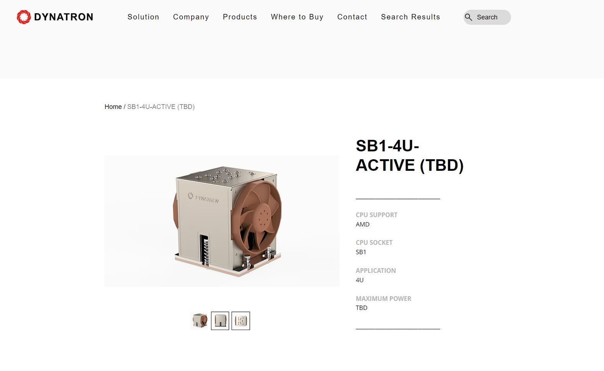

El socket que usarán los próximos procesadores AMD EPYC «Verano» podría llamarse SB1. La pista no viene de AMD, sino de un fabricante de refrigeración para servidores: Dynatron asegura en su web que sus soluciones de disipación dan soporte a «AMD EPYC Verano on Socket SB1». Conviene leerlo como un indicio, no como una confirmación: nace de un listado de producto y AMD todavía no ha desvelado qué zócalo empleará esta familia.

## El socket SB1, según el listado de Dynatron

Dynatron mantiene publicada una ficha para un disipador activo de 4U con la referencia «SB1-4U-ACTIVE (TBD)», donde ese «TBD» deja claro que el nombre definitivo sigue pendiente. En la página, la potencia máxima aparece también como TBD, y las medidas declaradas —128,05 × 106,6 × 130,7 mm— coinciden con las del modelo J26 de la propia marca para el socket SP7, así que es probable que sean valores provisionales heredados de otra ficha.

De la propia denominación se ha especulado con que la «B» de SB1 apunte a un encapsulado BGA soldado a la placa, pero es una lectura del nombre y no hay confirmación oficial al respecto.

## Qué se sabe de Verano

«Verano» es el nombre en clave del EPYC 9006 LP, un chip con microarquitectura Zen 6 que AMD presentó junto al resto de su sexta generación de EPYC. La compañía lo sitúa en hasta 72 núcleos, con frecuencias de boost de hasta 5 GHz y 24 canales de memoria LPDDR5X mediante módulos SOCAMM2 reemplazables. Su destino declarado son los racks de IA, como procesador anfitrión de clústeres de GPU, con lanzamiento previsto para la segunda mitad de 2027.

Los EPYC «Venice» de esa misma generación usan zócalos distintos: SP7, para configuraciones de hasta 256 núcleos, y SP8, hasta 128. Para Verano, AMD no ha revelado aún el nombre del socket.

## Qué implica al montar

Para quien monta, la lección vuelve a ser la de siempre en el segmento de servidor: el socket manda sobre todo lo demás. Un cambio de zócalo arrastra placa base, anclaje y disipador, y ninguna de esas piezas hereda compatibilidad del SP7 o el SP8. Un disipador activo de 4U, además, condiciona la altura y el flujo de aire dentro del chasis, así que en un rack no basta con que el procesador encaje: hay que validar el conjunto. Los EPYC de gama de entrada ya obligan a placas dedicadas, como se vio en [la ASRock Rack para EPYC 8005 Sorano](/noticias/asrock-rack-sorano-epyc-8005/). Hasta que AMD confirme el socket oficial, toma el SB1 como una pista de taller y no como una especificación de compra.
