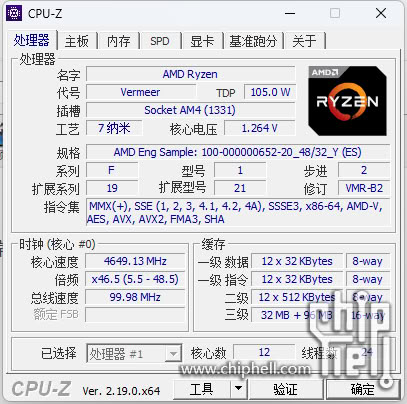
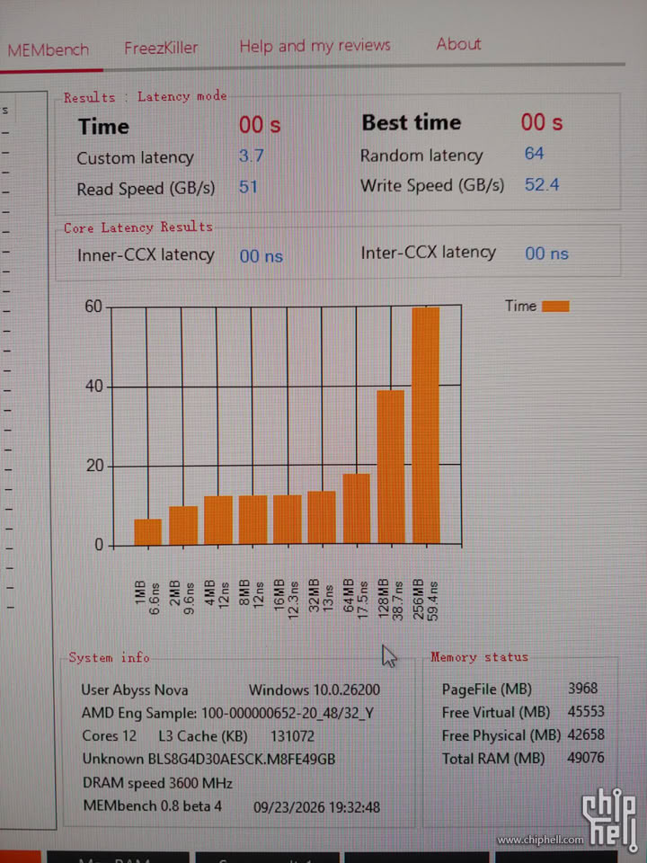
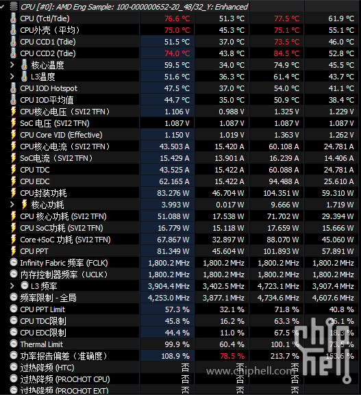

Un ejemplar de ingeniería del Ryzen 9 5900X3D, un procesador que AMD nunca llegó a poner a la venta, ha aparecido en el foro chino Chiphell. La pieza, con el código 100-000000652, es un chip Zen 3 de 12 núcleos y 24 hilos que, según recoge TechPowerUp, reporta 128 MB de caché L3. Lo interesante no es solo la cifra, sino cómo se reparte.

## 96 + 32: la caché del 5900X3D vive en un solo CCD

De esos 128 MB, 96 MB corresponden a un CCD y 32 MB al otro. En la práctica, solo uno de los dos chiplets de seis núcleos lleva apilada la caché 3D V-Cache de 64 MB. Es una configuración distinta a la de los prototipos que AMD mostró a Gamers Nexus en 2023: aquellos 5900X3D y 5950X3D llevaban caché en ambos CCD, 192 MB en total.

La razón de quedarse con un solo apilado es la frecuencia. Según las capturas del propietario, el chip se mueve en torno a los 4,7 GHz con un TDP de 105 W, mientras que el 5900X3D de doble apilado se quedaba en 4,4 GHz de boost. Menos caché apilada a cambio de más reloj: la muestra de un solo apilado gana en frecuencia, pero se deja por el camino la mitad de la caché 3D del prototipo de doble CCD.

## Arrancarlo ya era un problema

No basta con tener la muestra. El ejemplar se niega a funcionar con las versiones de BIOS actuales y solo arrancó con una más antigua que incluía el firmware SMU 56.70.0. El dueño habría pedido a ASRock que añada soporte en una BIOS más reciente. Es el problema clásico de las muestras de ingeniería: el silicio existe, pero el firmware de la placa no lo conoce.

## Qué significa para quien tiene AM4

Conviene recordar que AMD nunca vendió un X3D de doble CCD en AM4. La familia arrancó con el Ryzen 7 5800X3D de ocho núcleos en 2022 y se quedó ahí. El enfoque de un solo CCD con caché es, en cambio, el que AMD sí llevó a sus Ryzen 9 X3D en AM5, antes de que el Ryzen 9 9950X3D2 Dual Edition volviera a apilar en ambos chiplets este año. AMD no ha confirmado nada sobre esta muestra.

Para quien monta sobre AM4, la lectura práctica no cambia: un 5900X3D así nunca llegó al catálogo y perseguir una muestra de ingeniería obliga a pelear con BIOS antiguas y placas concretas. Si el objetivo es jugar sin complicaciones, el 5800X3D sigue siendo la pieza sensata; si lo que priman son los hilos, el 5900X de serie cubre mejor. Y para ver cuánto ha avanzado la caché 3D en dos generaciones, [AMD elevó cerca de un 50 % el rendimiento de sus Ryzen X3D en dos años](/noticias/amd-ryzen-single-core-ipc-50/) es la referencia.
