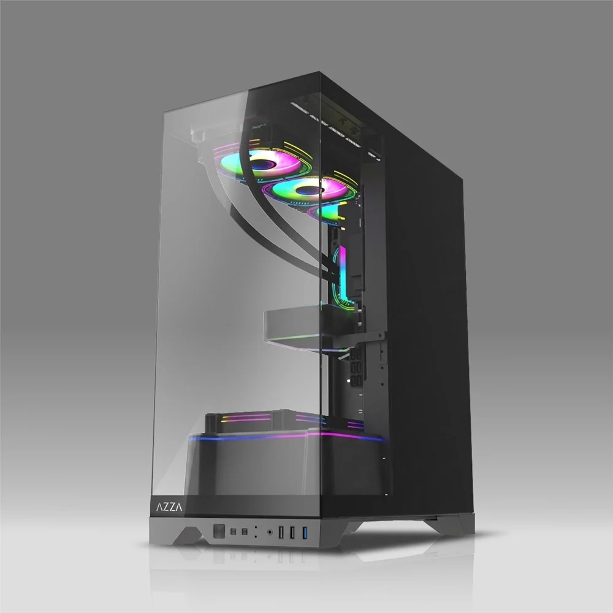

AZZA ha presentado la ABYSS, una caja de torre media en formato ATX que apuesta por el
cristal envolvente: tres de sus caras son paneles de vidrio, no solo la lateral de
siempre. El modelo llega en negro y blanco y está pensado, entre otras cosas, para
placas base con los conectores en la cara posterior, ese formato que deja el cableado
oculto por detrás del zócalo.

## Cristal por tres lados y placas con conectores traseros

El rasgo que define la ABYSS es su construcción envolvente. Frente a las cajas que
reservan el vidrio para un único lateral, aquí son tres las caras acristaladas, de modo
que el interior queda a la vista desde varios ángulos. La contrapartida es la de
siempre en este tipo de chasis: menos superficie metálica y más peso y fragilidad en el
transporte.

La compatibilidad con placas de conectores traseros es la otra baza del modelo. No se
trata de una mejora que el usuario pueda aprovechar con cualquier placa: hace falta una
base con los conectores montados en la cara posterior, y la ABYSS declara el soporte
para ese formato junto a las soluciones de cableado más convencionales.

## El interior de la ABYSS: GPU de 420 mm y disipador de 165 mm

Las medidas exteriores son 525×228×435 mm, con siete ranuras de expansión. En el papel,
la caja admite tarjetas gráficas de hasta 420 mm y disipadores de CPU de hasta 165 mm de
altura, con capacidad para siete ventiladores en total y espacio para un radiador de
360 mm en la parte superior. Para el almacenamiento reserva dos bahías de 3,5" y otras
dos de 2,5".

La cifra que conviene mirar dos veces antes de comprar es la de los 165 mm del
disipador. Deja margen para torres de aire grandes, como el
[Peerless Assassin 120H-A Dark de Thermalright](/noticias/componentes/thermalright-peerless-assassin-120h-a-dark/),
pero los modelos más altos del mercado entran justos o directamente no entran. La
longitud de 420 mm para la tarjeta gráfica, en cambio, cubre con holgura las GPU más
largas de gama alta.

## Ventilación y ARGB de serie

De fábrica, la ABYSS no sale vacía de ventiladores. En la base monta tres unidades
LFO-6512DR ARGB PWM de álabes invertidos junto a un filtro antipolvo de PVC, y en la
parte trasera instala un cuarto ventilador LFO-6512D ARGB PWM, en este caso de álabes
convencionales. La cubierta de la fuente añade una tira de iluminación ARGB, en línea
con el resto del conjunto.

El panel frontal de E/S ofrece un USB-C a 5 Gbps, otro USB-A también a 5 Gbps y un
tercer USB-A a 480 Mbps.

## Qué cambia para quien va a montarla

Para quien ya tenga en mente una placa con conectores traseros, la ABYSS entra en la
lista de candidatas: declara ese soporte y, además, resuelve de serie la iluminación y
parte del flujo de aire. Para el resto, el atractivo es el escaparate de cristal, no una
mejora térmica: tres caras acristaladas no refrigeran mejor que una chapa de acero, así
que conviene compensar con la disposición de los ventiladores y mantener limpio el
filtro inferior.

Antes de cerrar la compra, dos medidas mandan: la altura del disipador y la longitud de
la tarjeta gráfica. La caja deja 165 mm y 420 mm respectivamente, margen suficiente para
la mayoría de equipos, pero no para cualquier torre de aire.
