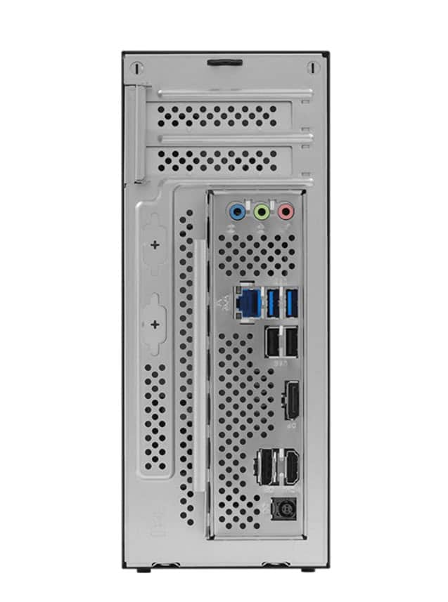

ASRock ha anunciado soporte oficial para las tarjetas gráficas profesionales Nvidia RTX PRO 4000 Blackwell SFF Edition y RTX PRO 2000 Blackwell en sus dos plataformas compactas, la DeskSlim X600 y la DeskSlim B760. La propuesta de la compañía es meter una GPU dedicada de gama profesional en un chasis de apenas 5 litros sin renunciar a la capacidad de ampliación de un equipo de sobremesa.

## Una ranura PCIe 5.0 x16 en 5 litros

El dato que decide el montaje es la ranura de expansión: ambas plataformas integran un slot PCIe 5.0 x16 preparado para tarjetas de bajo perfil y doble ranura de hasta 200 mm de longitud. Ese límite físico es el que marca qué GPU entra de verdad en la caja, porque las RTX PRO Blackwell en formato SFF encajan por diseño, pero cualquier otra solución tendrá que respetar altura y longitud.

Con esas medidas, ASRock orienta los DeskSlim a cargas de trabajo que hasta ahora pedían torres más grandes: inferencia de inteligencia artificial en local, creación de contenido, diseño CAD, modelado 3D y análisis de datos, además de productividad con varias pantallas.

## Dos plataformas DeskSlim: AM5 e Intel

La serie se divide en dos modelos según la plataforma de CPU, y aquí conviene mirar el consumo antes que la ficha de la caja:

- **DeskSlim X600:** socket AMD AM5, compatible con los procesadores Ryzen 7000, 8000 y 9000, con un consumo de CPU de hasta 120 W.
- **DeskSlim B760:** pensado para Intel Core de 12.ª, 13.ª y 14.ª generación, con chips de hasta 125 W.

Ambos comparten la misma base de memoria y almacenamiento: cuatro ranuras DDR5 UDIMM con hasta 256 GB de RAM, dos ranuras M.2 para SSD y dos puertos SATA adicionales. En un formato tan ajustado, esa combinación es la que permite montar un equipo de trabajo con margen para proyectos exigentes.

## Qué cambia para quien va a montar

La llegada de la arquitectura Blackwell de Nvidia en formato SFF deja a los DeskSlim como una vía para tener una estación de trabajo pequeña y silenciosa sin ceder en aceleración gráfica, en la línea de otras propuestas compactas como la [estación Minisforum MS-S1 MAX-P495](/noticias/componentes/minisforum-ryzen-ai-max-495-workstation/). Antes de comprar la tarjeta, conviene comprobar dos cosas: que sea una RTX PRO Blackwell SFF y que su longitud no pase de los 200 mm, porque es el margen real que da el chasis.

ASRock señala que la DeskSlim X600 y la DeskSlim B760 ya están disponibles a través de su red de distribución global.
