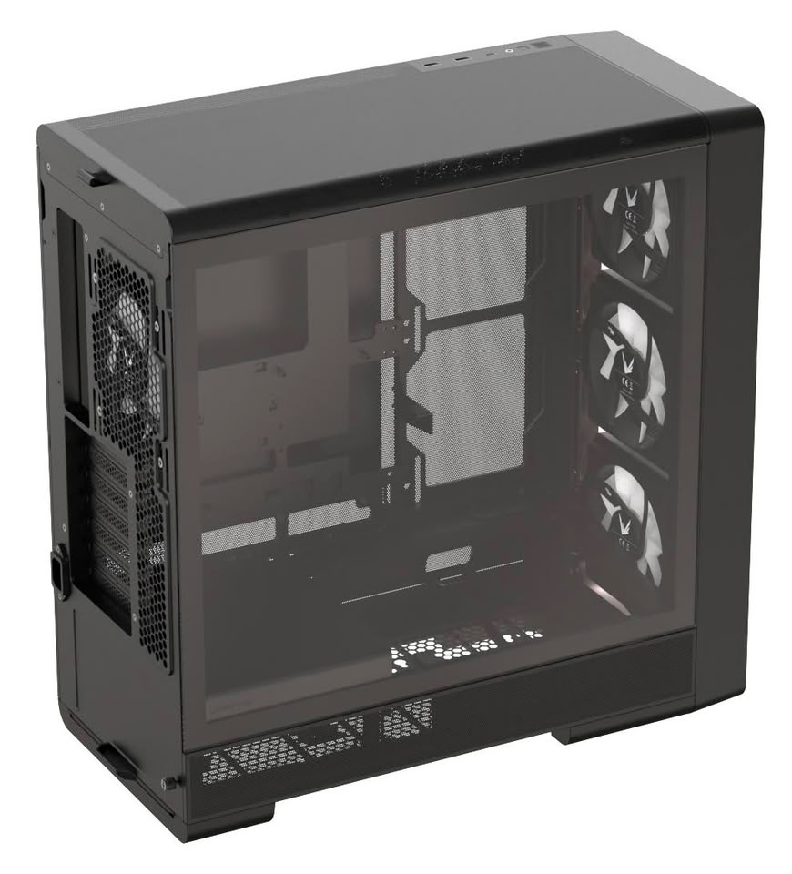
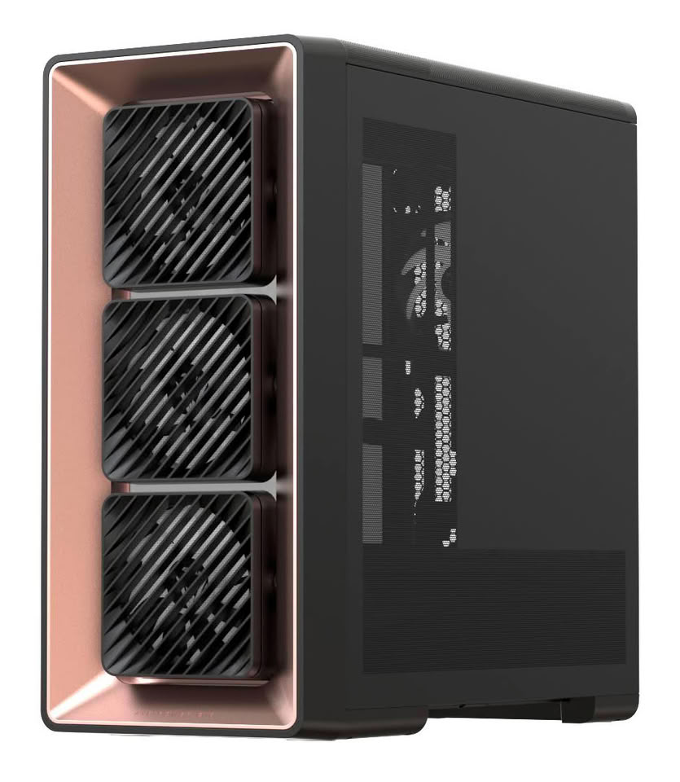

Formula V Line ha dado el salto al mercado estadounidense con la Air Power G10, una caja de tipo mid-tower ATX que ya se puede comprar a través de Newegg. La compañía la mostró por primera vez en Computex 2026 y ahora la pone a la venta con seis acabados distintos, partiendo de un precio de 89,99 dólares.

## Una entrada de aire orientable y una cámara inferior reconfigurable

En lugar de fijar los tres ventiladores frontales planos contra el chasis, la Air Power G10 monta cada uno sobre su propio soporte regulable. Cada ventilador se puede dejar a 0° o inclinarlo 10° de forma independiente, de modo que el aire de entrada apunte hacia la tarjeta gráfica o el procesador según convenga al montaje. Cada conjunto de ventilador también se puede retirar por separado para limpiarlo o sustituirlo sin desmontar el resto.

Ese ajuste por ventilador es lo que separa a esta caja de una torre con el frontal fijo: quien monte una GPU de gran formato puede dirigir el flujo hacia la zona de la tarjeta, y quien dé prioridad a la refrigeración del procesador puede apuntar los ventiladores hacia arriba.

En la cámara inferior, la fuente de alimentación y el soporte del ventilador inferior pueden intercambiar posiciones entre la parte delantera y la trasera. Así se puede reorganizar la zona baja del chasis para adaptarla al hardware y al flujo de aire que busque cada montaje. El soporte del ventilador inferior también es desmontable, lo que simplifica la instalación.

## Refrigeración de serie y espacio para el hardware

La G10 llega con cuatro ventiladores PA2 de 120 mm: tres frontales de entrada y uno trasero de extracción, todos con control PWM de 4 pines e iluminación ARGB de 3 pines. El chasis admite hasta once posiciones de 120 mm y, en la parte superior, radiadores de 240 mm o 360 mm. Para la tarjeta gráfica hay margen para modelos de hasta 420 mm de longitud, un dato que importa al planificar ensamblajes grandes. Si se van a poblar todas esas posiciones, conviene revisar antes [qué ventiladores de caja no controla de verdad la placa](/noticias/case-fans-wrong-headers/): el número de cabeceras reales pesa más que el recuento de la ficha.

## Precio y disponibilidad de la Air Power G10

La Air Power G10 se vende en seis acabados. Los Negro, Negro Oro Rosa y Negro Madera cuestan 89,99 dólares, mientras que los Blanco, Negro Titanio Plata y Negro Azul Oscuro suben a 99,99 dólares. Está disponible ya en Estados Unidos a través de Newegg, lo que marca la entrada de Formula V Line en el mercado estadounidense de componentes.

## Consejo de montaje

Al montar una caja como esta, conviene decidir la orientación de los frontales antes de pasar los cables: apuntar los tres ventiladores a la GPU mejora la refrigeración de la tarjeta, pero concentrar el flujo hacia el procesador deja menos aire directo a la gráfica. Antes de comprar, vale la pena comprobar la longitud de la GPU, la altura del disipador y la posición de la fuente en la cámara inferior; son las cotas que deciden si el ensamblaje entra sin sorpresas.
