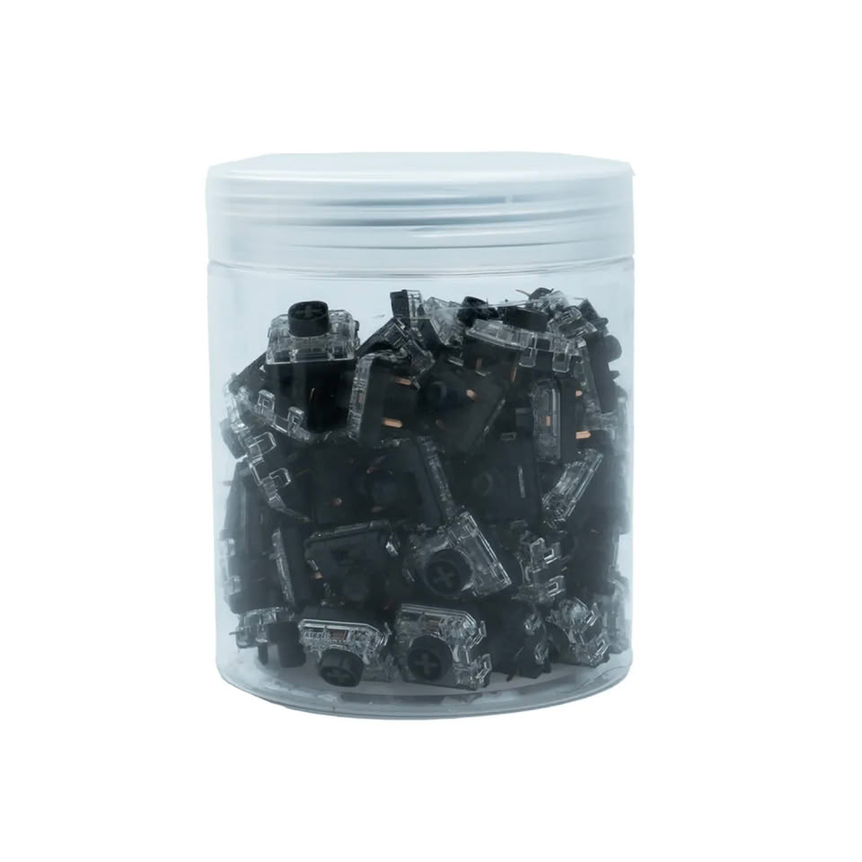

Gateron ha ampliado su familia Low Profile 3.0 con el Silent 3.0 Black, un interruptor lineal silencioso que conserva la disposición de 5 pines y el mismo zócalo que los Cherry MX convencionales. Para quien monta, ese detalle es el que decide: el fabricante puede ofrecer la misma carcasa en perfil bajo o en altura completa cambiando solo la placa, sin tocar el zócalo.

## Qué es el Silent 3.0 Black

Es un interruptor lineal pensado para entornos donde el ruido pesa y para quien trabaja de noche o comparte espacio. Gateron recurre a anillos de silicona en las piezas del vástago para amortiguar los sonidos de fondo y de retorno (bottom-out y top-out), la receta habitual en los diseños silenciosos.

La diferencia es que los anillos no recortan el recorrido: mantiene los 1,7 mm de actuación y los 3,4 mm de desplazamiento total de sus equivalentes no silenciosos. Es la variante más pesada de la familia silent 3.0, con 50 gf (±15 gf). El vástago es de POM, con carcasa inferior de nailon y superior de PC transparente, y sale lubricado de fábrica.

## Por qué importa para el montaje

La carcasa superior transparente deja pasar la retroiluminación, así que silenciar el teclado no obliga a renunciar a la iluminación de las teclas, algo que suele ser el precio a pagar cuando se busca bajar decibelios.

El punto que más pesa en una build es la compatibilidad. Al compartir la geometría de 5 pines con los zócalos Cherry MX, una misma carcasa puede venderse con teclas bajas o de altura completa cambiando únicamente la placa: no hace falta rediseñar el PCB ni el zócalo. Otros fabricantes también mueven ficha en el terreno de los interruptores, como muestra la actualización de los [Keychron K4 HE y K10 HE con interruptores magnéticos N-pole](/noticias/keychron-k4-k10-he/).

## Precio y compatibilidad

Gateron vende los Silent 3.0 Black directamente desde su web a 14 dólares por 35 interruptores y 44 dólares por 110 unidades. Llegan después de que el diseño Low Profile 3.0 haya aparecido en teclados de marcas como NuPhy y Chilkey.

A la hora de comprar, la comprobación que manda no es la del color ni la del tacto, sino la del zócalo: si la placa del teclado acepta interruptores Cherry MX de 5 pines, el Silent 3.0 Black es un recambio directo. Conviene confirmar ese dato antes de pedir el frasco de 110 unidades, porque un interruptor excelente en la ficha que no encaja en el zócalo no sirve de nada.

