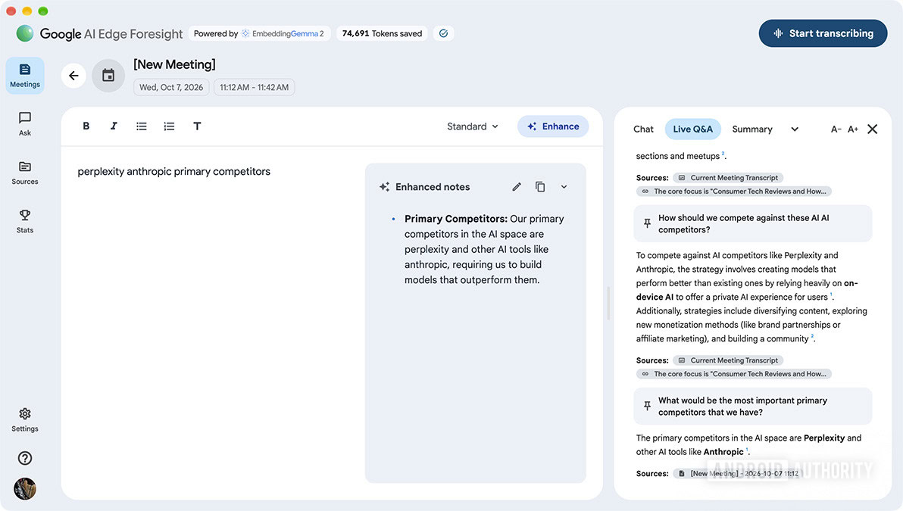
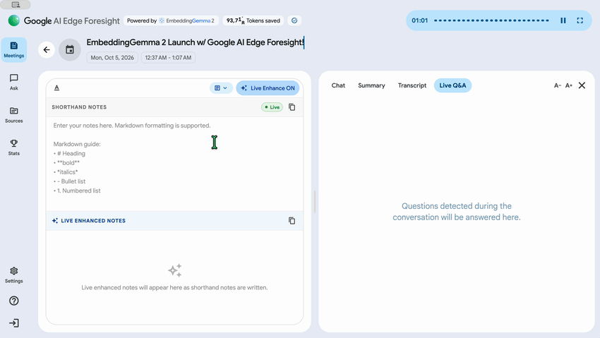

Google presentó **EmbeddingGemma 2**, un modelo multimodal pensado para ejecutarse en hardware de consumo, y lo acompañó de una aplicación para macOS llamada **AI Edge Foresight** que sirve de escaparate. La idea es sencilla de contar y complicada de ejecutar: tomar notas durante una reunión sin que el audio, la transcripción ni los documentos asociados salgan del equipo.

El modelo es lo que decide si la promesa se sostiene sobre la mesa de trabajo, y ahí los números importan tanto como la función.

## Qué exige EmbeddingGemma 2 del hardware

EmbeddingGemma 2 tiene **740 millones de parámetros**, se apoya en la arquitectura **Gemma 4** y se publica con licencia **Apache 2.0**. Google lo describe como un motor de decisión «de latencia ultrabaja» que busca en texto, imágenes, fotogramas de vídeo y audio dentro del propio dispositivo.

La cifra que interesa a quien mira la RAM antes que el escaparate: con cuantización, en un **Google Pixel 11 Pro** el modelo necesita **unos 191 MB de RAM activa** para los pesos de solo texto y **unos 567 MB** con la variante multimodal completa. No es una carga de trabajo que vaya a pelear por los recursos con el resto del sistema, y encaja con la idea de ejecutarlo en segundo plano mientras trabajas.

## Qué hace Foresight: de garabatos a notas, sin nube

AI Edge Foresight funciona durante videollamadas o reuniones presenciales: escucha en segundo plano para que tú te limites a anotar **viñetas taquigráficas** de lo que quieres recordar. La app, usando EmbeddingGemma 2, «enriquece esas notas abreviadas hasta convertirlas en apuntes pulidos» con la transcripción de la reunión, y lo hace al instante. Tanto la transcripción como el audio se procesan **íntegramente en el dispositivo**.

Hay más funciones además del resumen. Foresight puede apuntar a tus **carpetas de proyecto, materiales de referencia, diagramas y calendario**: admite archivos locales y Google Drive, de modo que puedes preguntarle por información concreta sin organizar antes los ficheros a mano. La app incorpora un **chat** con recuperación y resumen conversacional sobre tu conocimiento personal, y una función de **asistencia en vivo** que escucha y responde preguntas automáticamente.

Android Authority probó la aplicación simulando una reunión: según su experiencia, convirtió las viñetas en notas con rapidez y detectó preguntas para responderlas a partir de la transcripción.

## Dónde se ejecuta y con qué se queda

La app corre en **Apple Silicon** y se puede descargar gratis desde la página de Google AI Edge. La primera puesta en marcha exige descargar los modelos locales, un trámite que puede llevar un minuto antes de empezar a usarla. Foresight se suma así a las otras dos aplicaciones para Mac de la familia: **AI Edge Gallery** y **AI Edge Eloquent**, esta última centrada en transcripción sin conexión. En Android e iOS, las demos del modelo viven en Google AI Edge Gallery.

No es la primera vez que la familia Gemma aterriza en hardware de consumo: [ya vimos cómo una Intel Arc A750 reciclada movía Gemma-4-E4B como servidor local](/noticias/intel-arc-local-llm-server/), con la gráfica como único acelerador.

Para quien monta y exprime equipos, el detalle relevante no es la demo sino la **huella de memoria**: un modelo multimodal que se conforma con cientos de megabytes abre la puerta a funciones de este tipo en portátiles y mini-PC sin GPU dedicada. La letra pequeña, eso sí, es la de siempre: estos números son de Google y corresponden a un terminal concreto, así que el rendimiento real dependerá del chip, de la cuantización elegida y de cuánto quieras exprimir la parte multimodal.
