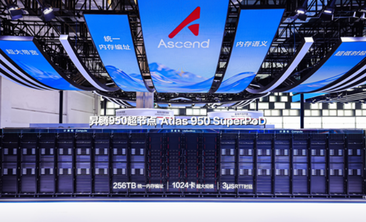

Huawei sostiene que su familia de aceleradores **Ascend** ya tiene en el mercado chino una cuota superior a la de **Nvidia**. La afirmación no viene de un informe de terceros, sino del propio fabricante: la formula el presidente rotatorio de Huawei, Xu Zhijun, en una sesión de preguntas y respuestas con periodistas que la compañía celebró durante el Huawei Connect del 17 de septiembre y que no publicó hasta el 5 de octubre.

Conviene leerla como lo que es, una declaración de parte. El propio Xu reconoció que reunir datos fiables sobre la cuota de Nvidia en China es difícil y que la cifra que maneja procede de las estadísticas de Huawei. Con esa cautela, el mensaje es claro: la compañía presenta el Ascend como el acelerador de referencia dentro de sus fronteras.

## Ascend por delante de Nvidia en China, según Huawei

En el mismo encuentro, Xu presentó el **supernodo Ascend 950** y su arquitectura de cómputo **Peerium**, la primera generación de producto basada en ella. La idea que resume el concepto es que un supernodo hace que miles —o decenas de miles— de procesadores trabajen «como un solo ordenador». Peerium abandona el tradicional esquema maestro-esclavo y conecta CPU, NPU, memoria, SSD, tarjetas de red y conmutadores en pie de igualdad, de modo que cómputo, almacenamiento y red se enlazan sin jerarquías.

Ese planteamiento apunta a los grandes entrenamientos de modelos de lenguaje, donde lo que se necesita no es una tarjeta rápida aislada, sino un bloque capaz de escalar sin perder cohesión. Es la misma lógica que Huawei ya había llevado al [Ascend 960, su supernodo reservado para el mercado chino](/noticias/huawei-ascend-960-superpod/).

## Sin capacidad para exportar: el Ascend 950 se queda en casa

A la pregunta de si la compañía piensa llevar el supernodo Ascend 950 fuera de China, Xu respondió que **no hay plan de expansión internacional plena**. El motivo no es estratégico, sino de capacidad: según el directivo, Huawei no tiene producción suficiente ni para cubrir la demanda doméstica. Reconoce que varios países muestran un interés fuerte, que la empresa hace pruebas y les entrega algunas unidades, pero en cantidades muy limitadas.

El dato que conviene retener es ese: el suministro interno se agota antes de abrir mercados. Para cualquiera que planifique un clúster de IA fuera de China, el Ascend 950 no es hoy una pieza que se pueda pedir con normalidad.

## Autosuficiencia: un camino que Huawei da por inevitable

Xu enmarcó todo lo anterior en la carrera china por la autosuficiencia en semiconductores. Su argumento es que un país de 1.400 millones de habitantes y potencia industrial no puede depender de que otros decidan si accede o no a determinados productos. Según él, la industria china tiene una fuerte sensación de urgencia y no aceptará esa dependencia.

El directivo admitió que la tecnología de chips china aún no está al nivel esperado, pero defendió que una **oferta suficiente y controlada** tiene un valor propio: permite trabajar sin la incertidumbre diaria del suministro. Su conclusión fue que el camino para el país, para la industria nacional y para Huawei pasa por la autosuficiencia completa de los chips y de toda la cadena de valor de los semiconductores, y que ese objetivo «tarde o temprano se hará realidad».

## Qué cambia para quien monta un sistema

Para quien especifica o monta un clúster de cómputo en España o el resto de Europa, la consecuencia práctica es sencilla: la disponibilidad manda sobre la ficha técnica. El Ascend 950 se queda, por ahora, dentro de China, así que las opciones reales de compra en el mercado local siguen pasando por Nvidia u otras alternativas occidentales.

Ninguna de las dos cosas está escrita en piedra. Si Huawei amplía capacidad, como sostiene que necesita, el mapa de proveedores de aceleradores para IA podría moverse; hasta entonces, trátese la cuota que la compañía se atribuye como un titular de mercado, no como una certeza verificada por terceros.
