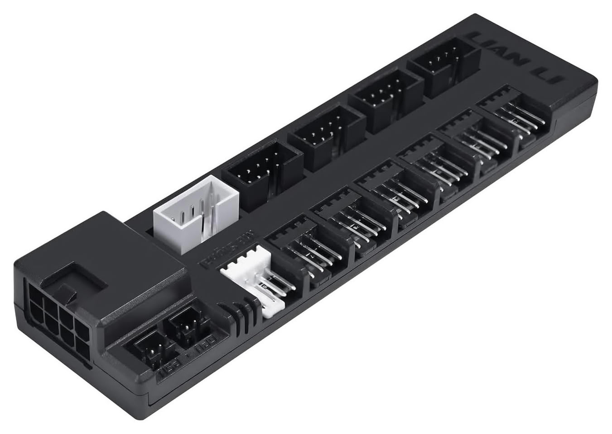
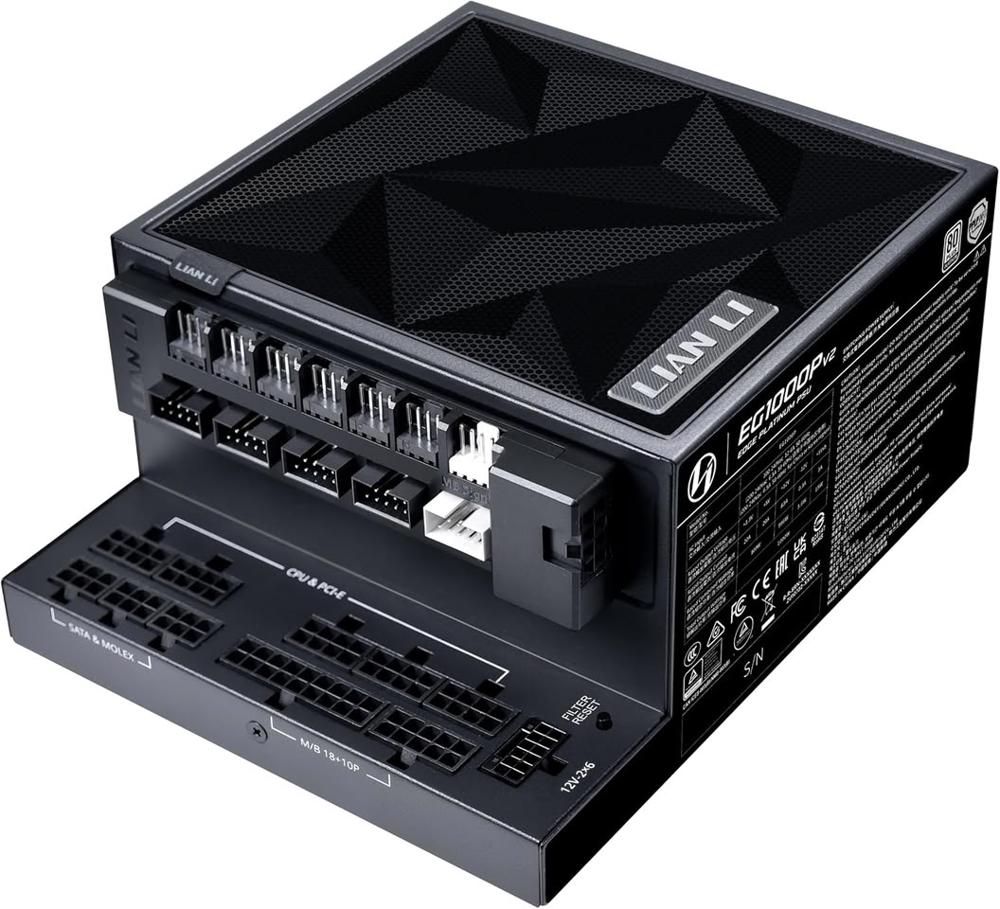
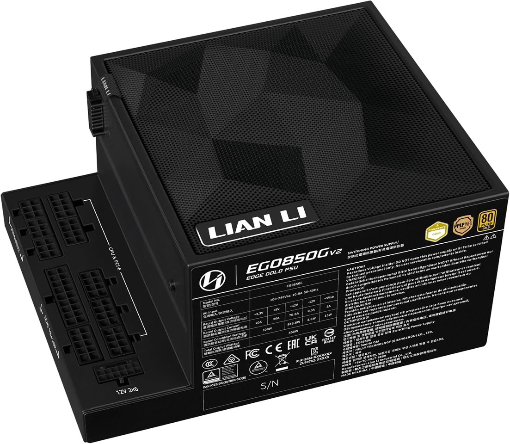

Lian Li ha ampliado su familia de fuentes Edge con las nuevas **Edge Platinum V2**, disponibles en 1350 W, 1200 W y 1000 W, y las **Edge Gold V2**, en 1000 W y 850 W. La compañía las acompaña de dos módulos de expansión, el **Edge Hub V2** y el **Edge Hub ADV**, que concentran puertos USB y canales PWM para ventiladores y, en el modelo superior, vigilan la temperatura del conector de alimentación de la GPU. Los datos provienen del comunicado del fabricante, recogido por TechPowerUp.

Al montar, lo que decide una fuente no es solo la potencia de la etiqueta, sino si entra en la caja y por dónde van a salir los cables. En esta gama, la respuesta es un formato en L.

## Un formato en L pensado para cajas de doble cámara

Las Edge V2 conservan el diseño en L de la serie: los conectores se reorientan hacia el exterior del chasis, de manera que los cables se resuelven en la cámara trasera y no cruzan la zona principal del equipo. Es un planteamiento dirigido a las cajas de doble cámara, donde el espacio junto a la placa y la GPU es el más disputado.

La geometría es idéntica en todos los vatios: 182 mm de fondo, 86 mm de ancho y 150 mm de alto, con el mismo anclaje. Eso simplifica el cálculo al comprar, ya que cambiar de modelo dentro de la gama no obliga a recolocar nada. Todas son totalmente modulares y cumplen con el estándar **ATX 3.1**.

## Edge Hub V2 y Edge Hub ADV: más USB y sensores térmicos

Los hubs amplían la conectividad interna más allá de lo que ofrece una placa base. El **Edge Hub V2** suma seis canales PWM de ventilador controlables de forma independiente y cuatro puertos USB, apoyados en una arquitectura de doble chip con reparto 1 a 4 y una ruta de señal directa entre chipset y USB. La monitorización en tiempo real desde **L-Connect 3** permite detectar picos de carga antes de que provoquen congelaciones de pantalla o caídas de señal en ventiladores con LCD, pantallas de AIO, cables Strimer y otros periféricos internos.

El **Edge Hub ADV** mantiene la expansión USB y los seis canales PWM, pero añade vigilancia térmica avanzada: sensores NTC que miden la temperatura de hasta dos cables 12V-2×6 de la GPU y del propio hub. Un microcontrolador ARM de 32 bits gestiona los avisos visuales en L-Connect 3 o por correo electrónico si el usuario no está frente al equipo. Si la temperatura se mantiene por encima del umbral durante 15 minutos, el sistema se apaga solo como protección. Ambos hubs se montan con imanes y pueden comprarse por separado.

## Cableado y mantenimiento

El cableado marca la diferencia entre las dos familias. Las **Edge Gold V2** usan cables planos con acabado texturizado; las **Edge Platinum V2** incluyen cables mallados individualmente y peines preinstalados en el 20+4 pines de placa y en el 12V-2×6 de la GPU, además de un conector 12V-2×6 de doble color que ayuda a comprobar que está insertado a fondo.

El modelo de 1350 W suma un juego adicional de cables cortos de 20+4 pines y 12V-2×6 para placas con conectores traseros e instalaciones con Strimer RGB, junto a un cable 12V-2×6 con sensor térmico en el lado de la GPU que se conecta al Edge Hub ADV. En el apartado de mantenimiento, las Gold y las Platinum montan un filtro antipolvo magnético desmontable; las Platinum añaden un recordatorio de limpieza a las 360 horas de funcionamiento que cambia a rojo el LED interno. Lian Li detalla además que la gama usa condensadores japoneses al 100 % (Rubycon, Nichicon y Nippon Chemi-Con) y respalda las fuentes con 10 años de garantía y los hubs con 2 años.

## Modelos, precios y con qué montar las Edge V2

La gama queda así, con precios de salida en dólares y euros:

- Edge Gold V2 850 W (negro, sin hub): 99,99 $ / 99,99 €
- Edge Gold V2 1000 W (negro o blanco, con Edge Hub V2): 139,99 $ / 139,99 €
- Edge Platinum V2 1000 W (negro o blanco, con Edge Hub V2): 164,99 $ / 164,99 €
- Edge Platinum V2 1200 W (negro o blanco, con Edge Hub V2): 179,99 $ / 179,99 €
- Edge Platinum V2 1350 W (negro o blanco, con Edge Hub ADV): 259,99 $ / 259,99 €
- Edge Hub V2 por separado: 21,99 $
- Edge Hub ADV por separado: 39,99 $

El formato en L solo se aprovecha en una caja de doble cámara con el hueco previsto para esta geometría; en un chasis convencional obliga a trabajar más el cableado. Quien busque la configuración más limpia tiene sentido en el modelo de 1000 W en adelante, que ya incluye hub. Y si el equipo monta una GPU de gama alta con conector 12V-2×6, el interés del Edge Hub ADV es la lectura térmica del cable, un punto sensible que ya ha dado problemas en tarjetas como las afectadas por el [caso del conector de 16 pines](/noticias/rtx-5090-triple-8-pin-mod/). Eso sí: ningún sensor sustituye a un conector bien asentado; la protección avisa y apaga, no arregla una instalación deficiente.

