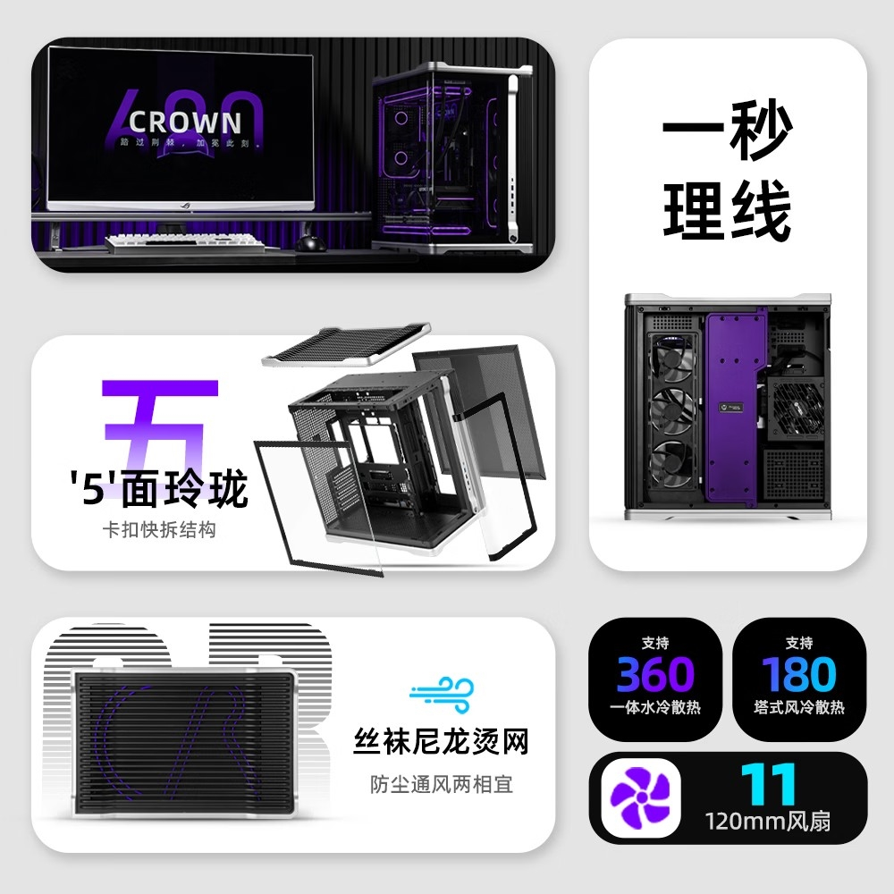

Mechanic Master ha abierto la preventa del CR680, el primer chasis de su serie CROWN. El precio de referencia es de 699 yuanes, aunque con una reserva de 99 yuanes el importe final baja a 628 yuanes. La compra se canaliza en JD.com, dentro del mercado chino: la fuente no confirma fecha ni precio para Europa, así que por ahora es una referencia a seguir.

La propuesta de esta caja se apoya en dos ideas muy de taller: quitar los tornillos de la ecuación y no obligar a elegir una única orientación del cristal. Sobre el papel, el CR680 es una caja grande de doble cámara que prioriza el acceso rápido al interior.

## El CR680, cinco caras sin tornillos y un lateral que se invierte

Salvo la trasera, las cinco caras del chasis se desmontan con clips. Es lo que la marca presenta como un montaje de cinco caras sin tornillos: cambiar un componente no obliga a ir soltando tornillo a tornillo. En la zona posterior hay un carenado para ocultar el cableado, lo que el fabricante llama gestión de cables en un segundo —un panel que tapa la fuente y los pasacables, un detalle que agradece quien monta con prisa.

El lateral es de cristal templado en dos piezas curvas y admite dos montajes. En posición vertical, el cristal queda a la izquierda; si se gira todo el chasis boca abajo, el lateral pasa a la derecha. Es una solución curiosa: la misma caja cambia de lado sin necesidad de comprar una segunda.

El techo, además, integra una malla pensada para dejar pasar el aire y frenar el polvo.

## Qué entra: GPU, radiadores y discos

Las medidas oficiales son 464 × 310 × 512 mm, con exterior de ABS inyectado e interior de acero SPCC. El peso neto declarado es de 11,35 kg y el bruto de 14,05 kg. La cifra que más condiciona el montaje es la longitud de la tarjeta gráfica: 420 mm. El disipador de torre no debe pasar de 180 mm y la fuente ATX, de 200 mm.

En placa admite formatos ATX, MATX e ITX, además de placas con conectores posteriores, y ofrece siete ranuras PCI-E.

La refrigeración es el otro pilar del diseño. Hay sitio para once ventiladores de 120 mm, repartidos en tres arriba, tres abajo, dos en la parte trasera y tres en la zona posterior. Tanto la parte superior como la posterior admiten radiadores de 360 mm, lo que da el doble circuito de 360 mm que promociona el fabricante.

Para almacenamiento, de serie hay dos bahías de 3,5/2,5 pulgadas y la opción de añadir dos más; el máximo declarado es de cinco discos de 3,5 pulgadas o seis de 2,5. En el panel frontal encontramos un USB Type-C, dos USB 3.0, un USB 2.0, un conector de audio combinado y un botón de encendido iluminado.

## Qué cambia para quien monta un PC

El CR680 no es una revolución térmica: es una caja amplia que juega a favor de quien cambia hardware a menudo. El desmontaje por clips y el lateral reversible simplifican el acceso, pero conviene mirar antes la compatibilidad física. Los 420 mm para la GPU, los 180 mm para el disipador de torre y los 200 mm para la fuente son márgenes holgados; menos holgado es el sitio que ocupa, con 512 mm de alto y más de 11 kg vacía, así que toca medir la mesa y prever el flujo de aire antes de comprarla.

Con 628 yuanes de precio promocional en China, el gancho está en montar sin herramientas. Quien siga el catálogo de [componentes de PC](/noticias/componentes/) encontrará el resto de novedades de la sección, y para el mercado europeo habrá que esperar confirmación oficial.
