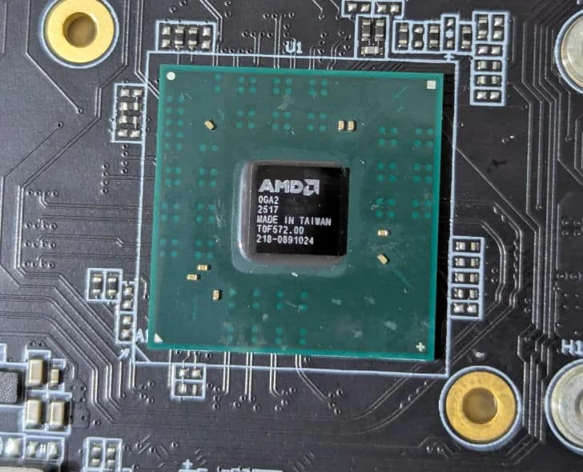
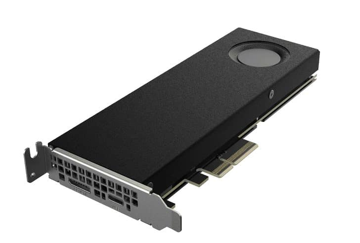
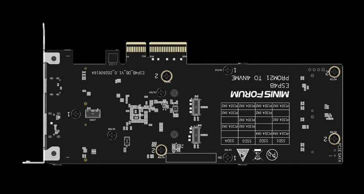

Minisforum ha puesto a la venta la **ESP4B**, una tarjeta de expansión que saca el chipset **AMD B850** (Promontory 21) de la placa base para multiplicar la conectividad de los equipos con pocas líneas PCIe disponibles. La idea es sencilla de explicar y complicada de encontrar: en lugar de repartir las líneas del procesador, la propia tarjeta incorpora el chipset y se encarga de repartir los puertos.

## Minisforum ESP4B: un solo slot x4 para cuatro SSD M.2

La ESP4B se conecta mediante una interfaz **PCIe 4.0 x4** y ofrece **cuatro ranuras M.2** para unidades NVMe. Lo interesante para quien la monte no es el número de slots, sino cómo se reparte el ancho de banda cuando se llenan:

- Con **dos unidades**, cada una trabaja a PCIe 4.0 x4 completo y se alcanzan lecturas de hasta **6,1 GB/s**.
- Con las **cuatro ranuras ocupadas**, el reparto baja a **x2 por unidad** y las lecturas quedan en torno a **3,3 GB/s**.

Ese ajuste automático es lo que evita depender de la **bifurcación PCIe** de la placa base. En plataformas que no la soportan —o que no la traen bien documentada—, la tarjeta sigue funcionando porque el chipset integrado hace el trabajo. Es el detalle que separa a la ESP4B de un simple adaptador pasivo. En placas de escritorio ese mismo chipset suele venir integrado en modelos como la [Gigabyte B850 AORUS ELITE X3D](/noticias/gigabyte-b850-aorus-elite-x3d/), que también reparte cuatro ranuras M.2; la diferencia es que allí el chipset vive en la placa y aquí, en una tarjeta.

## OCuLink y USB-C más allá del almacenamiento

El almacenamiento no es lo único que añade. La ESP4B incorpora un **puerto OCuLink**, pensado para conectar una **tarjeta gráfica externa (eGPU)**, y un **USB Type-C de 20 Gbps** para periféricos o almacenamiento externo de alto rendimiento. Con el adaptador incluido, el mismo puerto puede gestionar además hasta **cuatro dispositivos SATA**.

En un equipo compacto, esa combinación es la diferencia entre quedarse corto de almacenamiento y ampliar sin abrir el chasis dos veces. Aun así, el OCuLink conviene mirarlo con calma: su rendimiento depende del equipo y del adaptador concretos, y no sustituye a una ranura PCIe completa en la placa.

## Compatibilidad amplia y precio de 135 dólares

Las primeras pruebas que circulan por comunidades como Reddit apuntan a una compatibilidad más amplia de lo esperado. Según esos reportes, la tarjeta funciona tanto en plataformas actuales de AMD e Intel como en equipos antiguos —se cita un **Dell OptiPlex de 2011**— e incluso en sistemas basados en procesadores **ARM de Minisforum**, una firma que este mes también ha presentado [un mini PC gaming con Ryzen 9 8945HX y Radeon RX 9060 XT](/noticias/componentes/minisforum-mini-pc-rx-9060-xt/).

Su precio oficial es de **135 dólares**, lo que la coloca por encima de adaptadores similares. El argumento no es el precio, sino el conjunto: chipset propio, cuatro M.2, OCuLink y USB-C de 20 Gbps en una sola tarjeta.

## Qué cambia para quien va a montarla

Para un mini PC o una placa con expansión limitada, la ESP4B resuelve un problema real: añadir almacenamiento sin pelear por las líneas del procesador. Antes de comprarla, conviene comprobar tres cosas: que exista una **ranura PCIe 4.0 x4 libre** y accesible, que la caja tenga **holgura y flujo de aire** para cuatro SSD (aunque sean M.2, generan calor bajo carga sostenida) y que la fuente pueda alimentar el conjunto. Si el objetivo es una eGPU, hay que verificar la compatibilidad del OCuLink con la gráfica concreta. Con esas comprobaciones hechas, la tarjeta encaja donde un adaptador pasivo no llega.
