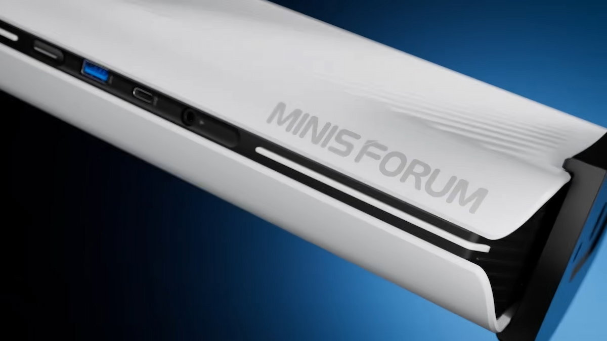
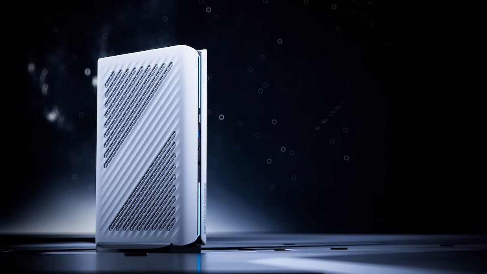

Minisforum ha presentado el AtomMan G1 Pro, un Mini PC gaming que sube el listón de su catálogo de equipos compactos. La configuración se apoya en un procesador AMD Ryzen 9 8945HX junto a una tarjeta gráfica Radeon RX 9060 XT con 16 GB de VRAM, además de 32 GB de RAM y 1 TB de SSD. El precio de partida anunciado es de 1.759 dólares, una cifra que sitúa al equipo en la liga de los sobremesa de gama alta.

## Qué trae el AtomMan G1 Pro

El bloque central del equipo es la pareja formada por el Ryzen 9 8945HX y la Radeon RX 9060 XT de 16 GB. Según la información publicada, esa combinación ofrece un rendimiento notable en FHD (1920 x 1080), con tasas de fotogramas altas si se mantiene la calidad gráfica en niveles exigentes. Es una tarjeta que [ya se ha visto mover cargas de CUDA en Windows con ZLUDA y ROCm](/noticias/cuda-on-amd-zluda-windows/), lo que da una idea de su margen fuera del terreno puramente lúdico.

En conectividad, el AtomMan G1 Pro incluye dos HDMI 2.1, un DisplayPort 1.4a y un DisplayPort 2.1b, además de varios puertos USB-A y USB-C. Es una salida de vídeo generosa para un chasis tan pequeño: permite alimentar varios monitores sin recurrir a adaptadores.

## Disipación y margen de ampliación

El punto que conviene mirar con lupa en cualquier Mini PC gaming es cómo saca el calor de la caja. La fuente describe un sistema de ventilación capaz de refrigerar un chip gráfico de esta categoría, pero advierte de que el equipo se calienta bastante como consecuencia. En un chasis pequeño el flujo de aire y la holgura son limitados, así que el margen térmico no es el de una torre: importa dónde se coloque el aparato y cuánto espacio libre se deje alrededor.

La memoria RAM sí se puede ampliar, lo que da algo de recorrido al equipo con el tiempo. No es un detalle menor cuando el resto de componentes va integrado y no admite cambios.

## ¿Merece la pena frente a un sobremesa?

La comparación con montar un ordenador a medida es inevitable. Según el medio, reunir un sobremesa con características similares rondaría hoy los 1.200 euros, frente a unos 800 euros de hace un año, en un contexto de precios inflados por la crisis de la memoria. Es decir, el sobrecoste del formato compacto es real y el G1 Pro no compite por precio.

Al montar, la decisión depende del uso: si el objetivo son juegos en FHD con calidad alta, el AtomMan G1 Pro ofrece el rendimiento en muy poco espacio y sin montaje. Si se va a subir de resolución o se piensa en ampliaciones más allá de la RAM, un sobremesa sigue siendo la apuesta más flexible y más barata de mantener a largo plazo.
