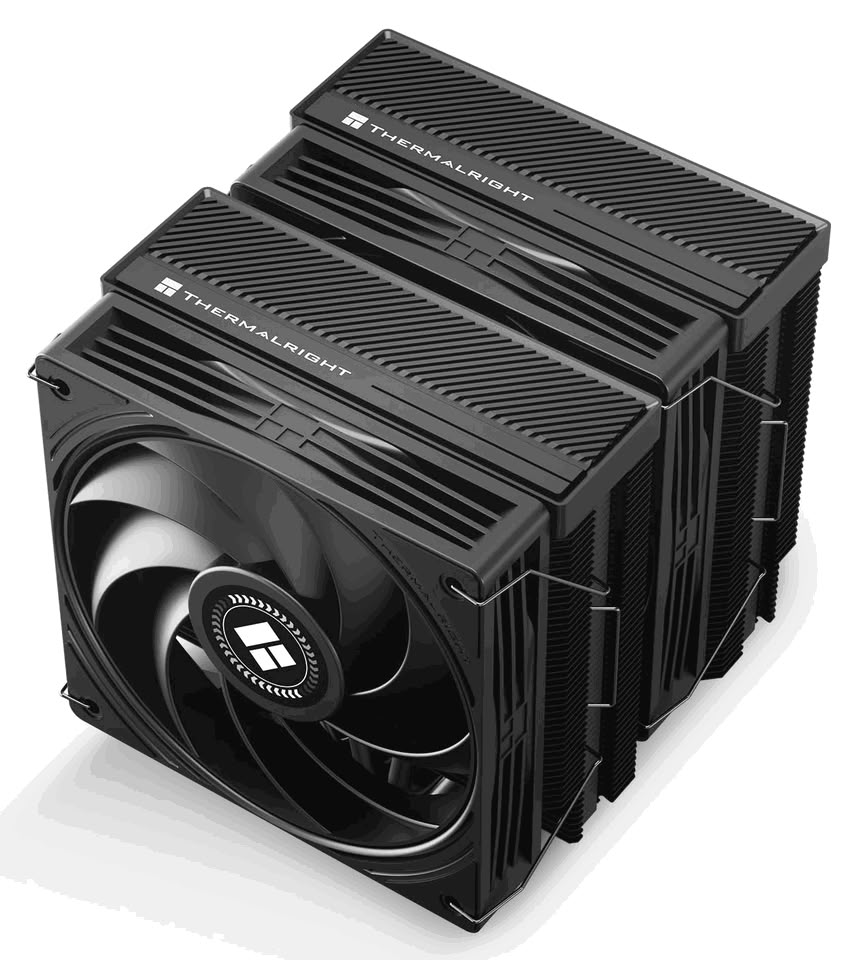

Thermalright ha ampliado su familia Peerless Assassin con el **Peerless Assassin 120H-A Dark**, una variante de doble torre con acabado negro en todas sus piezas. La compañía mantiene la receta de los modelos Black ya existentes —seis heat pipes de cobre, dos torres de aletas y doble ventilador—, pero sube las revoluciones para rascar unos grados de más bajo carga sostenida. El lanzamiento llega poco después del Assassin X 120-A Dark de una sola torre, con el que comparte precisamente el acabado oscuro como argumento.

## Doble torre negra con seis heat pipes de contacto directo

El bloque disipa el calor con seis heat pipes de cobre de 6 mm en forma de U, que recorren las dos torres de aletas con un esquema de contacto directo sobre el procesador: el tubo apoya directamente en la CPU, sin una placa intermedia. El conjunto mide 125 x 135 x 159 mm con los ventiladores instalados y remata la parte superior con tapas negras, un detalle que busca un acabado uniforme y evita el contraste de aletas desnudas que arrastran otros disipadores vendidos como «todo negro».

En cuanto a plataformas, el disipador da soporte a Intel LGA115X, 1200, 1700 y 1851, y a AMD AM4 y AM5, de modo que cubre tanto equipos recientes como montajes de generaciones anteriores.

## El 120H-A Dark sube los ventiladores hasta 2400 RPM

La diferencia real frente al Peerless Assassin 120 Black estándar está en el kit de ventiladores. Los dos TL-N12-R9 V2 incluidos giran hasta 2400 RPM, muy por encima de las 1550 RPM del modelo base. Cada unidad mueve hasta 85,35 CFM con 2,95 mmH2O de presión estática, y el ruido máximo declarado es de 33,3 dB(A), con rodamientos S-FDB y control PWM de 4 pines.

Ese margen extra de giro es lo que separa a esta versión del resto de la gama: con más caudal y más presión, Thermalright apunta a procesadores más exigentes, donde los ventiladores de serie se quedan cortos cuando la carga se mantiene en el tiempo.

## Precio y disponibilidad

Thermalright todavía no ha comunicado precio ni qué regiones recibirán el disipador. TechPowerUp apunta una estimación de unos 55 dólares tomando como referencia el 120 SE Black, que aparece en Amazon por unos 43 dólares. Es un cálculo del medio, no una tarifa confirmada por el fabricante, así que conviene esperar al anuncio oficial antes de darlo por bueno.

## Consejo de montaje

Antes de comprar, toca medir. Los 159 mm de alto con ventiladores son la referencia que hay que cruzar con la holgura interior de la caja, y el formato de doble torre obliga a revisar el espacio libre alrededor del socket y la altura de los módulos de memoria. Si vienes de un disipador de una sola torre, la ganancia no está en el acabado sino en el flujo de aire; y si tu caja tiene poco fondo, comprueba que los dos ventiladores no choquen con la tapa lateral.

La compatibilidad física manda por encima de cualquier ficha técnica, y [un disipador sobredimensionado puede cambiar por completo el comportamiento térmico del montaje](/noticias/rtx-4090-cooler-on-rtx-3060/) aunque el papel prometa otra cosa.

