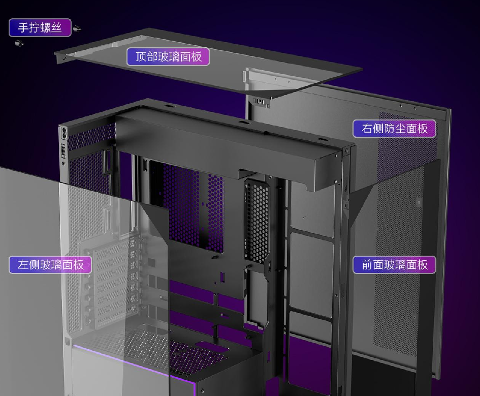

Thermalright ha presentado las cajas TR-A30 ARGB y TR-A30 Vision, dos torres ATX de tipo panorámico que comparten estructura y se diferencian en un único detalle: la versión Vision añade una pantalla magnética. El precio de salida parte de 299 yuanes en el mercado chino.

## Dos versiones de la TR-A30 sobre una misma base

Ambos modelos parten del mismo diseño: una estructura interna de dos cámaras escalonadas —una superior y otra inferior— con una tira ARGB integrada en el borde y un conducto oculto para los tubos del sistema de refrigeración líquida por encima de la placa base. El cristal templado cubre la parte superior, el lateral y el frontal, de modo que la caja deja ver el interior por varias caras a la vez.

La diferencia está justo en ese conducto oculto: la TR-A30 Vision incorpora allí una pantalla magnética de 9,16 pulgadas con resolución 1920 × 462, pensada para mostrar parámetros del sistema o efectos dinámicos. La TR-A30 ARGB se queda con la iluminación integrada y sin pantalla.

## Holguras y ventilación: lo que decide el montaje

Las dos cajas miden 440 × 232 × 512 mm y admiten placas Mini-ITX, Micro-ATX y ATX. La altura máxima para el disipador de CPU es de 165 mm; la longitud máxima de tarjeta gráfica, de 400 mm, y la fuente ATX puede llegar hasta 220 mm. Hay siete ranuras PCI de perfil completo.

Para almacenamiento ofrece un soporte modular independiente con una bahía de 3,5 pulgadas y dos de 2,5 pulgadas. El panel frontal reúne un USB Type-C, dos USB Type-A y tomas de audio y micrófono.

En refrigeración, Thermalright permite montar hasta siete ventiladores: tres de 120 mm en el lateral (con compatibilidad para radiadores de 120, 240 y 360 mm), uno de 120 mm en la parte trasera (radiador de 120 mm) y tres de 120 mm en la base. El detalle que conviene tener presente es que no incluye ningún ventilador de serie, así que el coste real del montaje sube al añadirlos. Si vas a poblarla, merece la pena repasar antes [por qué muchos conectores de ventilador no se controlan de verdad desde la placa](/noticias/case-fans-wrong-headers/).

## Precio y qué valorar antes de comprar

El precio de lanzamiento arranca en 299 yuanes en China. Para quien monte un equipo con un radiador de 360 mm en el lateral y una gráfica de gran tamaño, la TR-A30 encaja por holguras; ahora bien, al no traer ventiladores hay que presupuestarlos aparte y verificar el flujo de aire, sobre todo si la caja va muy cargada. La pantalla de la Vision es un extra de escaparate: útil para mostrar telemetría, prescindible si lo que importa es disipar.

Como consejo de montaje, conviene planificar el orden: instalar la placa y el radiador antes de cerrar el conducto de los tubos, y reservar los tres ventiladores inferiores si la gráfica va a trabajar cerca de la base. Es una caja donde el cristal manda y la ventilación se resuelve a mano, en la línea de la [doble torre Peerless Assassin](/noticias/componentes/thermalright-peerless-assassin-120h-a-dark/) que la marca presentó hace unos días.
