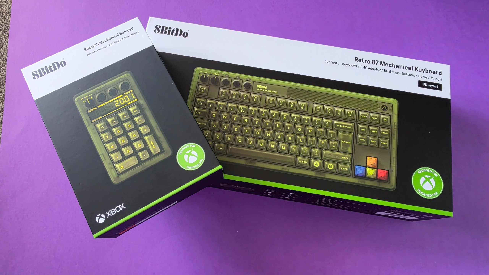
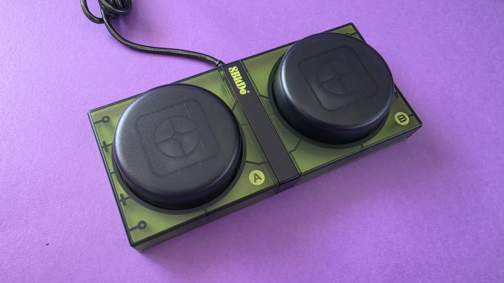
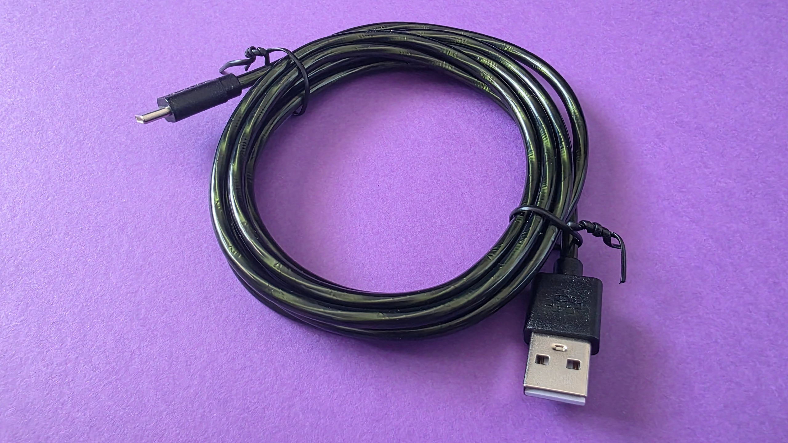
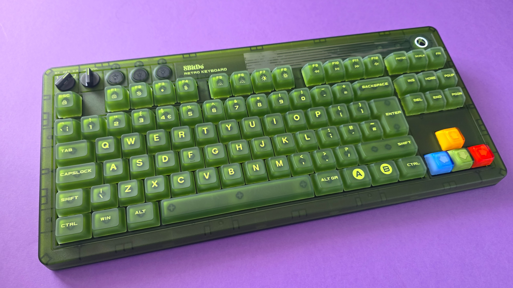
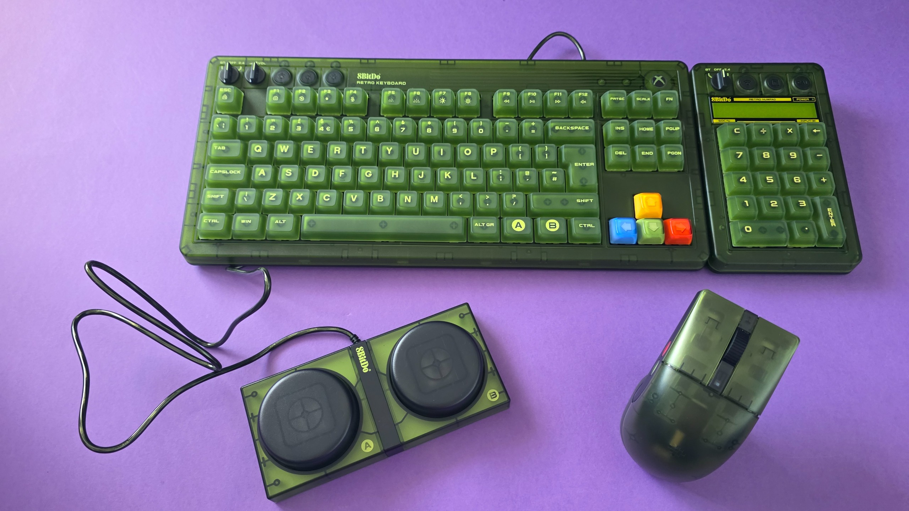
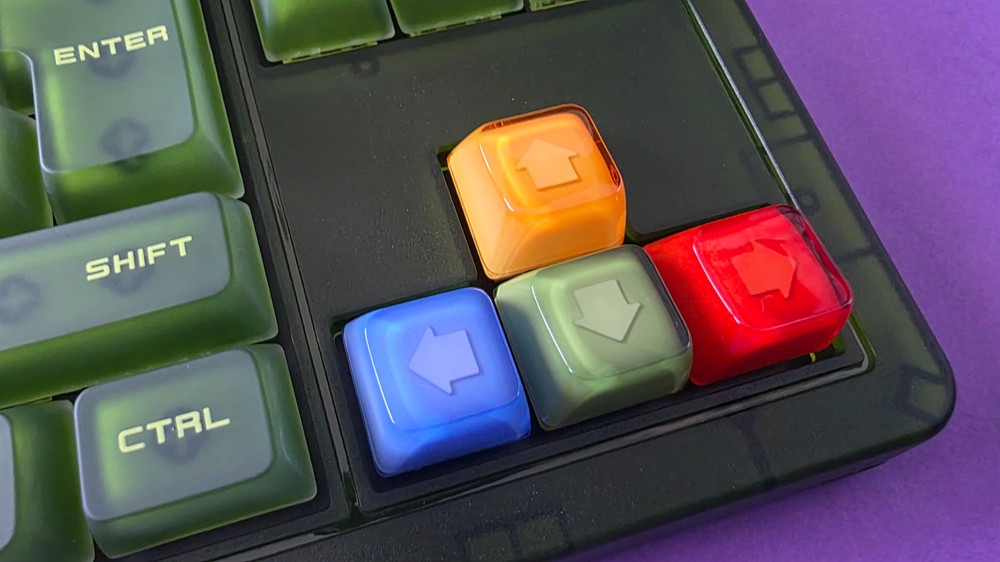
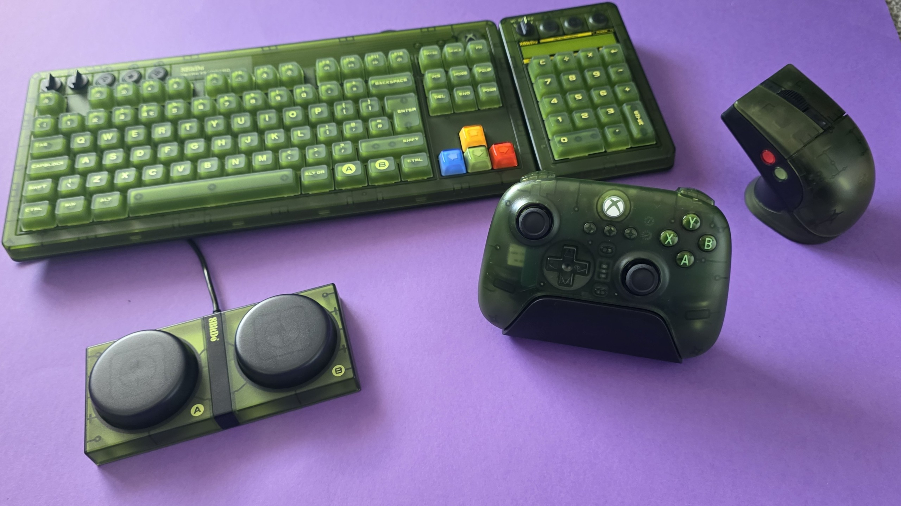
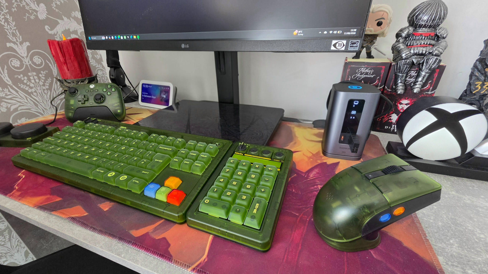
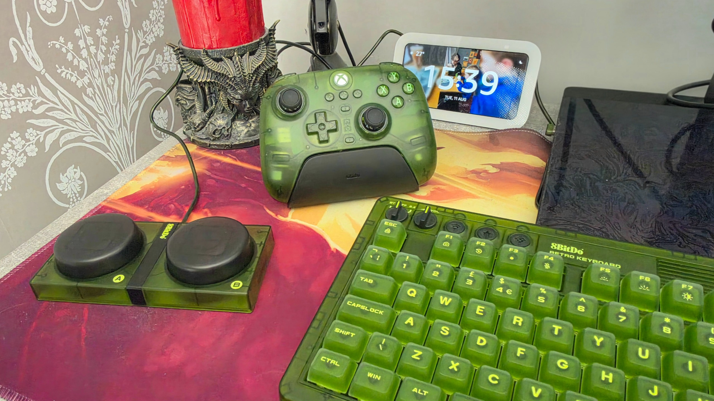
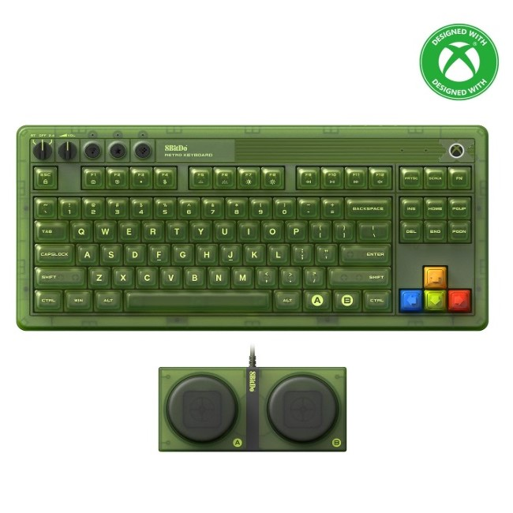

Xbox está a punto de cumplir 25 años y el goteo de periféricos conmemorativos no se detiene. Entre ellos, uno de los que más ha dado que hablar es el 8BitDo Retro 87 Mechanical Keyboard (Xbox Edition), un teclado mecánico de inspiración OG Xbox que acompaña a toda una colección con ratón, mando y teclado numérico. Windows Central lo ha usado a diario durante unos cuatro meses y ha publicado su análisis, en el que concluye que la nostalgia verde no está reñida con un teclado de trabajo serio.

## Qué es el 8BitDo Retro 87 (Xbox Edition) y a qué precio

El Retro 87 es un teclado de 87 teclas en formato Tenkeyless (TKL) con montaje superior, un diseño grueso y pesado que rinde homenaje al verde translúcido de la primera Xbox. Su precio oficial es de 119,99 dólares en Estados Unidos y 99,99 libras en Reino Unido, aunque el análisis lo sitúa de oferta en 89,99 dólares en Amazon, con descuentos recurrentes que llegan a rondar el 25 %.

La colección de 8BitDo para Xbox existe desde noviembre de 2024 e incluye teclado, teclado numérico, ratón e incluso mando. Si se quiere el teclado numérico a juego, se vende por separado como Retro 18 Mechanical Numpad (Xbox Edition), por 44,99 dólares o 39,99 libras.

## Qué trae: especificaciones y detalles de uso

Más allá del color, lo que decide una compra a largo plazo es lo que hay debajo. Estas son las claves que destaca el análisis:

- **Interruptores:** Kailh Jellyfish X, en variantes lineales o táctiles, sobre una PCB intercambiable en caliente y con N-key rollover completo.
- **Teclas:** ABS de doble capa con recubrimiento mate UV.
- **Conectividad:** triple modo, con inalámbrico a 2,4 GHz mediante receptor magnético, Bluetooth 5.0 y cable USB-C.
- **Batería:** 4.000 mAh, con una autonomía declarada de hasta 280 horas en 2,4 GHz y 300 horas en Bluetooth.
- **Extras:** retroiluminación RGB personalizable, dial de volumen y selector de modo de conexión, además de los Dual Super Buttons, dos botones programables estilo arcade que se conectan por jack de 3,5 mm.
- **Dimensiones y peso:** 376,6 × 169,6 × 46,8 mm y 1.100 g.
- **Software:** 8BitDo Ultimate Software V2, disponible para Windows y Android.

La caja incluye los Dual Super Buttons, el cable de carga USB-C, el receptor de 2,4 GHz y un mes de Xbox Game Pass para PC para nuevos suscriptores.

Elegir entre cable e inalámbrico en un periférico de Xbox no tiene una única respuesta, como ya vimos al comparar el [mando de Xbox con cable o inalámbrico](/noticias/xbox-controller-wired-wireless/); aquí la ventaja es que el Retro 87 permite alternar entre los tres modos sin reinstalar nada.

## Lo que convence y lo que no

El análisis es claramente favorable. La reseñista destaca la sensación táctil y sonora de los interruptores, la solidez de la carcasa y detalles prácticos como el compartimento magnético para guardar el receptor de 2,4 GHz, el cable mallado a juego o los diales de volumen y conexión. El PCB intercambiable en caliente deja la puerta abierta a cambiar los interruptores más adelante, y no se aprecia latencia apreciable en inalámbrico.

En el debe, dos matices que conviene conocer antes de comprar. El primero es la limpieza: las teclas ABS de acabado mate muestran las huellas y el brillo del dedo más rápido que en otros teclados, así que toca pasarles un paño con más frecuencia. El segundo afecta a quien quiera el teclado numérico a juego: como cada pieza necesita su propio receptor USB de 2,4 GHz, acaba ocupando dos puertos.

## ¿Merece la pena frente a la competencia?

La alternativa más directa es la colección de Razer por el 25.º aniversario de Xbox, con su Black Widow V4 75%, a 209,99 dólares o 199,99 libras. Cuesta casi el doble, pero a cambio ofrece un chasis más compacto y discreto e interruptores táctiles más silenciosos, para quien prefiera un homenaje menos llamativo.

Para quien busque exactamente lo contrario, el verde descarado y el tacto contundente de los primeros 2000, el 8BitDo Retro 87 queda en una posición difícil de igualar por precio. Es un periférico pensado para un escritorio de jugador, no para un despacho silencioso, y el análisis lo recomienda a quien quiera un teclado con personalidad y con la vista puesta en aguantar muchos años de uso.

