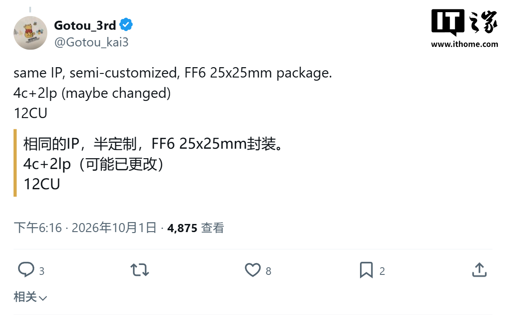

La próxima generación de consolas portátiles con Windows vuelve a moverse en el terreno de los rumores. El filtrador Gotou_3rd (@Gotou_kai3) publicó el 1 de octubre en X una breve lista de especificaciones atribuidas al AMD Ryzen Z3, el chip llamado a relevar al Ryzen Z1 en equipos como la ROG Ally o la Legion Go. La filtración, recogida por Wccftech, apunta a un diseño semi-custom sobre la misma base del Medusa Point, con núcleos Zen 6 y una GPU RDNA4m de 12 unidades de cómputo. Conviene decirlo desde el principio: AMD no ha confirmado nada y el propio filtrador admite dudas sobre la configuración final, así que lo que sigue no debe leerse como un anuncio.

## Qué se sabe del Ryzen Z3 y del Z3 Extreme

El dato más concreto de la filtración es el empaquetado: el Ryzen Z3 usaría un encapsulado FF6 de 25 × 25 milímetros, más pequeño que el FP8 del Strix Point. En un dispositivo de mano cada milímetro cuenta —menos superficie de placa, más espacio para batería o refrigeración—, así que el recorte de tamaño es justo lo que espera quien juega en movimiento.

En el plano de la arquitectura, el filtrador describe un diseño semi-custom que comparte la IP del Medusa Point, la familia móvil de AMD basada en Zen 6, pero con una configuración propia en lugar de reciclar un SoC de portátil. Habla de cuatro núcleos Zen 6 de alto rendimiento más dos núcleos de bajo consumo, un total de 6 núcleos y 12 hilos que el propio autor marca con un «puede cambiar» en su mensaje.

La GPU sería el otro punto fuerte: 12 unidades de cómputo basadas en RDNA4m. Wccftech recuerda que RDNA4m es en realidad una evolución de RDNA 3.5 y no debe confundirse con RDNA 4, reservada por AMD para las tarjetas gráficas dedicadas. En cuanto al consumo, el Ryzen Z3 aparecería optimizado para unos 15 W, mientras que la variante Ryzen Z3 Extreme apuntaría a unos 25 W.

## Qué cambia para quien juega en una consola portátil

Traducido al día a día, la filtración dibuja dos perfiles distintos. Un Z3 de 15 W encajaría en equipos finos y silenciosos, con la autonomía como prioridad; un Z3 Extreme de 25 W apuntaría al otro extremo, el de quien prefiere exprimir la GPU aunque la batería dure menos. La duda que el propio filtrador deja abierta es si ambos modelos compartirán los mismos 12 CU o si el Extreme se queda con la configuración completa.

El segmento está en plena ebullición: hace unos días se filtró que la [Steam Deck 2 apostaría por una APU AMD «Gainsborough» con Zen 6 y RDNA 5](/noticias/consolas/steam-deck-2-gainsborough/), una hoja de ruta que compite directamente con la de los chips Z.

Para el jugador, la pregunta relevante no es cuántos teraflops añade el papel, sino qué catálogo mueve y durante cuánto tiempo. Si el salto a RDNA4m llega acompañado de mejoras en escalado y trazado de rayos, la diferencia se notará en los juegos que hoy obligan a bajar la calidad para mantener la fluidez, no en una cifra de especificaciones.

## Una filtración, no un anuncio

Ni AMD ni los fabricantes de consolas portátiles han confirmado estas cifras, y el historial de este tipo de filtraciones obliga a la prudencia: las configuraciones cambian, los nombres cambian y los plazos se mueven. Tampoco hay fecha ni precio asociados al Ryzen Z3, así que hoy no hay nada sobre lo que decidir.

Para quien tenga una ROG Ally o una Legion Go en la mano, la recomendación es la de siempre: los equipos actuales siguen funcionando y recibiendo soporte, y comprar a la espera de un chip filtrado nunca ha salido bien. La decisión tendrá sentido cuando exista hardware real, un catálogo que lo aproveche y una generación con recorrido por delante.
