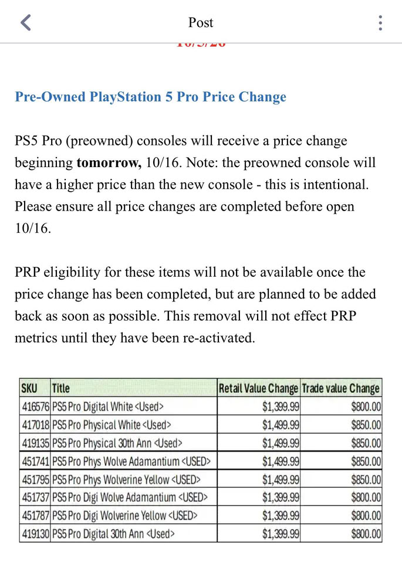

En GameStop, una PS5 Pro de segunda mano cuesta ahora más que una nueva. La cadena ha puesto la consola reacondicionada en 1.399,99 dólares, unos 500 por encima de los 899,99 dólares que Sony pide por una unidad sin estrenar, y un memorando interno filtrado asegura que la decisión no responde a un error de sistema, sino que es «intencionada».

## Qué dice el memorando filtrado

La cifra llega desde una imagen que un usuario —que se presenta como empleado de la compañía— publicó en el subreddit r/GameStop. En ella aparece el precio de las distintas versiones de la consola reacondicionada, con 1.399,99 dólares como punto de partida. El documento reconoce de forma explícita que «la consola de segunda mano tendrá un precio superior al de la nueva» y describe esa situación como intencionada, sin detallar el motivo.

Los moderadores de ese foro confirmaron después la validez de la publicación, aunque el material sigue siendo una filtración interna y no un cambio de precios oficial. GameStop no se ha pronunciado al respecto por el momento.

A esos 1.399,99 dólares hay que sumar las variantes: la versión con lector de discos sube hasta los 1.499,99, mientras que los miembros de GameStop Pro podrían acceder a la unidad base por 1.329,99. Según el calendario que recoge el memorando, el cambio entraría en vigor el próximo 16 de octubre; hasta entonces la tienda venía vendiendo la consola usada por unos 800 dólares, la tarifa que mantenía desde que Sony subió el precio de venta recomendado.

## Por qué la PS5 Pro usada cuesta más que la nueva

La explicación apunta a la escasez. Las PS5 Pro nuevas están prácticamente agotadas a su precio oficial y los pocos listados que quedan en grandes minoristas rondan los 1.500 dólares. Sony movió ficha en abril y elevó la consola a 899,99 dólares, una subida que justificó por el encarecimiento de la memoria; con GTA VI previsto para el 19 de noviembre, la presión sobre el stock no parece que vaya a ceder pronto. Esa dinámica conecta con la estrategia cauta de suministro que ya apuntaba a una [escasez de PS5 Pro hasta principios de 2027](/noticias/ps5-pro-supply-shortage-2027/).

En ese contexto, la segunda mano deja de ser la vía barata. La propia tabla de tasación del memorando valora la entrega de una PS5 Pro en 800 dólares, y en 850 si incluye lector, por encima de los 699,99 dólares que costaba en su lanzamiento de 2024.

## Qué cambia para el jugador

El resultado es una paradoja incómoda para quien quiere dar el salto: pagar más por una consola usada que por una nueva, siempre que la nueva se encuentre. A esos precios, la lógica de compra se desdibuja, porque el ahorro que justifica acudir al mercado de segunda mano desaparece y quedan solo las ventajas del soporte y la garantía de una tienda profesional frente a un particular.

Para el jugador español la situación no mejora: en los minoristas oficiales la consola escasea y los vendedores particulares manejan cifras que superan incluso las de GameStop. Con la escasez de componentes y el tirón de GTA VI como telón de fondo, la decisión pasa por esperar a que se normalice el suministro o asumir que esta generación se va a jugar con sobreprecio durante un tiempo.
