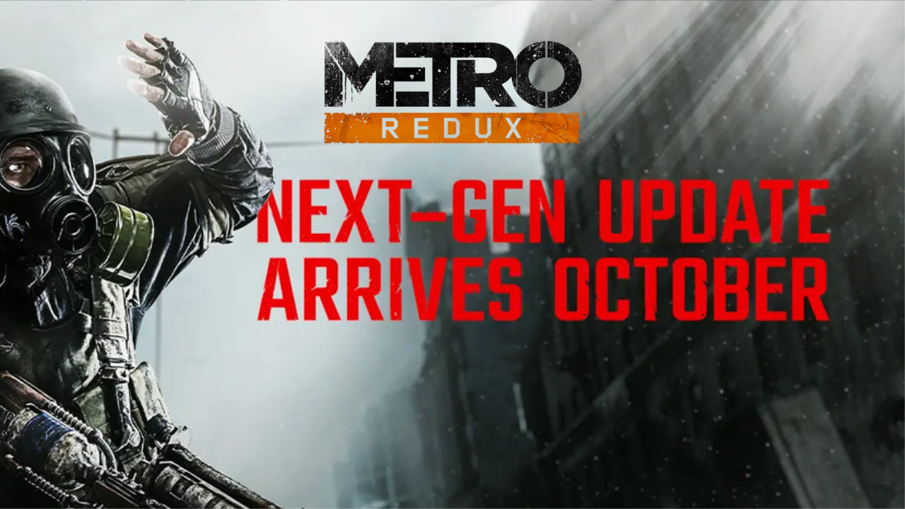

Los dos primeros Metro vuelven a moverse, y esta vez sin coste extra para quien ya los tenga. Deep Silver ha confirmado que la actualización next-gen de Metro 2033 Redux y Metro: Last Light Redux llegará primero a PC el 22 de octubre y después a las consolas de la generación actual, el 29 de octubre. No es un remaster ni un remake completos, pero el paquete de mejoras es amplio y, sobre todo, gratuito.

## Qué incluye el parche next-gen de Metro Redux

El anuncio, difundido mediante nota de prensa, detalla un conjunto de mejoras que va bastante más allá de subir la resolución. La actualización trae aplicaciones nativas para PS5 y Xbox Series X|S, texturas en 4K, mayor fidelidad de animación, audio de más calidad y escenarios con más detalle. A eso se suman iluminación, sombras y efectos de partículas mejorados.

En rendimiento habrá dos modos: uno Visual que apunta a 4K a 60 fotogramas por segundo y otro de Rendimiento que busca 4K reescalado a 120 fps. En PS5 Pro se añade compatibilidad con PSSR, el reescalado por IA de Sony que el [firmware 14.0](/noticias/sony-pssr-2-firmware/) ya activa por defecto en ese modelo, y el mando DualSense gana soporte para gatillos adaptativos. La compañía también menciona mejoras de calidad de vida, sin entrar en detalle.

Deep Silver describe este paquete como una muestra de lo que está por llegar: las notas del parche completas, con todas las características técnicas y las funciones propias de cada plataforma, se publicarán junto con el lanzamiento.

## Fechas y plataformas

- PC: 22 de octubre.
- PS5 y Xbox Series X|S: 29 de octubre.

La actualización es gratuita para quien ya posea los juegos. Conviene recordar que tanto Metro 2033 (2010) como Metro: Last Light (2013) ya recibieron en 2014 una versión Redux para PS4 y Xbox One, así que esta es la segunda vez que la duología se revisa para adaptarse al hardware más reciente; la diferencia es que ahora no hay que volver a comprarla.

## Qué significa para el jugador

Los Metro son un catálogo pequeño pero sólido, y una mejora gratuita de este calibre tiene un efecto claro: convierte unas versiones correctas en la forma definitiva de jugarlos en consola actual. Si ya los tienes, es una excusa razonable para rejugarlos; si nunca los probaste, la duología suele aparecer con frecuencia en rebajas y este parche la deja mucho más presentable que antes.

El contexto no es casual. 4A Games, el estudio detrás de la saga —basada en las novelas de Dmitry Glukhovsky—, prepara Metro 2039 para comienzos de 2027, y las mejoras de las dos primeras entregas funcionan como antesala. Para quien decide por catálogo y no por potencia, la pregunta no es si los juegos se ven mejor, sino si merecen la pena; y con este tipo de soporte alargado, la respuesta es más fácil de defender.
