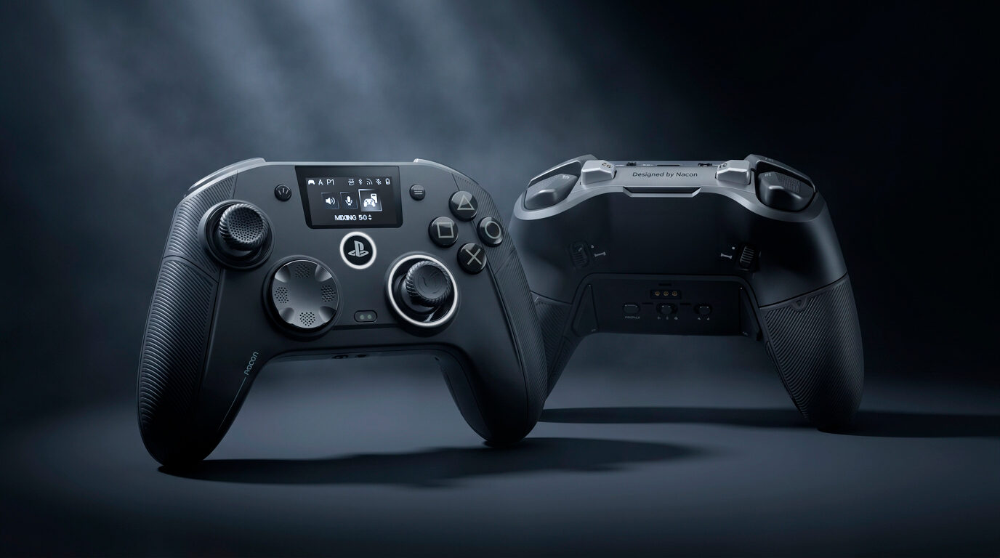
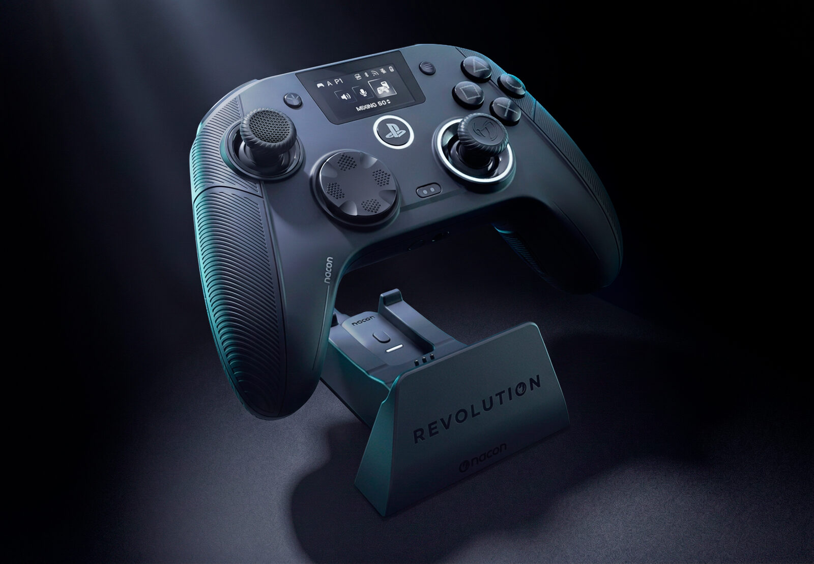
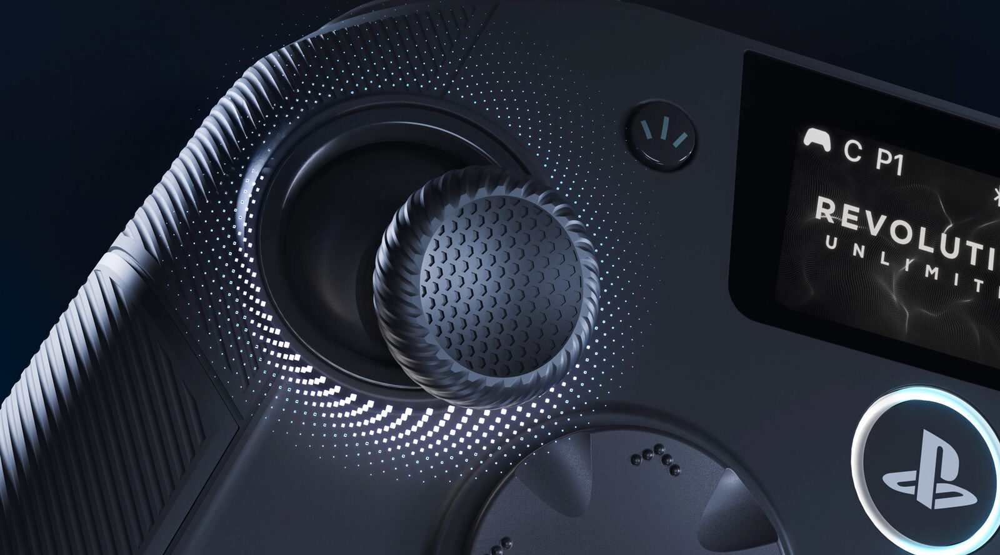

Nacon ha presentado el Revolution 5 Unlimited (R5U), un mando asimétrico de gama alta con licencia oficial para PlayStation 5 que apuesta por una característica poco habitual en el terreno de los accesorios: una pantalla de control integrada en el propio mando. La compañía francesa lo presenta como el primer mando con licencia oficial de Sony que incorpora esta solución, pensada para ajustar parámetros sin salir de la partida. Las reservas ya están abiertas por 229,99 dólares, 179,99 libras o 199,99 euros.

## Una pantalla integrada para ajustar sin salir del juego

El objetivo de esa pantalla es evitar el viaje constante al menú de la consola. Nacon asegura que permite ajustar la mezcla de audio, la sensibilidad de los joysticks y la asignación de atajos sobre la marcha, sin abandonar la partida. El R5U es además el primer mando de la marca que recurre a la tecnología magnética TMR (*Tunneling Magnetoresistance*), un tipo de sensor que la compañía presenta como un salto en fiabilidad, precisión y consumo frente a los joysticks convencionales, y que ya han adoptado otros mandos con licencia oficial como el [Turtle Beach Rematch para Switch 2](/noticias/turtle-beach-rematch-switch-2-review/).

## El Revolution 5 Unlimited, pensado para el juego competitivo

El resto de la ficha técnica está claramente orientada a la competición. Nacon habla de botones de acción con microinterruptores, de topes de gatillo (*Trigger Blockers*) con tecnología de «disparo instantáneo» que permiten pasar de un recorrido analógico a un clic ultracorto, y de varios botones de atajo reasignables. A ello se suma un modo Shooter Pro que elimina las zonas muertas de los joysticks para ganar respuesta y precisión.

El mando se vende con una funda de transporte y una base de carga dedicada, un detalle práctico para quienes alternan partidas largas, y es el primer mando de Nacon con licencia oficial para PS5, de modo que carga y conexión se resuelven en el mismo sitio. En conectividad ofrece triple vía —PS5, PC y televisores inteligentes con Android— y se apoya en una aplicación móvil para afinar los ajustes avanzados, además de un modo de PC propio que promete una latencia ultrabaja de 1 ms.

## Qué cambia para el jugador

«Con el Revolution 5 Unlimited, Nacon demuestra su capacidad para marcar nuevos estándares en el segmento de los periféricos para juego competitivo», ha declarado Yannick Allaert, director de la división de accesorios de Nacon. La compañía enmarca así el lanzamiento en una categoría, la de los mandos asimétricos con licencia oficial, en la que otros fabricantes llevan años moviéndose.

El precio, sin embargo, sitúa al R5U en la gama más alta de los accesorios para PS5: los 199,99 euros lo colocan en la misma liga que otros mandos pro premium, como el [SteelSeries Aeon Pro](/noticias/steelseries-aeon-pro/), que también apuesta por la base de carga. La pregunta de siempre con este tipo de producto no es cuánta tecnología lleva, sino cuánta de esa ventaja se nota en la partida y cuánto tiempo seguirá recibiendo soporte a lo largo de la generación. En ese terreno, la referencia más cercana que tiene la marca es el Revolution 5 Pro, del que TechRadar dijo que era «un mando fantástico que se queda a las puertas de ser imprescindible». Habrá que ver si la pantalla integrada y los sensores TMR bastan para dar el paso que entonces le faltó.
