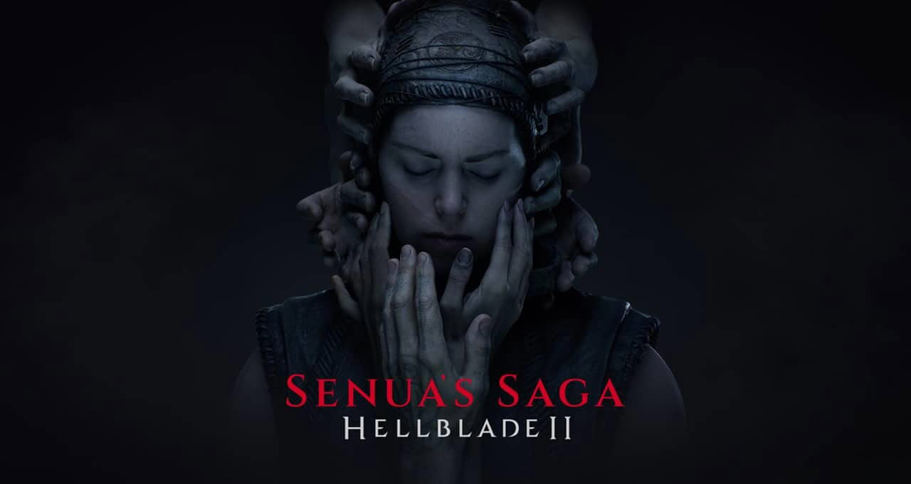

Trabajadores de Ninja Theory, el estudio de Cambridge responsable de Hellblade, han empezado a publicar en LinkedIn que se han quedado sin empleo o que su puesto corre peligro. Las publicaciones, detectadas primero por el periodista Chris Kerr, proceden de perfiles muy distintos: un director técnico, un programador de jugabilidad, diseñadores de sonido y artistas técnicos, entre otros. La señal es la misma que en tantas otras rondas de recortes: no llega un comunicado, llegan currículums.

## La consulta de cierre de Ninja Theory, aún sin cifras

Ni Xbox ni Ninja Theory han concretado cuántas personas están afectadas, y el cierre sigue siendo, de forma oficial, solo una propuesta. El detalle que más pesa está en boca de la propia plantilla: la programadora de jugabilidad Katrin Mair escribió que era triste saber que «no podremos terminar aquello en lo que estábamos trabajando». Es la frase que resume el momento, porque el proyecto en cuestión tiene nombre.

## De plan de venta a cierre propuesto

Ninja Theory debía sobrevivir al «reset» de 3.200 empleos que Xbox anunció en julio. Entonces, la consejera delegada de Xbox, Asha Sharma, aseguró que el estudio había alcanzado términos para pasar a una nueva propiedad, con financiación para terminar Senua. Ese plan se deshizo en septiembre, cuando el director de contenido de Xbox, Matt Booty, comunicó al personal que «dos acuerdos distintos para Ninja Theory se cayeron» y que arrancaría una consulta sobre el cierre propuesto. Booty añadió que la compañía seguiría buscando alternativas, aunque desde entonces no ha habido novedades. La situación encaja en el goteo de recortes que ya venimos siguiendo, como [la oleada de 268 despidos confirmada en septiembre](/noticias/xbox-despidos-268-ceo-microsoft/).

## Qué pasa con Senua, el tercer Hellblade

Senua, la tercera entrega de la saga, se presentó en junio durante el Xbox Games Showcase con una ventana de lanzamiento para 2027 en PC, Xbox y PlayStation 5. Xbox no la ha cancelado de forma oficial, pero el futuro del juego depende ahora de una decisión que no se ha tomado y de un equipo que, sobre el papel, ya no está completo. Además, Xbox tenía previsto un encuentro interno para el 6 de octubre, así que es probable que en los próximos días se conozcan más detalles sobre el alcance real de la medida.

## Qué significa para quien juega

Para el jugador, la consecuencia práctica no es un lanzamiento movido, sino la incertidumbre sobre un catálogo. Hellblade se ganó su sitio por una apuesta narrativa muy concreta, y ese tipo de exclusivo es justo el que una consola necesita a lo largo de la generación para justificar su compra. Si el cierre se confirma, Xbox pierde uno de sus estudios con una voz más reconocible y deja en el aire una franquicia que venía a ser su carta de presentación para 2027. La decisión sobre la consola no cambia hoy, pero el argumentario del catálogo, ese que tanto pesa al elegir plataforma, se debilita un poco más.
