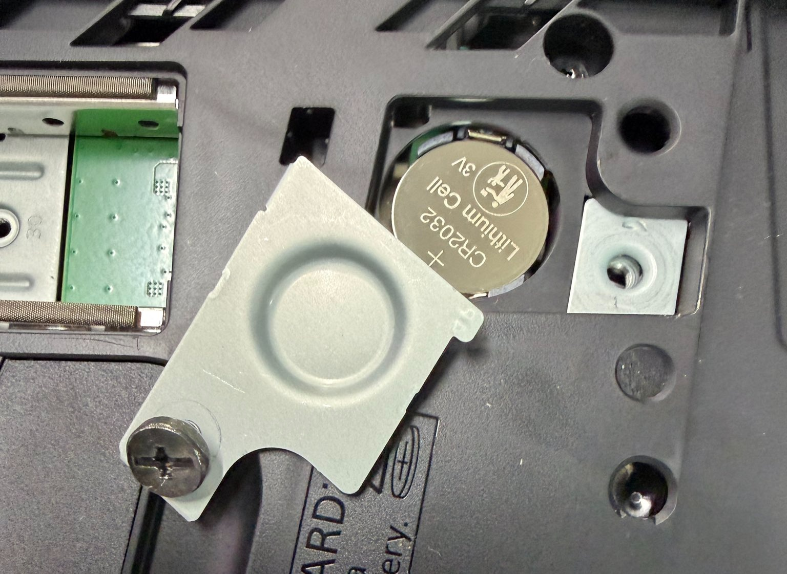
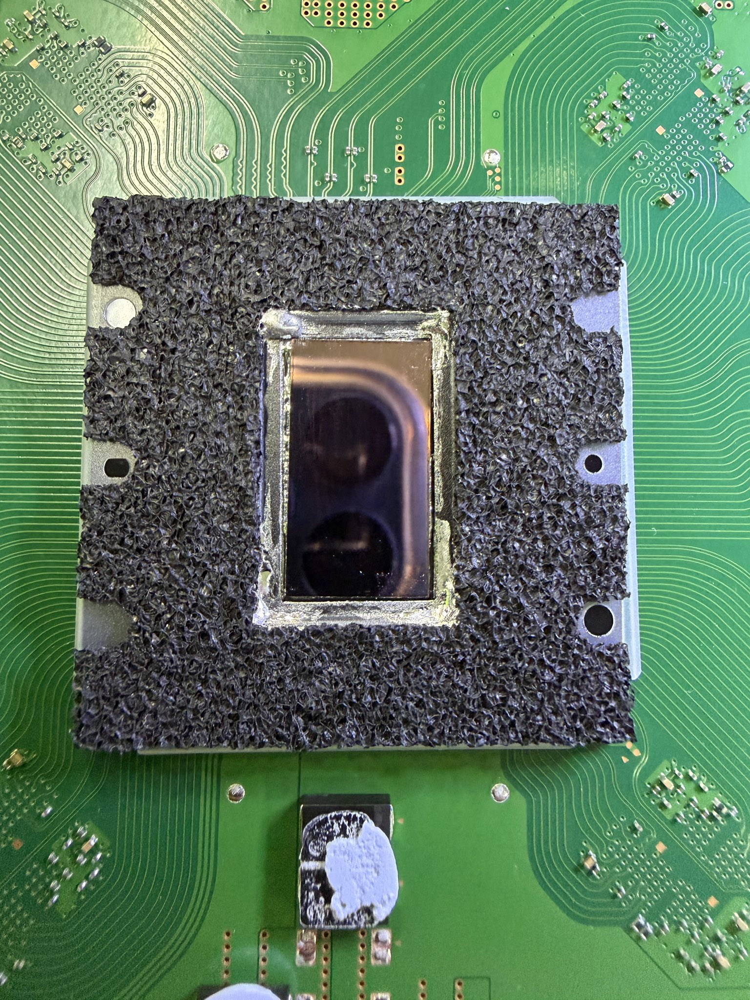

Cada vez que Sony retoca la PS5 por dentro, la pregunta del jugador es la misma: ¿esto cambia lo que juego o cuánto me va a durar la consola? La respuesta corta es que el catálogo y los servicios siguen igual, pero la máquina que sale de fábrica no. Un desmontaje de la edición limitada de Wolverine, la variante que acompaña al [lanzamiento de Marvel's Wolverine](/noticias/marvels-wolverine-ps5-launch/), ha revelado una revisión de hardware que Sony no ha anunciado: nueva placa EDM-051, pila CR2032 reemplazable y una refrigeración más cercana a la de la PS5 Pro.

El reparador @Modyficator89 publicó el 1 de octubre en X el resultado de abrir esa unidad. Bajo la carcasa no hay un simple cambio de acabado: la consola monta el número de placa más reciente de la PS5 Slim, el EDM-051, con la disposición interna rediseñada y varios componentes distintos respecto a las primeras revisiones de la Slim. El autor resume la revisión en seis puntos:

- Diseño de placa distinto, con el EDM-051 como referencia.
- Pila CMOS CR2032 reemplazable en lugar de una unidad fijada.
- Distribución interna rediseñada y simplificada.
- Refrigeración revisada con interfaz de metal líquido al estilo de la PS5 Pro.
- Disipador con construcción y materiales notablemente distintos frente a revisiones anteriores.
- Retimer HDMI nuevo, más barato y con el circuito optimizado.

## La nueva placa de la PS5 Slim y una pila que por fin se cambia

El cambio con más recorrido para el usuario es pequeño y barato: la pila. La PS5 ha dependido históricamente de una pila de botón que mantiene el reloj del sistema y parte de los ajustes de firmware. Cuando se agota, la consola puede arrastrar problemas de hora y de arranque, y sustituirla no es una tarea doméstica. En la placa EDM-051 esa pila pasa a ser una CR2032 estándar y accesible, pensada para que cualquiera pueda cambiarla con la consola abierta.

El detalle casi cómico, como señala el propio autor del desmontaje, es que Sony no ha actualizado la documentación: la consola sigue enviándose con el manual antiguo, que no menciona la nueva pila. El cambio más favorable para el servicio técnico es justo el que la compañía no cuenta.

## Refrigeración con metal líquido más cerca de la PS5 Pro

El apartado que más miradas concentra es la refrigeración. La PS5 Slim de 2025 ya había recibido una revisión de su sistema térmico, y esta nueva placa vuelve a mover piezas. Según el desmontaje, la zona que rodea el APU y su superficie de protección es distinta, y el encapsulado del metal líquido se parece más al que usa la PS5 Pro.

El objetivo es reducir la superficie que queda expuesta directamente al metal líquido y controlarlo mejor alrededor del procesador. Es un matiz técnico, pero relevante: la refrigeración por metal líquido ha sido durante años un punto sensible en la PS5, con la migración y la corrosión del compuesto entre los problemas más citados en unidades antiguas. Un contacto menos agresivo apunta a un diseño más estable a lo largo de la vida de la consola.

## Qué cambia para el jugador

En el plano del rendimiento, nada. Esta revisión no promete más FPS ni mejores tiempos de carga, y quien espere un salto de generación no lo va a encontrar aquí. Lo que cambia es la experiencia de propiedad: una pila reemplazable, una refrigeración pensada para durar y un retimer HDMI más barato son mejoras de fiabilidad y de coste, no de catálogo.

Para quien está pensando en comprar una PS5 Slim, la lectura práctica es que las unidades fabricadas con la placa EDM-051 son las más recientes y, sobre el papel, las mejor preparadas para envejecer bien. Para quien ya tiene una consola en casa, no hay motivo para cambiar: sigue accediendo al mismo catálogo, a las mismas suscripciones y a la misma retrocompatibilidad. Esta revisión silenciosa no mueve la decisión de compra, pero sí refuerza algo que pesa a lo largo de la generación: que la consola que se vende hoy está más cuidada por dentro que la del lanzamiento.
