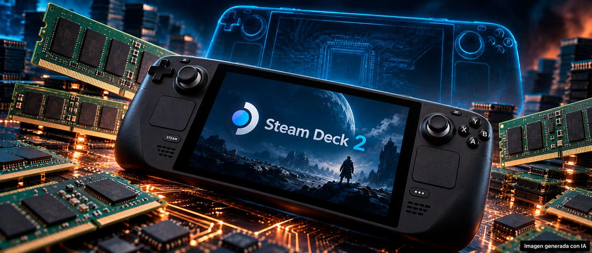

La Steam Deck sigue siendo la referencia entre las consolas portátiles de PC, y cada filtración sobre su sucesora se lee con atención. La última apunta a una APU de AMD bautizada «Gainsborough» que combinaría núcleos Zen 6, gráficos RDNA 5 y un nodo de 3 nanómetros. Conviene decirlo desde el principio: se trata de un rumor y ni AMD ni Valve lo han confirmado, así que ningún dato de los que siguen debe tomarse como un anuncio.

## Una APU semicustom llamada «Gainsborough»

El canal de YouTube Moore's Law is Dead vuelve a la carga con un vídeo sobre la futura consola de Valve, recogido por El Chapuzas Informático. La filtración, atribuida a un usuario de X, señala la aparición de una APU llamada «Gainsborough» en los controladores de AMD y en documentación interna. Se describiría como una APU semicustom diseñada por el equipo S3 de AMD para clientes, y no estaría destinada a los portátiles de otras marcas.

Según esa misma información, se fabricaría con el nodo TSMC N3P de 3 nanómetros, y el equipo que la habría desarrollado también participó en las consolas PlayStation. La principal pista sobre su destino es el nombre: la APU de la Steam Deck original se llamaba «Aerith», y «Gainsborough» es el apellido de la misma protagonista de Final Fantasy VII, de modo que juntos forman el nombre completo del personaje. Es un guiño sugerente, pero solo eso.

## Qué rendimiento se le atribuye a esta Steam Deck 2

Si la filtración se cumpliera, la configuración más ambiciosa hablaría de entre 4 y 8 núcleos Zen 6C, entre 12 y 24 unidades de cómputo RDNA 5 y fabricación en N3P, con un rendimiento similar al de la futura PS6 portátil. El salto frente a la Steam Deck original sería notable: donde la actual se mueve en la órbita de una PS4, esta apuntaría más cerca de una PS5, sobre todo en escenarios con trazado de rayos y reescalado, donde la generación RDNA 5 saca ventaja.

La filtración añade detalles sobre la rumoreada PS6 portátil, que usaría una APU «Canis» fabricada también en N3P, con 4 núcleos Zen 6C y 2 núcleos Zen 6 LP, soporte de hasta 48 GB de RAM LPDDR5X a 192 bits y una iGPU de 16 CU que funcionaría a 1,2 GHz en modo portátil y a 1,65 GHz en modo dock. Para la Steam Deck 2, la ventana de lanzamiento que se maneja es de finales de 2027 a principios de 2028.

## Por qué importa más el catálogo que la guerra de teraflops

Leído en frío, el rumor promete el tipo de salto que Valve lleva años pidiendo a gritos. La compañía ha repetido que no dará el paso a una segunda generación hasta que el hardware suponga una evolución real y no un simple aumento de potencia a costa de la autonomía. Esa es la razón por la que la pregunta clave no es cuántos teraflops sumaría «Gainsborough», sino qué permite ejecutar: un salto de RDNA 5 en trazado de rayos y reescalado se traduce en juegos que hoy exigen concesiones, no en una cifra para presumir.

Conviene recordar que el discurso de Valve sigue siendo prudente y que el movimiento del hardware no siempre llega cuando se espera. La propia compañía reconoció hace unas semanas que todavía estudia «cómo y cuándo» presentar la sucesora, tal y como recogimos al cubrir sus declaraciones sobre [cuándo llegará la Steam Deck 2](/noticias/steam-deck-2-how-when/). El catálogo, la compatibilidad verificada y el soporte de la generación actual pesan hoy más que una tabla de especificaciones sin confirmar.

## Qué significa para quien va a comprar

No hay confirmación oficial de AMD, Valve ni Sony, y los rumores de 2024 que situaban la consola a finales de 2026 no se han cumplido, así que la sucesora parece todavía lejos. Para quien quiera jugar ahora, la Steam Deck actual sigue funcionando y mantiene el soporte del fabricante; para quien esté dispuesto a esperar, la filtración dibuja una portátil más cercana a una PS5, pero sin fecha ni precio y con el riesgo habitual de las filtraciones. Comprar a partir de un rumor nunca es un buen plan: la decisión debería llegar cuando exista hardware real y un catálogo que lo aproveche.
