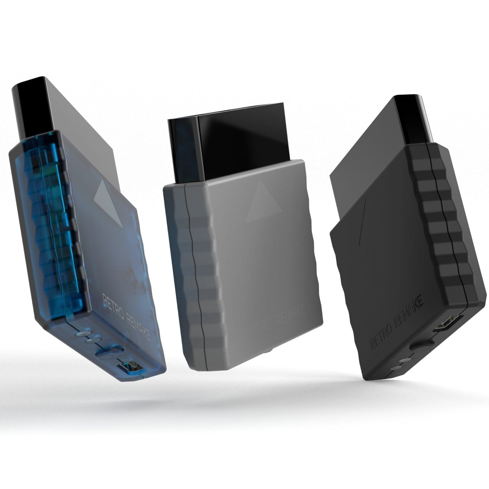

El SuperStation One, la consola basada en FPGA de Taki Udon y fabricada por RetroRemake, ya tiene abiertas las reservas de una nueva remesa en colores transparentes. Se trata de acabados que la firma presenta como edición limitada y que, según el propio Udon, no volverán a fabricarse una vez se agoten.

Los pedidos se gestionan a través de la web de RetroRemake y parten de 249,99 dólares para los nuevos colores, con los primeros envíos previstos para diciembre. Quien quiera una unidad tendrá que darse prisa: parte de las variantes ya están empezando a agotarse.

## El SuperStation One: una plataforma FPGA pensada para el catálogo

La clave del SuperStation One es que no funciona como un sistema cerrado, sino como una plataforma FPGA que ejecuta muchos de los núcleos de MiSTer. Eso significa que, además de la emulación de la primera PlayStation, en la que se inspira su diseño, la consola va sumando otras máquinas a lo largo de la generación gracias a esa base de núcleos.

Para quien juega a retro, ese planteamiento importa más que la ficha técnica: el valor no está en una cifra de rendimiento, sino en cuánto catálogo puedes tener en un único aparato conectado al televisor. La compatibilidad con el ecosistema MiSTer es, precisamente, lo que ha convertido al SuperStation One en una de las opciones FPGA más seguidas del sector, y la comunidad no deja de ampliarla: hace unos días vimos cómo el [kit Mercury convierte un MiSTer FPGA en una Sega Saturn](/noticias/emuladores/mister-fpga-mercury-sega-saturn/), una muestra de hasta dónde puede llegar ese catálogo.

## Precio, reservas y promoción de lanzamiento

- **Precio de partida:** 249,99 dólares para los nuevos colores transparentes.
- **Envíos:** comienzan en diciembre.
- **Código promocional:** `preorder-bonus` regala un receptor Bluetooth o un cable AV con el pedido, y está activo hasta el 12 de octubre.
- **Disponibilidad:** al tratarse de una edición limitada, RetroRemake no tiene previsto reeditarlas cuando se agoten.

## Accesorios que amplían la experiencia

El anuncio llega apenas un día después de que RetroRemake presentara su SuperStation Bluetooth Receiver, un accesorio que aprovecha el puerto de mando para conectar mandos Bluetooth actuales. Según el medio, el receptor no solo sirve para la SuperStation, sino que también funciona con las PS1 y PS2 originales.

A esa pieza se suma una bandeja de discos para PS1 que la compañía tiene en reserva para una próxima tanda y que permite reproducir los juegos originales en disco de forma auténtica, un detalle relevante para quien conserva su colección física.

## Qué cambia para el que quiere comprar una

La llegada de colores transparentes no cambia lo que la consola hace, pero sí refuerza el gancho de una máquina que vive de su catálogo y de su comunidad. La decisión de compra, en cambio, sigue dependiendo de lo mismo que siempre: cuántos núcleos te interesan de verdad y durante cuánto tiempo la plataforma seguirá recibiendo soporte.

Con una edición limitada que no se va a reponer y unas unidades que ya empiezan a escasear, quien dude entre esperar o reservar debería tener claro que aquí el reloj corre en contra. Si el catálogo retro y el soporte a largo plazo pesan en tu decisión, el momento de mover ficha es ahora.
