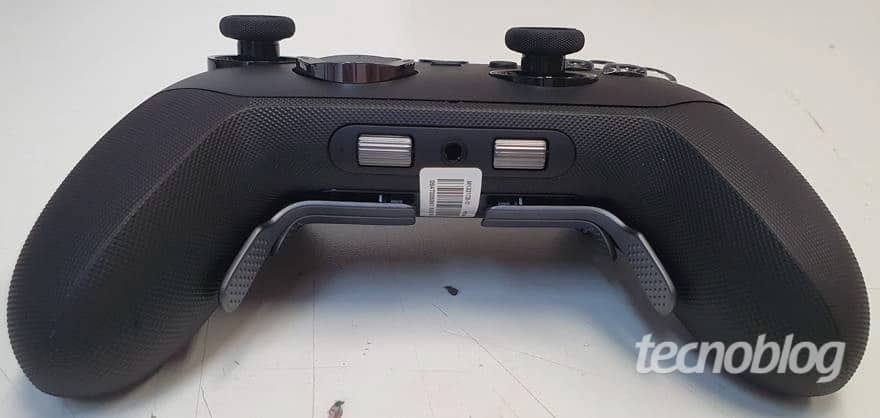
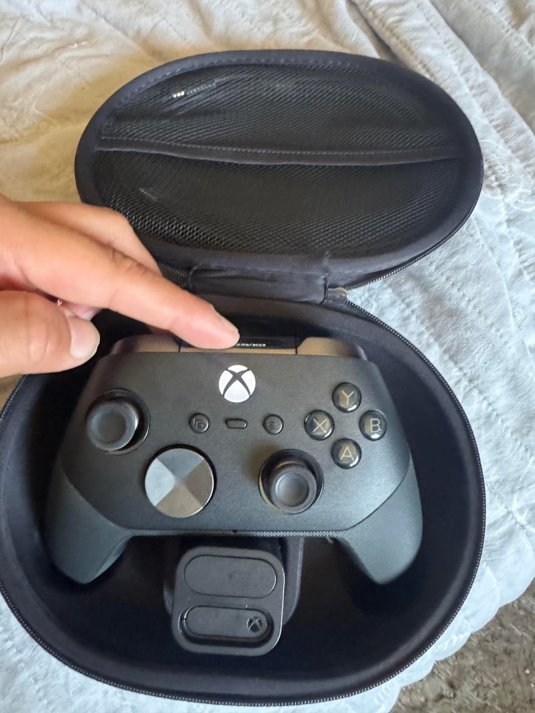

El Xbox Elite Series 3 ha vuelto a asomar, y esta vez la pista llega desde dentro de la propia Microsoft. Un vaciado de datos del Xbox Design Lab, recogido por KitGuru, ha dejado a la vista referencias a joysticks Hall Effect y TMR, unos hápticos descritos como «avanzados» y una rueda de desplazamiento para el audio. No hay anuncio oficial, ni fecha, ni precio: conviene leer todo lo que sigue como una filtración, no como una confirmación.

## Qué se ha filtrado

El origen del rastro es la tienda de personalización Xbox Design Lab: según los datos que circulan por Reddit y que recogen KitGuru, Windows Central y El Chapuzas Informático, el próximo mando Elite apostaría por dos tipos de sensor antideriva a la vez, Hall Effect y TMR, en módulos de joystick intercambiables con variantes de tensión estándar, suelta y firme. A ello se sumaría una opción de recorrido «silencioso» o de baja fricción, pensada para rebajar el roce y el ruido del stick contra su anillo.

En personalización, la filtración describe 27 combinaciones distintas de toppers y paletas traseras, con paletas estándar, clásicas, de doble anchura, cortas, largas y tipo mariposa. Las crucetas se dividen entre diseños estándar, de cruz y facetados o de mayor agarre, separando por fin las meramente estéticas de las que el material filtra como «Performance D-pad». También aparecen faceplates metálicos, acabados con nombre propio, más colores y grabado personalizado.

El capítulo de la vibración es el que más se parece a lo que Sony estrenó con el DualSense: la lista habla de hápticos «avanzados» que combinan motores de disparador por impulso (ERM) con actuadores VCA, una receta que apunta a una respuesta más suave y precisa que la de un motor convencional. Cierra el cuadro una rueda de desplazamiento dedicada al control de volumen, la pieza que ya se intuía en filtraciones anteriores del mando.

## Por qué el Xbox Elite Series 3 puede acabar con el drift

Para quien juega, la noticia no está en la lista sino en una palabra: drift. El desgaste de los potenciómetros analógicos hace que el personaje se mueva solo, y afecta a los mandos oficiales de las tres grandes. Los sensores magnéticos Hall y los TMR eliminan ese contacto físico, así que la deriva deja de ser una cuestión de tiempo. No es una tecnología inédita en el sector: el [Turtle Beach Rematch para Switch 2](/noticias/turtle-beach-rematch-switch-2-review/) ya apostaba por sticks TMR, y el [Nacon Revolution 5 Unlimited](/noticias/consolas/nacon-revolution-5-unlimited-ps5/) dejó claro que los mandos premium oficiales no tienen reparos en subir de precio por añadidos que antes eran terreno de terceros. Que Xbox los adopte de serie en su mando tope de gama sería el cambio con más impacto real en la experiencia, por encima de cualquier cifra de papel.

## Qué cambia para el jugador

De momento, poco tangible: no hay precio ni fecha. KitGuru recuerda que los Elite Series 2 rondan las 150 libras en Reino Unido y que las nuevas funciones podrían empujar el precio del Series 3 algo más arriba. La propia filtración habla de cuatro SKU —dos con motores hápticos completos y dos sin ellos, repartidos entre versiones base y «completas»—, lo que sugiere que la háptica avanzada será un extra que se pague aparte.

Desde Windows Central apuntan además a una conexión Wi-Fi directa para reducir la latencia en Xbox Cloud Gaming y a un cambio de dispositivo más ágil entre Xbox, Bluetooth y otras fuentes, aunque esas funciones no forman parte de la lista filtrada y su autor las presenta como algo que ha oído, no como un hecho. El mismo medio sostiene que fiabilidad y reparabilidad habrían sido prioridades de diseño, una promesa que solo se podrá comprobar con el mando en las manos.

Y si algo está claro es que el Elite Series 2 arrastró una fama de problemas de calidad que el Series 3 tendría que romper. La decisión de compra, como siempre, no llegará con la lista de características: llegará con el precio, con el soporte a lo largo de la generación y con si este mando, por fin, aguanta años sin que vuelvan los males de su predecesor.
