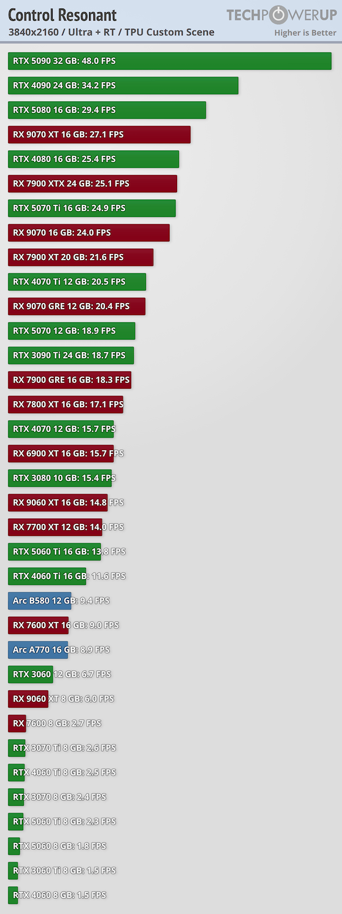

El lanzamiento de **Control Resonant**, la secuela de *Control* firmada por Remedy Entertainment, ha traído consigo una de las cargas gráficas más severas de los últimos años. El análisis de rendimiento publicado por **TechPowerUp** —con 35 tarjetas gráficas puestas a prueba— deja una conclusión incómoda: ni siquiera la **GeForce RTX 5090** logra mantener los 60 fps a 4K nativo con trazado de rayos activo y sin reescalado por inteligencia artificial. Se queda en **48 fotogramas por segundo**.

## Qué dicen las pruebas

El escenario medido por TechPowerUp es exigente de por sí: 3840×2160, calidad Ultra y trazado de rayos en el escenario personalizado del medio, todo sin activar DLSS ni FSR. En esa configuración, la RTX 5090 marca 48,0 fps, por debajo del umbral de fluidez que la mayoría de jugadores considera aceptable. La RTX 5080, un escalón por debajo, cae hasta los 29,4 fps, un resultado que la deja prácticamente fuera de juego. Incluso la RTX 4090, todavía una referencia dentro de la generación anterior, se queda en 34,2 fps.

Un matiz importante es que la RTX 5090 utilizada en las pruebas aún funcionaba con controladores en fase temprana, por lo que el medio no descarta que futuras versiones de software expriman algo más de rendimiento. Aun así, el margen que la separa de los 60 fps es amplio.

## Por qué Control Resonant es tan exigente

El motivo no es un capricho de los ajustes gráficos. La obra integra **iluminación global y trazado de trayectorias (path tracing)** en todos los presets de trazado de rayos, sin permitir desactivarlos por separado. El path tracing simula el rebote de la luz varias veces dentro de la escena para lograr un resultado mucho más realista, pero su coste computacional crece de forma desproporcionada respecto al trazado de rayos convencional. Es el mismo tipo de carga que ya vimos en *Alan Wake 2*, también de Remedy y también sobre el motor propietario Northlight.

A esto se suma que el título no ofrece un modo de renderizado puramente nativo: obliga a pasar por DLSS o FSR —con escalado al 100 % como opción—, lo que confirma que sus responsables contaban con el reescalado como parte de la experiencia desde el primer día.

## Qué cambia para el jugador

La lectura práctica para quien piense jugarlo en PC es sencilla: si se quiere disfrutar a 4K con *path tracing* y calidad máxima, el reescalado y la generación de fotogramas dejan de ser un extra y pasan a ser requisitos de facto. Según los datos recogidos, incluso a 1080p con calidad Ultra y trazado de rayos haría falta al menos una RTX 4070 para rondar los 60 fps sin ayuda del reescalado.

Para el jugador hispanohablante que esté valorando actualizar su equipo, el mensaje es claro: las tarjetas de gama alta siguen siendo la vía para las configuraciones más ambiciosas, pero la reconstrucción de imagen por software ya no es un adorno, sino la pieza que decide si el juego se puede disfrutar o no a resolución 4K.
