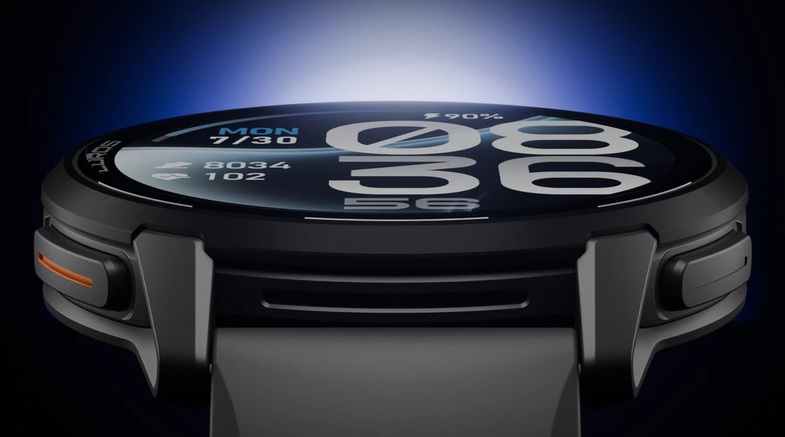
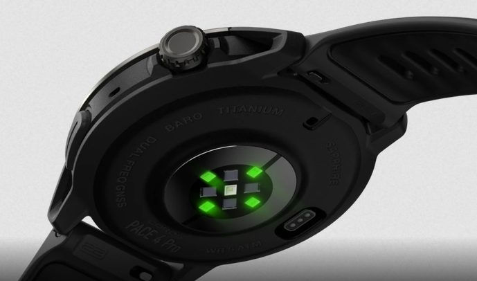

El Coros Pace 4 Pro ya tiene su primer análisis a fondo y deja una conclusión incómoda: es el mejor reloj que la marca ha construido en la saga Pace, con una pantalla legible a pleno sol y autonomía para una ultra de cien millas, pero su precio de 449 euros lo coloca en un terreno donde Garmin ofrece mucho más alrededor del deporte. El medio independiente the5krunner, que compró la unidad con su propio dinero, le otorga un 88 % y advierte de que las pruebas de precisión siguen en curso, con resultados detallados previstos para noviembre.

## Qué trae el Pace 4 Pro

El salto de hardware es el mayor que ha visto la familia. La pantalla LTPO AMOLED de 1,47 pulgadas y 466 × 466 píxeles alcanza los 3.500 nits declarados y se protege con cristal de zafiro y bisel de titanio TC4, una combinación inédita en la gama. El conjunto mide 47,6 mm de caja y 11,8 mm de grosor, con 43 gramos en correa de nailon y 51 en silicona. Según el fabricante, el panel es un 22,5 % más grande que el del Pace 4 a cambio de 11 gramos más de peso.

La autonomía es el otro argumento: 60 horas de GPS en modo Alto, 40 horas en modo Máximo de doble frecuencia y 21 días de uso diario, cifras que bajan a 45 y 30 horas y a 7 días si la pantalla permanece siempre encendida. La carga completa lleva alrededor de hora y media, y reproducir música recorta el GPS a 17 o 15 horas según el modo. Los datos de autonomía están confirmados en la página oficial del producto.

En navegación, los 32 GB de almacenamiento guardan mapas con nombres de calles y senderos, una veintena de categorías de puntos de interés y 14 niveles de zoom, con indicaciones giro a giro, aviso de salida del trazado y vuelta al inicio. El reloj duplica la memoria RAM del Pace 4 para mover los mapas con fluidez, pero no recalcula la ruta en la muñeca: si el corredor se equivoca, el mapa muestra su posición y el resto queda en sus manos. El altavoz y el micrófono permiten responder llamadas, escuchar avisos y usar el control por voz, aunque este exige llevar el móvil conectado con la aplicación abierta. Las notas de voz y los pines geolocalizados, que el análisis atribuye al Pace 4 de 2025, siguen presentes.

## Por qué importa: el precio cambia las reglas del juego

El Pace 4 Pro salió a la venta el 22 de septiembre por 449 euros en negro o blanco, con correa de silicona o nailon. Sustituye al Pace Pro y convive con el Pace 4, que cuesta 229 libras en Reino Unido y ya recibió mapas mediante actualización: entre ambos hay unos 160 euros de diferencia que, según el análisis, compran hardware y no software, porque mapas, métricas y entrenamientos son los mismos.

Y la lista de ausencias pesa a este precio: sin pagos sin contacto, sin música en streaming (solo archivos MP3 copiados desde el ordenador), sin tienda de aplicaciones, sin sensores ANT+ (solo Bluetooth) y sin plan de entrenamiento que se adapte a lo entrenado. El electrocardiograma es una medición puntual de 30 segundos dentro del chequeo de bienestar, la linterna usa la propia pantalla en lugar de un led dedicado y los perfiles de escalada quedan reservados al Apex 4. La plataforma de entrenamiento EvoLab, con carga de entrenamiento, estado de forma, predictor de carrera y VO2 máximo, sigue siendo gratuita, con novedades como la estrategia de ritmo para competición y las alertas de puertos.

La comparación que plantea el análisis es directa: el Garmin Forerunner 265, actualmente en oferta por debajo de las 290 libras, ofrece pagos, Spotify, ANT+, tienda Connect IQ y planes adaptativos a cambio de una pantalla más tenue, sin mapas con nombres de calles y con bastante menos batería. Quien busque mapas de Garmin tiene que subir hasta el Forerunner 970, que cuesta casi el doble. En un mercado donde cada gramo de autonomía cuenta, como se vio en el [duelo entre el Amazfit T-Rex 3 Pro y los Garmin Fénix](/noticias/amazfit-t-rex-3-pro-garmin-rival/), la batería vuelve a ser la moneda de cambio.

## Qué cambia para el lector: ¿merece la pena comprarlo?

El veredicto del análisis es matizado: compra Coros por lo que ocurre durante la carrera (pantalla, mapas, batería, construcción) y Garmin por todo lo que la rodea (pagos, música, aplicaciones, entrenamiento adaptativo, recálculo de ruta). Para la mayoría de los corredores, concluye, el Pace 4 por 229 libras es la compra más sensata ahora que comparte mapas y software. El Pace 4 Pro queda para quien vaya a aprovechar las 60 horas de GPS, necesite leer la pantalla bajo cualquier luz o haya roto antes el cristal mineral de un Pace más barato.

Queda una reserva importante: la precisión del nuevo sensor óptico de frecuencia cardiaca aún no tiene nota final. Las primeras pruebas apuntan a un GPS entre bueno y puntero, pero con dudas en el pulso óptico, en línea con lo observado por otros probadores independientes. Los resultados completos llegarán en noviembre y pueden mover el veredicto en uno u otro sentido.

La atribución completa de especificaciones, tablas comparativas y metodología de pruebas corresponde al análisis original de the5krunner, enlazado en la fuente de este artículo.
