Corsair ha renovado su catálogo de refrigeración con la segunda generación de sus kits de refrigeración líquida **Nautilus II** y con los nuevos ventiladores **RS II** y **RS II ARGB**. La línea de AIO se divide en tres familias —RS LCD, RS y RS ARGB— con radiadores de 240 y 360 mm, mientras que los ventiladores se venden por separado en formatos de 120 y 140 mm y en un bloque unificado de 360 mm. Todos los componentes se conectan directamente a la placa base, sin necesidad de un controlador externo.

## Qué ha lanzado Corsair

El anuncio abarca seis configuraciones de refrigeración líquida y seis referencias de ventilador. Los **Nautilus II RS LCD** llegan en 240 y 360 mm y en acabado negro o blanco; los **Nautilus II RS**, sin iluminación, solo en negro; y los **Nautilus II RS ARGB**, con luz direccionable, en negro o blanco. En el apartado de ventiladores, Corsair ofrece los **RS II** en versión suelta de 120 y 140 mm y en el formato RS360 II Unified Frame, con variantes ARGB equivalentes.

La compañía insiste en un punto práctico: tanto los ventiladores como las bombas se gestionan desde la propia placa base, de modo que no hace falta añadir un controlador dedicado para ajustar las curvas de velocidad ni la iluminación.

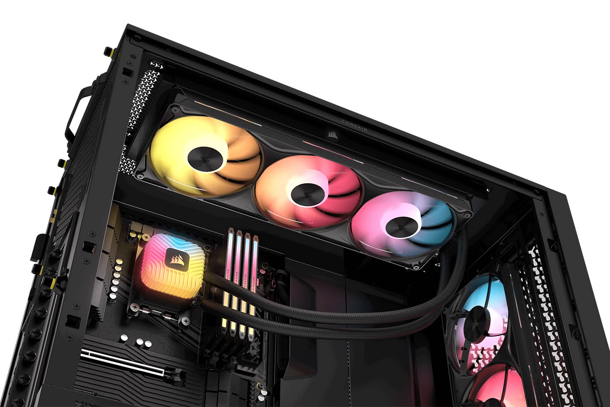

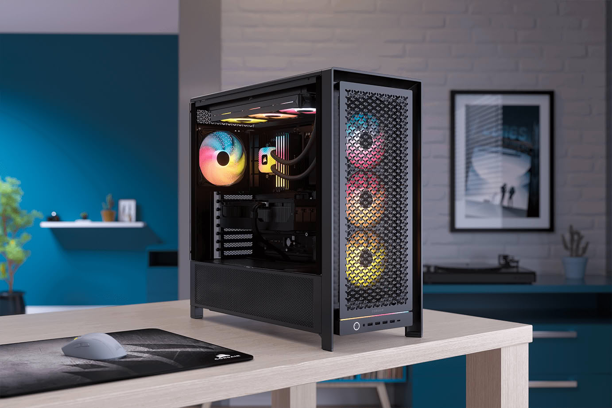

## Pantalla más grande y bomba FlowDrive 2S

La variante más llamativa es la **RS LCD**, que sustituye la pantalla circular de 2,1 pulgadas de la generación anterior por un panel IPS rectangular de **3,5 pulgadas**, un 67 % más grande y con una resolución de 480 × 640 píxeles a 60 Hz. La pantalla se conecta por DisplayPort y Windows puede reconocerla como una segunda pantalla; además, permite mostrar métricas del sistema, GIF animados y widgets de iCUE a un máximo de 60 FPS.

Bajo la pantalla, Corsair instala la nueva bomba **FlowDrive 2S** y una placa fría más delgada, optimizada para los procesadores AMD actuales, con la que busca reducir la resistencia térmica y mejorar la transferencia de calor. El conjunto se apoya en los nuevos ventiladores RS II, que aportan presión estática concentrada y cuentan con modo Zero RPM para detener las aspas cuando la carga es baja.

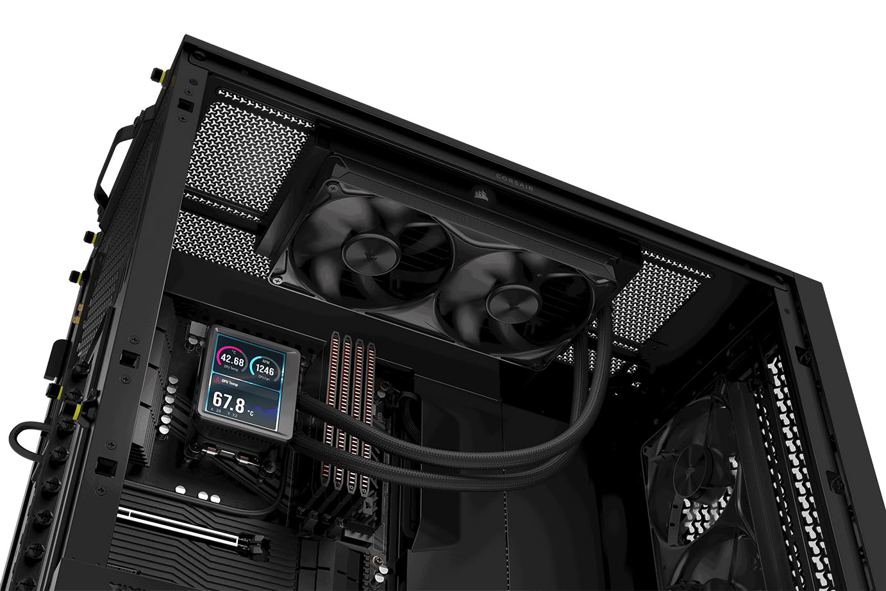

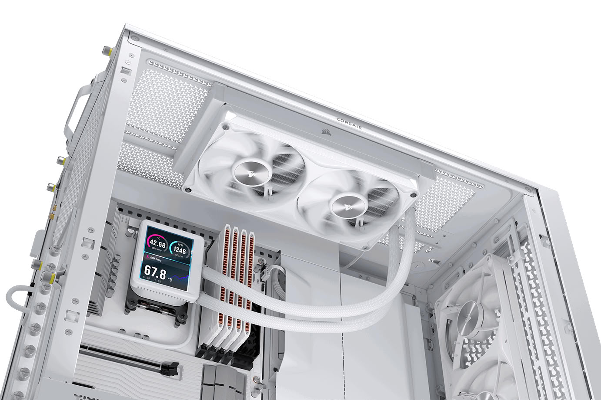

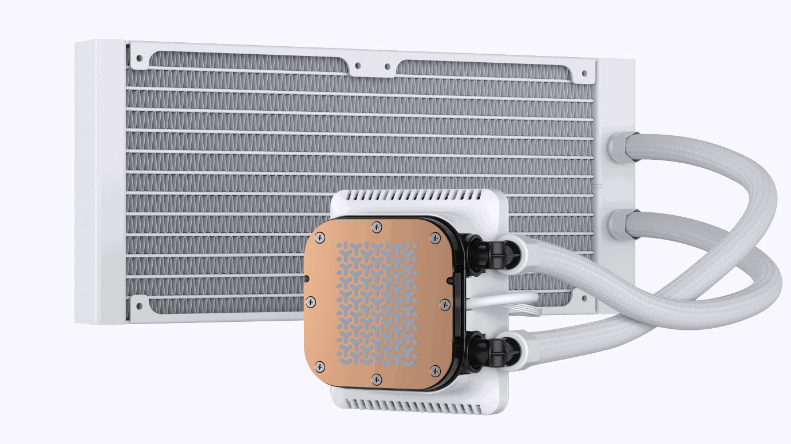

## Ventiladores RS II: marco unificado, ARGB y control directo

Los RS II estrenan álabes con tecnología **AirGuide** rediseñados, pensados para reducir el ruido y concentrar el flujo de aire a través de radiadores densos. Sus rodamientos **Magnetic Dome** buscan una marcha más silenciosa y una mayor vida útil, y el diseño **Unified Frame** agrupa los ventiladores en un solo bloque para simplificar el cableado: el RS360 II se fija con apenas cuatro tornillos. La conexión en cadena permite enlazar varios ventiladores y controlarlos como un grupo desde la placa base.

En las versiones ARGB, cada ventilador incorpora ocho LEDs direccionables y la tapa de la bomba suma otros ocho, lo que da un total de **24 LEDs en los modelos de 240 mm y 32 en los de 360 mm**. Quien ya tenga el ecosistema iCUE LINK puede integrar los nuevos componentes con el módulo **COMMANDER DUO**, vendido por separado, que unifica el control PWM y ARGB.

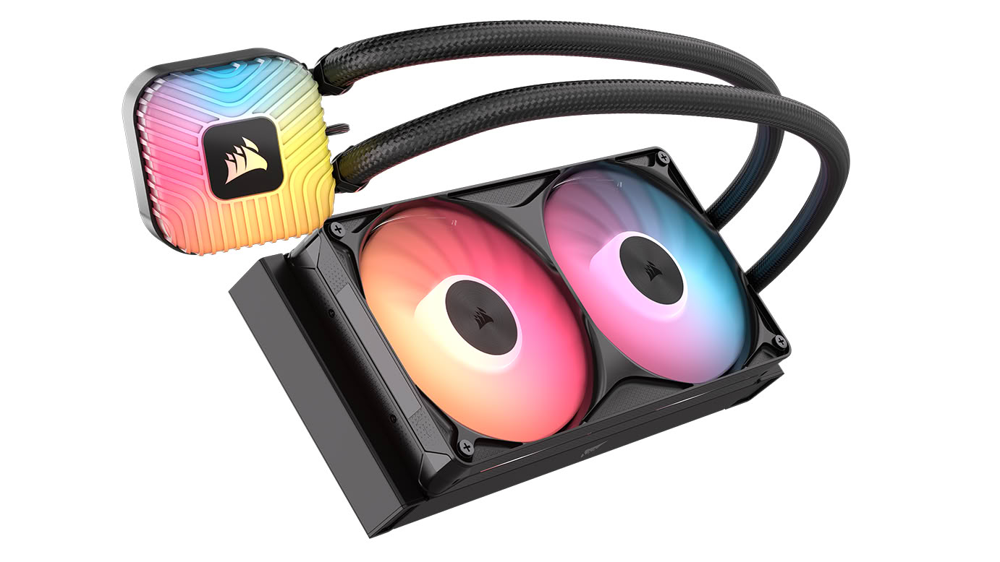

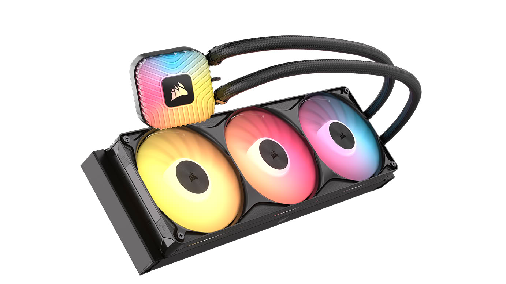

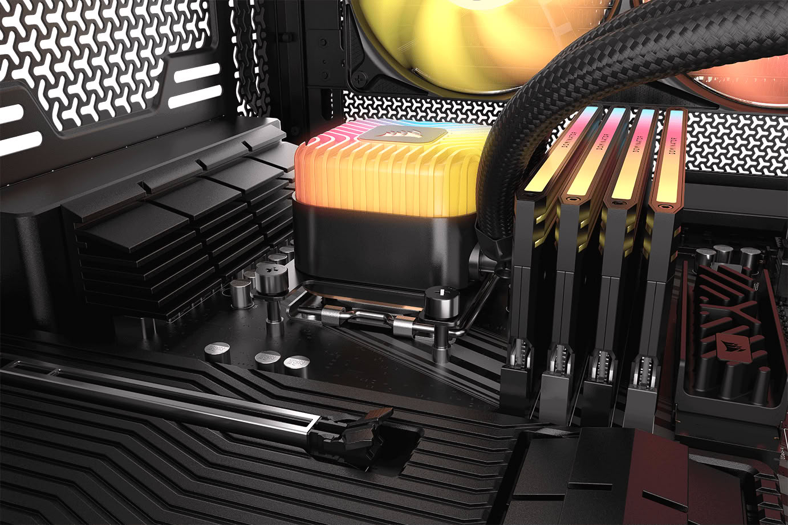

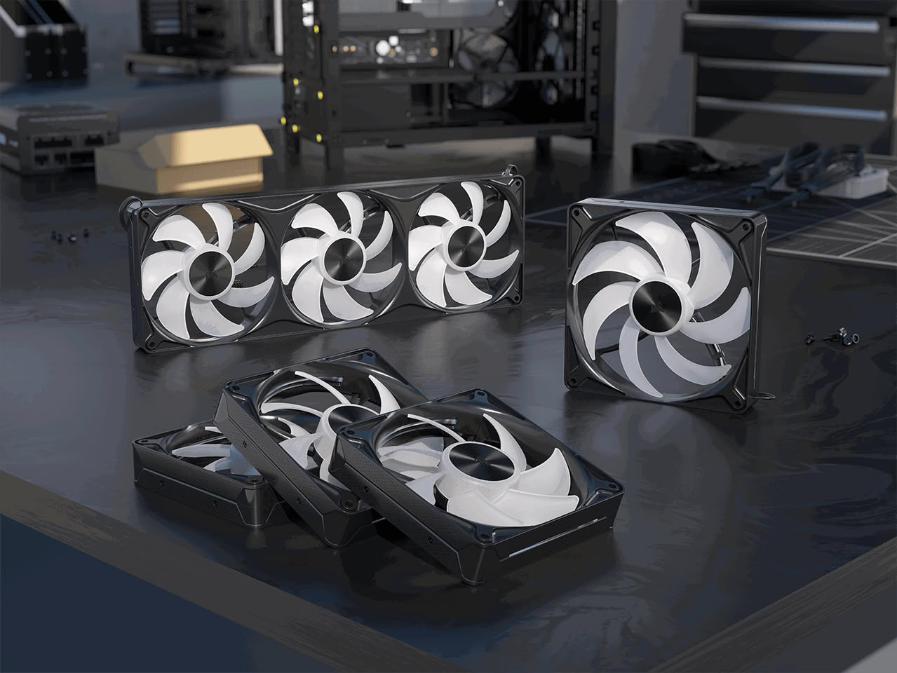

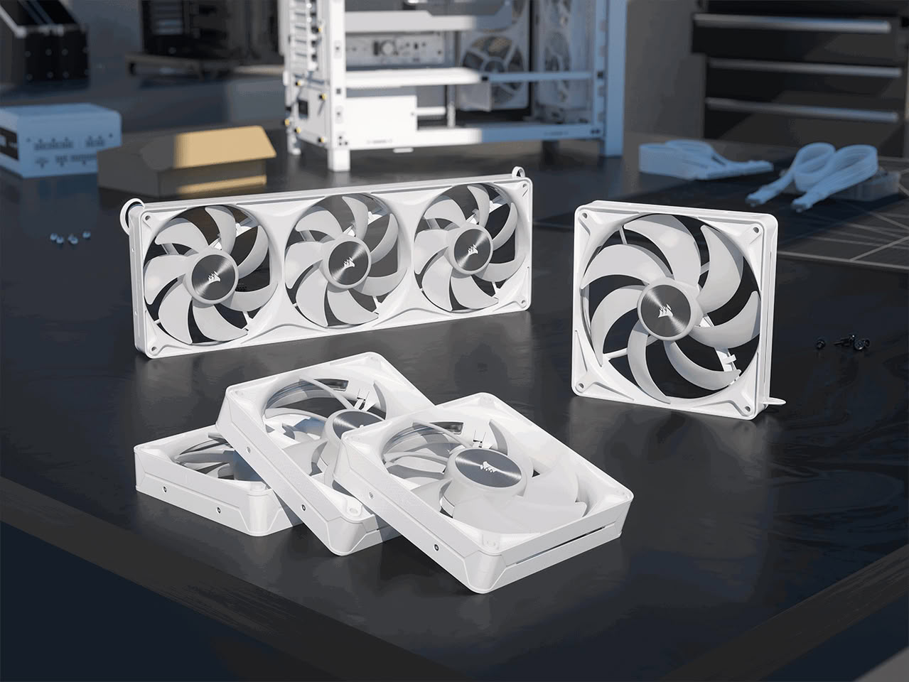

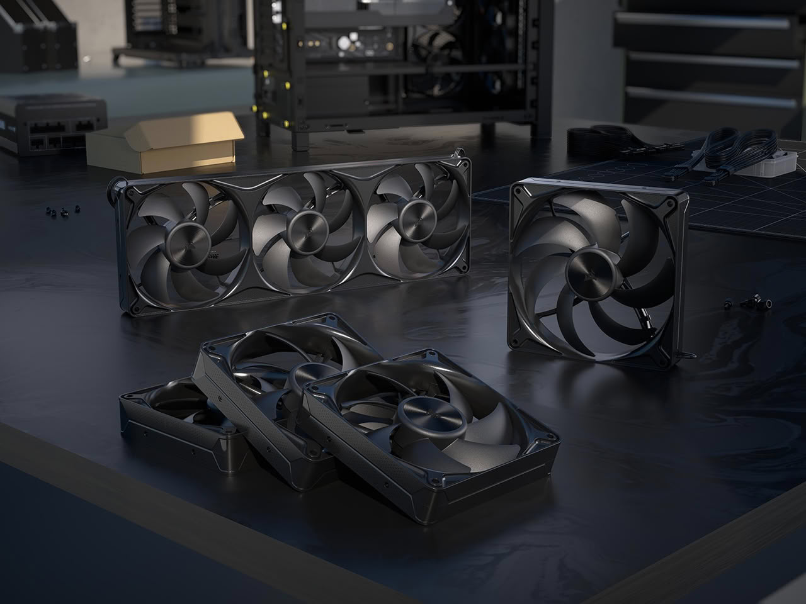

## Precios en Europa y disponibilidad

Los productos ya están disponibles en la tienda de Corsair y en distribuidores autorizados, con una **garantía de cinco años**. Estos son los precios oficiales para Europa con IVA incluido:

| Modelo | Radiador | Acabados | Pantalla LCD | Precio (Europa, IVA incl.) |
| --- | --- | --- | --- | --- |
| Nautilus II RS LCD | 240 mm | Negro y blanco | 3,5" · 480 × 640 · 60 Hz | 129,90 € |
| Nautilus II RS LCD | 360 mm | Negro y blanco | 3,5" · 480 × 640 · 60 Hz | 149,90 € |
| Nautilus II RS | 240 mm | Negro | — | 84,90 € |
| Nautilus II RS | 360 mm | Negro | — | 104,90 € |
| Nautilus II RS ARGB | 240 mm | Negro y blanco | — | 89,90 € |
| Nautilus II RS ARGB | 360 mm | Negro y blanco | — | 114,90 € |

| Ventilador | Formato | Precio (Europa, IVA incl.) |
| --- | --- | --- |
| RS120 II | 120 mm | 11,90 € |
| RS140 II | 140 mm | 17,90 € |
| RS360 II Unified Frame | Bloque unificado de 360 mm | 29,90 € |
| RS120 II ARGB | 120 mm | 17,90 € |
| RS140 II ARGB | 140 mm | 23,90 € |
| RS360 II ARGB Unified Frame | Bloque unificado de 360 mm | 39,90 € |

Para el comprador, lo relevante es que Corsair lleva la refrigeración líquida con pantalla a precios contenidos: el Nautilus II RS LCD de 240 mm se queda en 129,90 euros y la gama de ventiladores arranca en 11,90 euros. Además, la conexión directa a la placa base simplifica el montaje al no exigir un controlador externo para regular velocidad e iluminación.

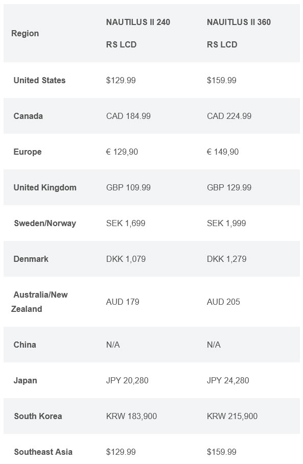
