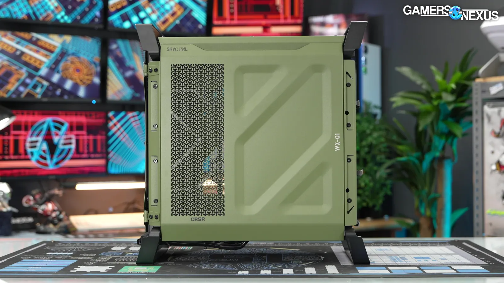
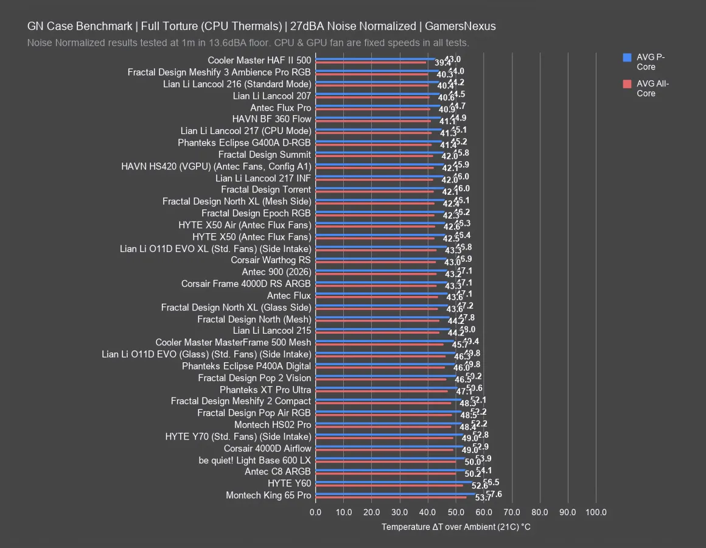

La Corsair Warthog ya está a la venta y es justo lo que promete su aspecto: una caja divertida de estética militar que recupera el espíritu del Vengeance C70 de 2012. Según el análisis de GamersNexus, cuesta 180 dólares sin ventiladores y 200 dólares en su variante RS, con dos ventiladores frontales de 200 mm y uno trasero de 120 mm. Su lanzamiento llegó en septiembre tras un calendario accidentado: prevista primero para el 11 de agosto, Corsair la retrasó a octubre al detectar holguras en el embalaje y finalmente la adelantó a septiembre.

## Una Corsair Warthog nostálgica montada sobre la Frame 4000D

El guiño militar está en cada detalle: pintura verde oliva (también disponible en negro), serigrafía estilo plantilla, protectores de interruptores, tapa abatible sobre los conectores frontales, tornillería vista y una etiqueta de tela de «quitar antes de montar». El nombre y el acabado remiten además al vehículo M12-FAV de Halo, tal como señala el medio. Nada de esto mejora el rendimiento; es pura diversión, algo que el laboratorio celebra después de años de cajas intercambiables.

Por dentro, Corsair confirmó desde el principio que la base es una Frame 4000D, una caja que el propio GamersNexus ya había valorado positivamente. De ella hereda buena parte de las especificaciones y el sistema modular de la familia Frame, incluida la bandeja perforada compatible con placas de conector trasero y un frontal que admite gráficas de hasta 400 mm con ventiladores instalados. La conectividad frontal incluye un USB-C 3.2 Gen 2x2 de 20 Gbps, dos USB-A 3.1 Gen 1 y toma combinada de audio. Para quien busque otras opciones recientes del mercado, conviene repasar [la caja Cronox ARGB presentada por ASUS](/noticias/asus-rog-cronox-eurux/).

## Construcción y montaje de la Corsair Warthog: luces y sombras

El análisis deja una impresión agridulce en la calidad constructiva. Las asas y las patas de acero, de unos 3,4 mm con pintura, soportan sin problema el peso del equipo, pero al retirar los paneles exteriores queda el chasis ligero de la Frame, que flexa con facilidad. Los paneles laterales no llevan tornillos y encajan en el panel superior, lo que obliga a un orden concreto de desmontaje; el medio se pregunta si el retraso del embalaje tuvo que ver con paneles que se soltaban durante el transporte.

Hay detalles cuidados: un LED trasero que ilumina la zona de conexiones (un acierto heredado de clásicas como la NZXT H440 que nunca se generalizó), accesorios en bolsas de papel con clasificador de tornillos reutilizable y las especificaciones impresas en una etiqueta trasera. La gestión de cables es buena gracias a la bandeja perforada con puntos de amarre reposicionables, y Corsair publica modelos imprimibles en 3D para accesorios, aunque el laboratorio advierte de que resultan exigentes de imprimir. El punto débil es la capacidad de serie para almacenamiento: sin una jaula adicional, solo admite dos unidades de 2,5 pulgadas y una de 3,5. Además, los ventiladores de 200 mm de la versión RS no se pueden reubicar, el soporte lateral queda prácticamente inutilizable con una placa ATX estándar y el montaje superior, teórico para radiadores de hasta 360 mm, se queda en la práctica en un máximo razonable de 280 mm.

## Térmicas y ruido: la Corsair Warthog pierde frente a sus rivales

Con los ventiladores ajustados a un umbral de 27 dBA en cámara hemianecoica, la CPU quedó 47 grados por encima de la temperatura ambiente, empatada con la Frame 4000D RS pero por detrás de la Fractal Torrent (46), la HAVN BF 360 Flow (45) y la Cooler Master HAF II 500 (43). En GPU el resultado es más flojo: 48 grados sobre ambiente y 53 en la VRAM, frente a los 45 de la Frame 4000D RS, los 43 de la BF 360 y los 42 de la HAF II 500, todas ellas normalizadas al mismo ruido.

A máxima velocidad, la Warthog RS marcó 39 dBA, más silenciosa que la mayoría de las comparadas, y empató con la Torrent en CPU con 42 grados sobre ambiente, aunque la BF 360 (41) y la HAF II 500 (40) siguieron por delante. En GPU mantuvo la debilidad con 47 grados sobre ambiente y 51 en la VRAM, lejos de los 39 de la Torrent. El laboratorio apunta a una posible mejora mediante un deflector impreso en 3D que dirija el aire hacia la gráfica, pero los modelos existentes de la Frame 4000D habría que adaptarlos al chasis de la Warthog.

La conclusión es clara y el medio la formula sin rodeos: por rendimiento puro, la HAF II 500 ofrece mejores cifras al mismo precio, la Torrent sigue siendo una referencia y la Frame 4000D RS comparte chasis con la Warthog a mitad de precio (unos 85–90 dólares en la tienda de Corsair). Con 200 dólares sin ser una barbaridad en el mercado actual, la Warthog solo tiene sentido si su estética conquista al comprador; es, en palabras del análisis, una compra nostálgica. Para el lector español, la lección es la habitual: antes de pagar el sobreprecio del diseño, conviene comprobar el precio final en Europa y si la refrigeración de la gráfica, su punto más débil, encaja con el equipo previsto.
