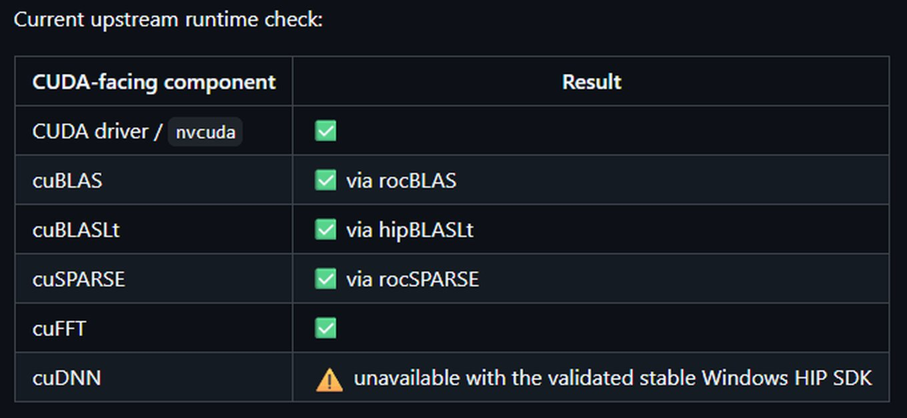

Un desarrollador en solitario ha demostrado que es posible ejecutar en Windows
cargas de trabajo que solo admiten CUDA sobre hardware de AMD, sin recurrir a la
virtualización ni al arranque dual. Su proyecto, publicado en GitHub bajo el
nombre de **CUDA-for-AMD-Windows**, consiguió hacer funcionar varias bibliotecas
de CUDA sobre una Radeon RX 9060 XT de consumo, la única GPU soportada
oficialmente por ahora.

El resultado no es un nuevo runtime, sino un puente cuidadosamente automatizado.
Aprovecha ZLUDA —la conocida capa de traducción que en su día recibió financiación
de AMD— y la conecta con el SDK HIP/ROCm nativo de Windows. De este modo,
herramientas y repositorios que exigen de forma rígida una GPU de NVIDIA pueden
llegar a ejecutarse en una Radeon.

## Cómo funciona el puente entre CUDA y ROCm

El proyecto se presenta como una configuración en PowerShell altamente
automatizada y reproducible. Mediante una serie de scripts, el conjunto detecta
la arquitectura de la GPU del usuario, descarga una versión concreta de ZLUDA
(la v6-preview.69) y la asigna a las bibliotecas matemáticas de ROCm que ya
están presentes en Windows.

En la práctica, el desarrollador logró interceptar y mapear la API del driver de
CUDA junto con las bibliotecas cuBLAS, cuSPARSE y cuFFT hacia sus equivalentes de
AMD. Como prueba de concepto, entrenó de principio a fin una red de aprendizaje
por refuerzo PPO de 2,2 millones de parámetros usando bibliotecas de CUDA sin
modificar sobre una Radeon RX 9060 XT.

## Rendimiento medido en una RX 9060 XT

La documentación del proyecto incluye una prueba A/B controlada con esa carga de
2,2 millones de parámetros. La ruta «pública», basada en versiones oficiales de
ZLUDA y en el HIP SDK 6.4 de AMD, alcanzó una mediana de 13.278 pasos por segundo
(SPS). Una superposición alternativa reconstruida a partir de binarios antiguos
de ZLUDA se quedó en 12.876 SPS, aproximadamente un 3 % más lenta.

| Métrica (mediana) | Ruta pública | Superposición recuperada |
| --- | ---: | ---: |
| SPS globales | 13.278,46 | 12.875,80 |
| SPS de recolección | 63.306,00 | 59.360,67 |
| SPS de consumo | 16.806,36 | 16.445,66 |
| Tiempo de inferencia | 0,5863 s | 0,6293 s |
| Tiempo de aprendizaje PPO | 3,2076 s | 3,2958 s |

Aun así, el propio autor advierte de que «una reescritura posterior eliminó
LibTorch/ZLUDA del PPO y logró un rendimiento sustancialmente mayor», lo que
indica que esta pila de traductores sigue imponiendo una penalización de
rendimiento.

## Limitaciones y qué esperar

Conviene mantener las expectativas en su sitio. Se trata de un proyecto
individual de código abierto, no de una solución empresarial, y su alcance es
deliberadamente estrecho. Bibliotecas clave para el aprendizaje automático, como
cuDNN, TensorRT y NCCL, todavía no se resuelven, por lo que la compatibilidad
depende por completo de cada carga de trabajo: si una herramienta concreta se
apoya en cuDNN, esta configuración fallará.

Además, el propio ZLUDA se mantiene hoy como un «proyecto de fin de semana»
después de perder su respaldo comercial por segunda vez, por lo que depender de
esta tubería para trabajo en producción sigue siendo un riesgo considerable. Se
trata de una herramienta para aficionados y experimentadores, no de una
estrategia de despliegue corporativo.

Pese a ello, la demostración es relevante: sugiere que la barrera para ejecutar
software exclusivo de CUDA en GPUs de AMD no es un defecto de hardware
insalvable, sino un problema de traducción relativamente abordable. Al ser
código abierto, su potencial va más allá de esta primera prueba, y las
contribuciones de la comunidad podrían ampliar la detección de hardware y
resolver bibliotecas más reticentes.
