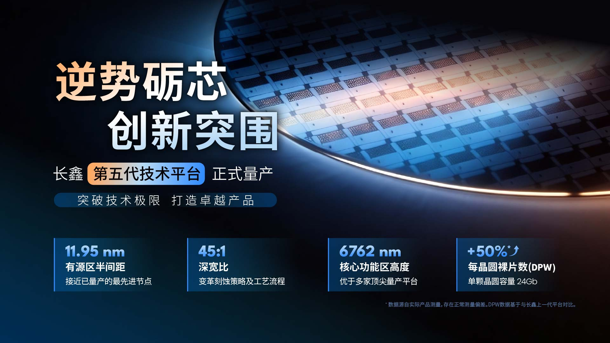

CXMT (ChangXin Memory Technologies) anunció el 20 de septiembre, en el marco de la World Manufacturing Convention celebrada en Hefei, la entrada en producción en masa de su plataforma tecnológica DRAM de quinta generación, bautizada como G5 Platform. Junto a ella presentó una nueva familia de productos LPDDR5X construida sobre esa misma base. La empresa china define el paso como un hito para su hoja de ruta, con procesos que, según su propio anuncio, se acercan a los mejores nodos de memoria que hoy se fabrican en volumen.

## Qué cambia en la plataforma G5 de CXMT

La plataforma G5 se apoya en una litografía de cuádruple patronaje (SAQP, por sus siglas en inglés) para llevar el semipaso del área activa de la matriz de memoria hasta los 11,95 nanómetros. A ese dato se suman otras dos cifras que resumen el salto de escala: la relación de aspecto del condensador alcanza 45:1 y la altura de la zona activa de la matriz se reduce a 6.762 nanómetros, gracias a la introducción de una puerta metálica de alto dieléctrico k (HKMG) optimizada para DRAM.

- **Semipaso del área activa:** 11,95 nm mediante cuádruple patronaje.
- **Relación de aspecto del condensador:** 45:1, tras rediseñar el flujo del proceso y combinar nuevos materiales.
- **Altura de la matriz de celdas:** 6.762 nm, con proceso HKMG específico para DRAM.
- **Densidad de chips:** al menos un 50 % más de dies por oblea (DPW) que la plataforma anterior.

CXMT añade que la densidad de oblea, el indicador que resume cuántos chips útiles salen de cada disco de silicio, crece al menos un 50 % frente a su generación previa. La compañía también menciona avances en ingeniería de interfaces, estructuras *saddle-fin* y líneas de bits con espaciador de baja constante dieléctrica (low-k). El desarrollo se apoya en un gemelo digital que abarca diseño, tape-out, fabricación y mantenimiento del rendimiento, una línea de I+D virtual donde la empresa modela el proceso antes de llevarlo a la fábrica. En la letra pequeña de su nota, CXMT advierte de que las medidas físicas tienen el margen de error habitual de la metrología y de que los porcentajes se calculan contra su cuarta generación.

## Dos módulos LPDDR5X de 24 Gb, ya en producción

El apartado de producto que acompaña al anuncio es un par de memorias LPDDR5X de 24 gigabits por dado, el 50 % más de capacidad que los modelos equivalentes de la generación anterior. CXMT las ofrece en dos encapsulados, de 496 y 245 bolas, pensados para teléfonos inteligentes y electrónica de consumo portátil, y asegura que ambas están ya en producción en masa.

La elección del formato no es casual. La LPDDR5X es la memoria de bajo consumo que domina los móviles y los equipos portátiles, justo el segmento donde CXMT compite de forma más directa con los grandes fabricantes. Que la empresa presente primero esta familia —y no una solución de alto ancho de banda para centros de datos— dice bastante de dónde está su fortaleza real hoy.

## Qué implica para los precios y para el tablero de la memoria

Ese «al menos un 50 % más de dies por oblea» es, en términos de negocio, el dato más relevante del anuncio. Producir más chips por cada oblea reduce el coste unitario de fabricación, y es precisamente la palanca con la que un fabricante puede bajar precios sin sacrificar margen. Sin embargo, conviene no sacar conclusiones precipitadas: CXMT sigue siendo un actor de escala muy inferior a Samsung, SK Hynix y Micron, de modo que su capacidad, por sí sola, no va a resolver la tensión de precios que atraviesa el sector.

El contexto del mercado ayuda a leer el movimiento. Mientras los tres grandes desvían su inversión hacia la memoria de alto ancho de banda que reclama la inteligencia artificial, la DRAM convencional —la de equipos de sobremesa, portátiles y móviles— ha ido quedando tensionada y más cara, como se ha notado incluso en el [precio de la gama iPhone de Apple](/noticias/apple-iphone-dram-price-hike/). En ese hueco es donde CXMT ha crecido, y su nuevo nodo le da argumentos técnicos para defender esa posición: si su semipaso de 11,95 nm está a la altura de lo que la industria produce en volumen, la distancia con los grandes en DRAM convencional se acorta.

El matiz importante es que la comparación procede de la propia CXMT y no cuenta con verificación independiente. Lo que el anuncio sí confirma es una estrategia: la compañía quiere dejar de ser un fabricante de segunda fila en nodos maduros y competir en la frontera de la DRAM de uso general, mientras la [rentabilidad extraordinaria que logró en el último trimestre](/noticias/cxmt-dram-margins/) le da margen financiero para sostener esa carrera. En el mercado de PC, ese avance ya ha tenido consecuencias visibles, como las [BIOS de ASUS para AM5 optimizadas para la DDR5 de CXMT](/noticias/asus-am5-bios-cxmt-memory/), señal de que el ecosistema empieza a tratar sus chips como memoria de primera.

Para el comprador hispanohablante, la lectura es de medio plazo. Un proveedor adicional fabricando en volumen y con mejor densidad añade competencia al mercado de memoria convencional, y eso históricamente empuja los precios a la baja. Pero entre el anuncio y una bajada perceptible en la tienda media hay distancia: la nueva capacidad debe traducirse en oferta real y la industria sigue atrapada por la demanda de los centros de datos. Hoy, la noticia cambia la posición competitiva de CXMT más rápido de lo que cambiará la factura de quien compre un portátil.
