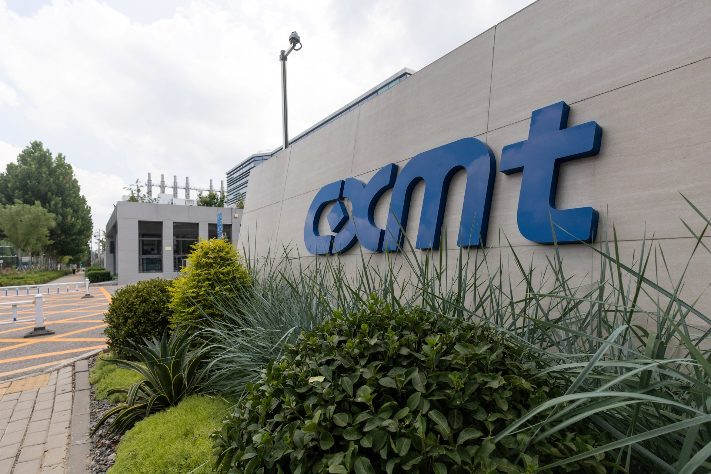
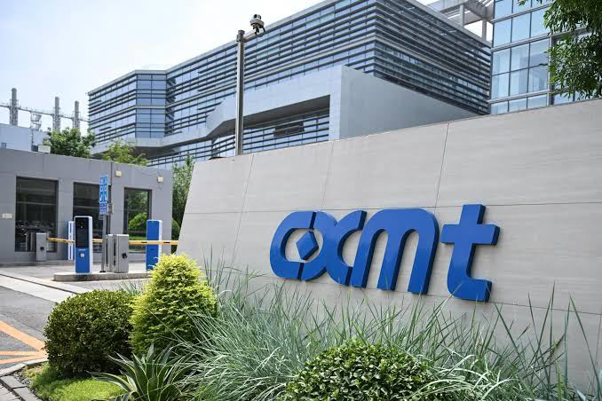
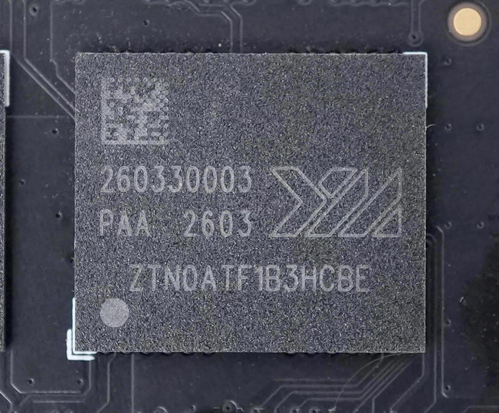

Un informe de Reuters publicado el 18 de septiembre asegura que CXMT (ChangXin Memory Technologies), el principal fabricante chino de memoria DRAM, estudia dar el salto al mercado de la memoria NAND flash. Según tres personas conocedoras de los planes de la compañía, la empresa prevé instalar una línea de producción y desarrollo (I+D) de NAND en su nueva planta de Pekín. La información no ha sido confirmada por CXMT ni por ninguna de las partes implicadas.

## Qué dice el informe

De acuerdo con las fuentes citadas por Reuters, CXMT planea habilitar una línea de I+D de memoria flash NAND en su segunda fábrica de la capital china. La compañía también habría puesto en marcha en Pekín un instituto de investigación entre cuyos proyectos figura el desarrollo de NAND, siempre según el mismo informe.

El reportaje añade que la empresa ya ha comentado sus planes con clientes, entre ellos una compañía de creación reciente que quiere comprar sus chips de NAND para productos de almacenamiento destinados a sistemas de inteligencia artificial y supercomputación. Reuters no identifica a ese cliente. Las fuentes hablan bajo condición de anonimato porque los planes de CXMT son privados.

Quedan abiertas las preguntas clave: no se sabe cuándo empezaría a operar la línea de I+D ni si CXMT tiene intención de pasar de la fase de desarrollo y producción de prueba a la fabricación comercial a gran escala. Tampoco hay datos sobre la arquitectura del 3D NAND, el número de capas, el proceso de fabricación, las prestaciones esperadas o la capacidad de producción.

## Un informe, no un anuncio oficial

Conviene leer la noticia con la etiqueta de rumor. CXMT no ha confirmado oficialmente ninguna iniciativa de 3D NAND, y el propio medio que publicó el informe original —Reuters— se apoya en fuentes anónimas. CXMT, su rival nacional YMTC, Samsung y el gobierno municipal de Pekín no respondieron a las peticiones de comentario.

El grado de confirmación es, por tanto, bajo, y el calendario, incierto. Un análisis publicado por Tom's Hardware a partir del mismo informe señala que la segunda fábrica de CXMT en Pekín todavía no ha comenzado las obras, de modo que una línea experimental dentro de ella no estaría operativa antes de dos o tres años como mínimo. Es decir: aunque el plan se materialice, no tendría ningún efecto sobre la escasez de memoria actual.

## Por qué importa: escasez, autosuficiencia y las dos estrellas

El contexto explica el movimiento. La fuerte demanda de los servidores de inteligencia artificial ha provocado una escasez global de memoria que la industria espera que se mantenga al menos hasta 2027. El consejero delegado de SK Hynix, Kwak Noh-jung, advirtió en julio de que 2027 podría ser el peor año del sector desde el punto de vista de la oferta, y la consultora TrendForce calcula que la tensión en el suministro de NAND no se relajará hasta la segunda mitad del próximo año. Los fabricantes han priorizado la inversión en DRAM y en memoria de alto ancho de banda (HBM), lo que ha limitado la capacidad añadida de NAND y ha agravado la escasez en ese segmento.

En ese escenario, CXMT y YMTC —conocidas en China como las "dos estrellas" de la industria nacional de memoria— han operado hasta ahora en mercados separados: CXMT domina la producción china de DRAM y YMTC es el principal fabricante local de NAND. Esa frontera empieza a difuminarse. Reuters informó en abril de que YMTC había enviado muestras de DRAM de bajo consumo a clientes, y ahora el informe apunta en la dirección contraria. El resultado sería una CXMT que compite de forma directa con Samsung, SK Hynix y Micron, pero también con su propia compatriota.

No es casual que sea una empresa china la que explore este paso. Según TrendForce, Samsung fue el mayor proveedor mundial de NAND por ingresos en el segundo trimestre, con una cuota del 29,3 %, seguida de SK Hynix y Micron. CXMT, en cambio, es hoy un especialista en DRAM que cotiza desde julio tras captar 57.920 millones de yuanes (unos 8.600 millones de dólares) en la mayor salida a bolsa de Asia en lo que va de año. Nació con dinero del gobierno de Hefei y el respaldo del gran fondo estatal de semiconductores, y ese origen explica que sus decisiones estratégicas no se lean solo en clave de rentabilidad: convertirse en el segundo productor chino de NAND encaja de lleno en el plan de autosuficiencia de Pekín.

De hecho, la lógica comercial del movimiento es discutible. El 3D NAND exige procesos, conocimientos y equipos muy distintos de los que necesita la DRAM, y algunos analistas dudan de que CXMT tenga incentivos económicos para dispersar sus recursos cuando ya obtiene buenos resultados en su negocio actual. Desde la óptica industrial del gobierno chino, en cambio, el cálculo es mucho más sencillo.

## Qué cambia para el comprador

A corto plazo, nada. Una línea de I+D, que además llegaría a una fábrica que aún no se ha empezado a construir, no altera la escasez de memoria ni los precios de los SSD que se están pagando hoy. Quien espere un alivio del coste de la memoria por esta noticia debería mirar a otro lado.

La lectura relevante es a medio plazo. Si CXMT supera la fase de investigación y llega a fabricar NAND en volumen, China pasaría a tener dos productores nacionales compitiendo entre sí y con los grandes del sector, un escenario que añadiría presión a la baja sobre los precios de la memoria flash con el tiempo. Y confirmaría una tendencia de fondo: los fabricantes quieren ser proveedores integrales, capaces de suministrar tanto DRAM como NAND, en lugar de especialistas en un solo tipo de chip. Por ahora, todo esto sigue siendo un informe sin confirmación oficial.
