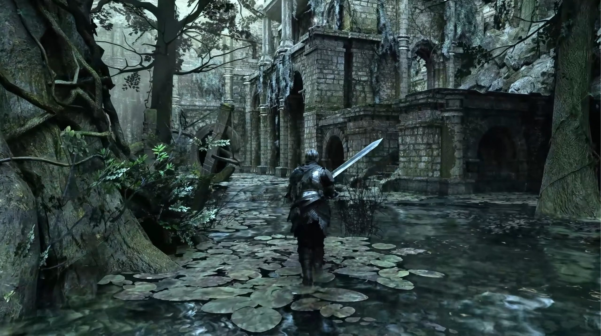

El modder conocido como **Ganaboy** ha publicado un nuevo vídeo de su proyecto de *path tracing* para **Dark Souls 3**, la tercera entrega de la saga de FromSoftware lanzada en 2016. La demostración, grabada en la zona de **Crucifixion Woods**, se apoya en renderizado por trazado de rayos y en **NVIDIA DLSS 5** para reconstruir la imagen, y el resultado se acerca al de un remaster moderno.

Conviene aclarar desde el principio que esto es un **mod hecho por un tercero**, no un anuncio de FromSoftware ni de NVIDIA. El vídeo es material de trabajo del propio autor y no existe una versión oficial del juego para consolas de nueva generación ni un remaster confirmado.

## Qué muestra el vídeo y de dónde sale

El metraje está publicado en el canal de YouTube **DS2 Lighting Engine**, el espacio donde Ganaboy documenta su motor de iluminación para la saga. La grabación se hizo con un equipo de referencia concreto: un **Ryzen 3600** con 16 GB de RAM y una **RTX 5080** limitada a 250 W, ejecutando el preset por defecto a **1440p con DLSS en modo Quality**.

Según la descripción del propio autor, DLSS 5 se aplica **antes del reescalado** porque el denoising recae en **NRD**, lo que reduce el coste de rendimiento del trazado de rayos. La imagen resultante del denoiser se reescala después mediante el supermuestreo de DLSS. El autor cifra en unos **10 ms** el tiempo de renderizado de cada fotograma en esa configuración, un dato que sirve de referencia para estimar cómo se comportará una GPU distinta.

## El proyecto y su relación con Dark Souls 2

No es la primera vez que Ganaboy lleva el trazado de rayos a la saga. A principios de este año ya publicó una versión de su motor de iluminación con *path tracing* para **Dark Souls 2**, y este proyecto para la tercera entrega reutiliza ese trabajo como base.

De la información compartida por el autor se desprende que:

- La **fecha de lanzamiento prevista** es para finales de este año, sin día confirmado.
- Más del **80 % del juego** ya está incorporado al **BVH**, la estructura que permite calcular las intersecciones de los rayos.
- El **tamaño de instalación** rondará los **3 a 4 GB**, con una geometría **diez veces mayor** que la del mod de Dark Souls 2.
- El **rendimiento** será similar al de Dark Souls 2 con su mod, pero al haber mucha más geometría el autor recomienda subir un escalón el reescalado: quien usaba el modo Quality en Dark Souls 2 debería pasar a **Balanced** aquí.
- El denoising se apoya en **NRD-SH** por defecto, en lugar de Ray Reconstruction, porque esta última penaliza demasiado en las **RTX 20 y 30**. Se admite cualquier tarjeta AMD con soporte de trazado de rayos, aunque el autor avisa de que hace falta una GPU decente.

## Qué cambia para quien juega en PC

El interés de este mod está en que, a día de hoy, la versión de PC de Dark Souls 3 es la única que puede acercarse a este tipo de iluminación. FromSoftware no ha anunciado un remaster ni un remake de la entrega, de modo que quien quiera revisitar el juego con un acabado visual más cercano al de los lanzamientos actuales tendrá que pasar por la escena de mods.

Eso sí, hay que tomarlo como una **versión en desarrollo**. El propio autor reconoce que la compatibilidad con el **online y con Seamless Co-op** no está probada, por lo que no puede garantizar su funcionamiento, y advierte de que en los casos menos favorables el motor recurre a luces falsas para compensar. En el apartado jugable, la iluminación por defecto de este mod no da prioridad a las antorchas, así que no será necesario llevarlas para avanzar. Para el lector que siga el proyecto, la referencia útil es el canal del autor, donde va publicando avances y detalles técnicos.
