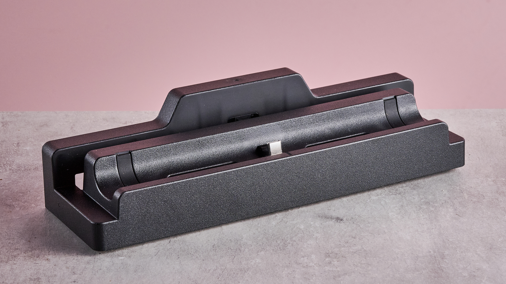
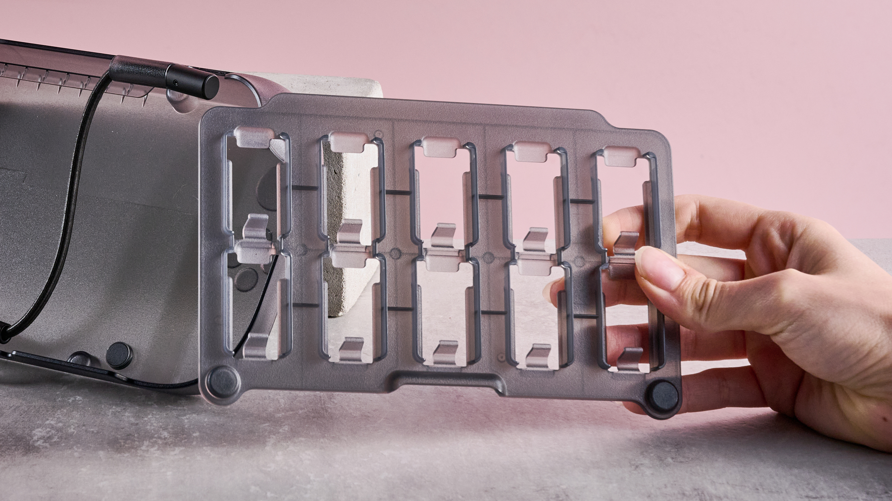
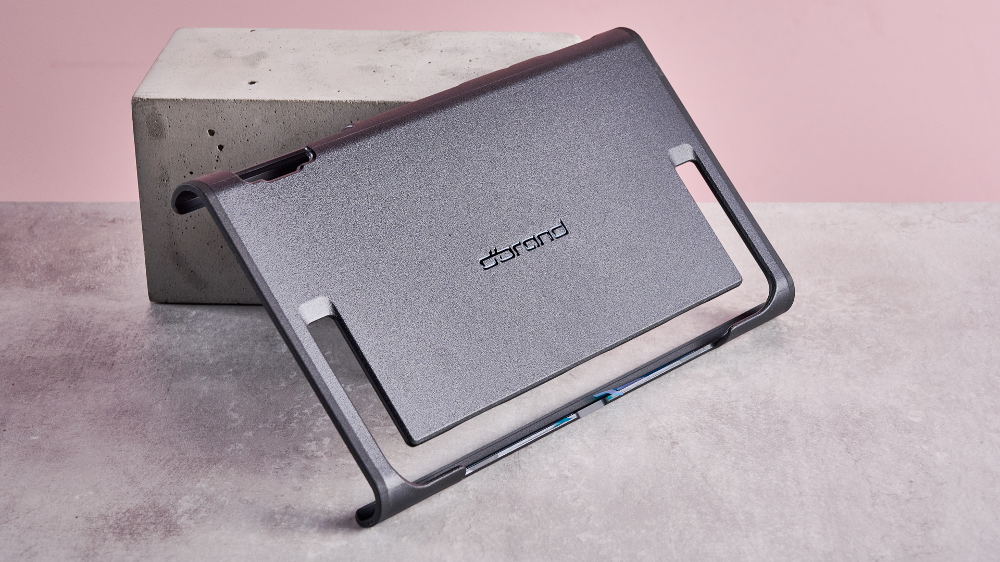
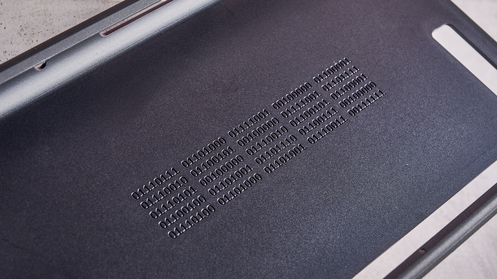

Proteger una consola híbrida como la Switch 2 obliga a elegir entre dos filosofías: una funda de transporte que se guarda y se saca, o una carcasa que se queda puesta de forma permanente. El Killswitch de Dbrand apuesta por la segunda, y TechRadar ha publicado su análisis con una conclusión clara: el producto convence por materiales, ergonomía y facilidad de montaje, pero su precio lo aleja de las opciones económicas. El análisis lo firma Harry Padoan, redactor sénior de reseñas del medio, tras una semana de uso continuado.

## Qué protege el Killswitch y cómo se monta

El Killswitch no es una funda de transporte al uso, sino una carcasa que envuelve la consola y la mantiene protegida también cuando se juega. Según el análisis, el montaje es de los puntos fuertes: basta con retirar unas tiras adhesivas y encajar la carcasa sobre el sistema, mientras que cada Joy-Con 2 recibe su propia funda individual y la pata de apoyo cuenta con una cubierta que se adhiere con facilidad. La carcasa deja libres los elementos que deben quedar accesibles —controles de volumen, botón de encendido, puertos USB-C y rejillas de ventilación—, un detalle importante para no comprometer la refrigeración de la consola.

En cuanto al grosor, el medio describe una carcasa delgada: añade algo de profundidad, pero no ensancha la consola hasta hacerla incómoda. Ese equilibrio es justamente lo que busca una carcasa permanente, porque un producto demasiado voluminoso termina estorbando en el uso diario.

## Cómo se comporta en el uso real

El análisis destaca sobre todo la ergonomía. La superficie texturizada y ligeramente curvada mejora el agarre en modo portátil, y el redactor probó títulos como *Mario Kart World* y *Yoshi and the Mysterious Book* sin que la consola le resultara aparatosa. También realizó una prueba de caída desde una altura controlada para evaluar la resistencia, además de usar todos los accesorios del paquete.

El punto que resuelve uno de los problemas clásicos de las carcasas es el adaptador de dock incluido: se coloca sobre la base habitual de la Switch 2 y permite seguir usando el modo televisor sin retirar la funda. El adaptador admite paso de señal 4K a 60 Hz, así que no obliga a renunciar a la salida de vídeo de la consola. Es, en la práctica, lo que permite alternar entre juego portátil y juego en televisor sin desmontar nada, algo relevante si se tiene en cuenta que la Switch 2 gestiona de forma distinta ciertas funciones según el modo de uso, como ocurre con el [VRR en modo dock que analizamos hace unas semanas](/noticias/switch-2-docked-vrr/).

El otro punto débil señalado no tiene que ver con la resistencia, sino con el mantenimiento: tanto la carcasa como los agarres de los sticks tienden a atrapar polvo y fibras. El redactor advierte que los agarres quedaron algo sucios tras una hora de uso. No lo considera un problema grave, pero sí un detalle a tener en cuenta para quien cuide el aspecto del equipo.

## Precio y variantes: dónde duele

Aquí llega el principal reparo del análisis. El Killswitch se vende en varios paquetes con precios en dólares que van subiendo según lo que se añada:

- **Essential**, desde 59,95 dólares: carcasa principal, vinilo y adaptador de dock.
- **Travel**, 99,85 dólares: suma agarres para los sticks y funda de transporte.
- **Ultra**, 134,80 dólares.
- **Everything**, 154,75 dólares: añade además dos protectores de pantalla y un soporte para mandos Joy-Con 2.

El redactor probó el paquete Travel, que incluye la funda de transporte con diez ranuras para juegos físicos y los agarres para los sticks, y describe estos últimos como cómodos y firmes. Aun así, su veredicto es que el conjunto completo resulta caro: pagar cerca de 155 dólares por la protección integral es una cifra alta, aunque el producto llegue a justificarla por acabados y sensación premium. El Killswitch para Switch 2 salió al mercado en junio de 2025, y el medio recuerda que es habitual verlo rebajado en la web de Dbrand.

## Para quién vale la pena

El análisis es explícito en sus recomendaciones. El Killswitch encaja en quien busca protección sin renunciar a nada: durabilidad, montaje sencillo y la posibilidad de alternar entre modo portátil y dock sin quitar la carcasa. En cambio, no es la opción para quien tenga un presupuesto ajustado o prefiera una funda de transporte tradicional, ya que existen alternativas más baratas de Nintendo y de otros fabricantes.

Conviene recordar que son precios de referencia en Estados Unidos: en España y el resto de Europa hay que sumar envío e impuestos de importación, lo que engorda la factura final. Y como ocurre con cualquier accesorio que se apoya en la zona de unión de los mandos, merece la pena probar el conjunto antes de dar por bueno el ajuste: en la Switch 2 se ha documentado que [algunos accesorios pueden contribuir a desconexiones del Joy-Con derecho](/noticias/joy-con-2-drift-teardown/), un detalle que Dbrand resuelve aquí con fundas individuales para cada mando.

En resumen, TechRadar lo sitúa como una de las mejores soluciones de protección para la consola, con la salvedad del precio y de la tendencia a retener polvo. La conclusión es la de un accesorio bien ejecutado que, a cambio de inversión, ofrece algo poco habitual: no tener que elegir entre proteger la consola y usarla.
