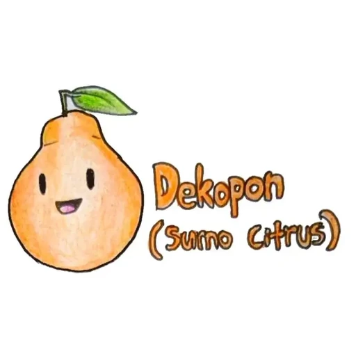
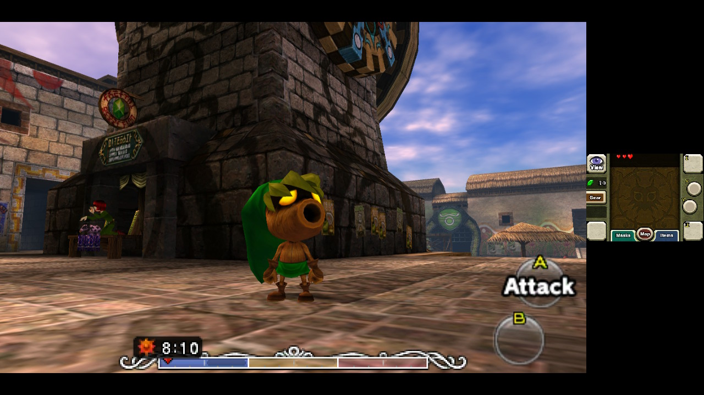
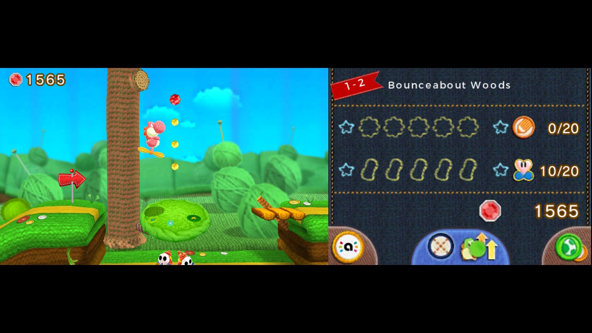

**Dekopon** es un port del emulador de Nintendo 3DS **Azahar** a Nintendo Switch. Su
autor, el desarrollador conocido en GBAtemp como **PalindromicBreadLoaf**, mantiene
el proyecto como código abierto en GitHub y, en el hilo donde lo presentó, afirma
que «muchos juegos se pueden jugar a plena velocidad» ya en la versión
**3.0.0-RC1**. Conviene aclararlo desde el principio: ese «casi a plena velocidad»
es la valoración de su creador, no una medición independiente, y el rendimiento
depende del título.

## Qué es Dekopon y por qué importa

Azahar es el emulador de 3DS que continuó el trabajo de Citra y Lime3DS, disponible
para PC y otras plataformas. Dekopon no parte de cero: toma ese código y lo adapta
al hardware de la consola híbrida. El port incluye su propio driver Vulkan, apodado
**nxvk**, sobre el que su autor reconoce que NVK hizo el trabajo pesado y que a él
solo le quedó resolver las plataformas WSI y algunas particularidades del SoC Tegra.

El interés no es menor: la emulación de 3DS en Switch existía hasta ahora a través
de núcleos antiguos de Citra en RetroArch, que en el propio hilo se describen como
problemáticos. Varios usuarios recuerdan que títulos como *Bravely Default*,
*Bravely Second* o *Radiant Historia: Perfect Chronology* se movían mal en esa
época incluso con overclock completo. El autor también responde a quienes comparan
su trabajo con Tico, otro emulador de 3DS para Switch presentado días antes:
sostiene que Tico **no es de código abierto** y que eso, a su juicio, incumple la
licencia GPLv2 de Azahar. Es una acusación del propio desarrollador de Dekopon, no
un hecho verificado de forma independiente.

## Cómo rinde la emulación de 3DS en Switch y cuáles son sus límites

Según la información publicada en el hilo, el rendimiento es muy variable según el
juego. El autor asegura que muchos títulos ya se juegan a velocidad completa,
«a veces incluso con los relojes de fábrica en modo portátil», aunque recomienda
subir la CPU a las frecuencias de unidad de desarrollo para reducir los tirones de
compilación de shaders y suavizar el ritmo de fotogramas. En modo dock y con la
consola cargando, señala que se puede llegar a escalado de resolución de hasta 4x
sin perder velocidad, y que en portátil con 3x es suficiente.

El límite lo marcan los juegos exclusivos de **New 3DS**. El autor explica que los
cuatro núcleos de la 3DS corren en un único hilo de emulación, lo que supone un
déficit de unos 1,2 GHz frente a lo que haría falta: 2 GHz de un solo núcleo en
Switch frente a los 804 MHz de cada uno de los cuatro núcleos de la 3DS. Dividir
los hilos de emulación resolvería el problema, pero implicaría mucho trabajo para
muy poca ganancia, según su propio análisis. El proyecto mantiene además una **tabla
de compatibilidad** pública que se actualiza con los reportes de los usuarios.

En las respuestas del hilo hay experiencias dispares: un usuario pregunta si mejora
al antiguo núcleo de Citra y el autor responde que la demo de *Bravely Second* se
mueve bien en el pueblo a 2x de resolución y con los relojes base en portátil. Son
impresiones de foro, no pruebas de laboratorio, y así hay que leerlas.

## Cómo probarlo y qué esperar

Dekopon es **homebrew**: requiere una Switch con acceso al Homebrew Menu, no
funciona en una consola de fábrica, y no incluye juegos. Los archivos se colocan en
`/switch/dekopon/roms/` —el autor tuvo que corregir en el hilo una errata inicial
que indicaba otra carpeta— y el emulador admite los mismos formatos que Azahar. En
cuanto a los controles, el pulsado de la palanca derecha (R3) cambia la
disposición de las pantallas, el botón `+` muestra la información de cada juego,
incluidas
actualizaciones y DLC, y `+` junto con `-` cierra la partida en curso. El propio
autor admite que la interfaz es mejorable y anima a quien quiera a rehacerla.

El movimiento se suma al goteo de ports homebrew de emuladores para Switch, como el
[Cemu-nx que lleva Wii U a la consola](/noticias/cemu-wii-u-switch-port/). Para
quien tenga una consola con homebrew, Dekopon es una vía a tener en cuenta para una
biblioteca de 3DS que la Switch nunca ofreció de forma oficial; para el resto, es
un proyecto técnico en evolución cuyo mejor caso conviene tomar con cautela.
